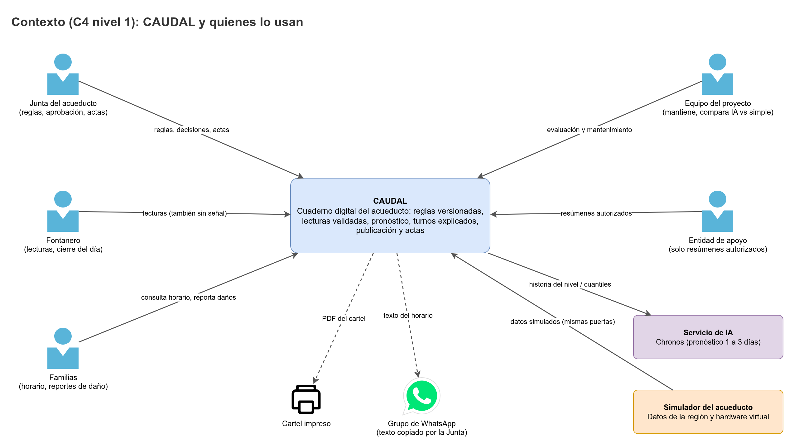

# CAUDAL Backend

API REST de **CAUDAL**, el cuaderno digital del acueducto veredal: reglas versionadas de la Junta, lecturas validadas del tanque, pronóstico con IA y respaldo simple, propuesta de turnos explicada, aprobación de la Junta, publicación sin datos personales, cierre del día y actas.

Java 25 · Spring Boot 4.1 · PostgreSQL 18 · Swagger.



## Estado

**Fase 1: fundaciones.** Esqueleto de Spring Boot con calidad de código (Spotless, Checkstyle, SpotBugs), PostgreSQL 18 con Flyway, logs JSON, formato canónico de errores, salud y Swagger. Las fases siguen el [orden de trabajo](docs/Roles-y-planeacion.md) y el [plan de commits](docs/Plan-de-commits.md).

## Versiones fijadas

| Componente | Versión |
|---|---|
| Java (JDK) | 25 LTS (Temurin) |
| Maven (Wrapper) | 3.9.16 |
| Spring Boot | 4.1.1 |
| springdoc-openapi | 3.1.1 |
| PostgreSQL | 18 (imagen `postgres:18`) |

## Documentación

- [Índice de la documentación](docs/README.md): problema, actores, historias de usuario, requerimientos, reglas de negocio, arquitectura, modelo de datos, API, seguridad, patrones, IA, datos simulados, hardware, planeación y plan de commits.
- [AGENTS.md](AGENTS.md): reglas obligatorias para personas y agentes.
- [Flujo de trabajo](.agents/workflow.md): cuentas, ramas, commits y PR.
- [Política de seguridad](SECURITY.md) y [cómo contribuir](CONTRIBUTING.md).

## Cómo correrlo en local

Requisitos: JDK 25 y Docker Engine con Compose. Con Podman funciona igual si `DOCKER_HOST` apunta a su socket (`systemctl --user start podman.socket` y `export DOCKER_HOST=unix://$XDG_RUNTIME_DIR/podman/podman.sock`).

1. Prepara las variables. Spring no lee `.env` por su cuenta, así que se exportan en la terminal:

   ```bash
   cp .env.example .env      # reemplaza cada "cambia-esto-..." por un valor local
   set -a; . ./.env; set +a
   ```

   Para la base local, usa `jdbc:postgresql://localhost:5432/caudal?sslmode=disable` en `DATABASE_URL` y `FLYWAY_URL`. Mientras no existan los roles de la Fase 2, `DATABASE_USERNAME` y `DATABASE_PASSWORD` pueden ser los mismos de Flyway.

2. Levanta PostgreSQL 18:

   ```bash
   docker compose up -d db
   docker compose ps         # el servicio db debe quedar "healthy"
   ```

3. Ejecuta la API:

   ```bash
   ./mvnw spring-boot:run
   ```

4. Comprueba que responde:

   ```bash
   curl http://localhost:8080/actuator/health      # {"status":"UP", ...}
   ```

### Rutas de documentación

| Ruta | Contenido |
|---|---|
| `http://localhost:8080/swagger-ui.html` | Swagger UI (redirige a `/swagger-ui/index.html`) |
| `http://localhost:8080/v3/api-docs` | Documento OpenAPI en JSON, con los esquemas `bearerAuth` y `deviceSignature` |
| `http://localhost:8080/actuator/health` | Salud del servicio, sin detalles |

Con `API_DOCS_ENABLED=false`, Swagger UI y `/v3/api-docs` responden `404`. Cada respuesta trae la cabecera `X-Request-Id`, que es el mismo `request_id` de los logs y de los errores.

### Pruebas y calidad

```bash
./mvnw verify             # compila, pruebas unitarias (*Test) y de integración (*IT), Spotless, Checkstyle y SpotBugs
./mvnw spotless:apply     # aplica el formato
```

Las pruebas de integración usan PostgreSQL 18 real con Testcontainers (perfil `test`), por eso necesitan Docker o Podman. El mismo `./mvnw verify` corre en GitHub Actions (`.github/workflows/ci.yml`), junto con CodeQL y gitleaks (`.github/workflows/security.yml`).

## Repositorios del proyecto

| Repositorio | Contenido |
|---|---|
| `caudal-backend` (este) | API, dominio, seguridad, base de datos y documentación canónica |
| [`caudal-frontend`](https://github.com/NicoalsD/caudal-frontend) | PWA del fontanero, panel de la Junta y página pública |
| [`caudal-ia`](https://github.com/NicoalsD/caudal-ia) | Pronóstico con Chronos |
| [`caudal-simulador`](https://github.com/NicoalsD/caudal-simulador) | Simulador de datos de la región y del hardware |

## Equipo

Nicolas Diaz (`NicoalsD`) · Drako Salazar (`Drako2305`) · Nicolas Mora (`nicomora70`). Proyecto de la materia Patrones de Software.
