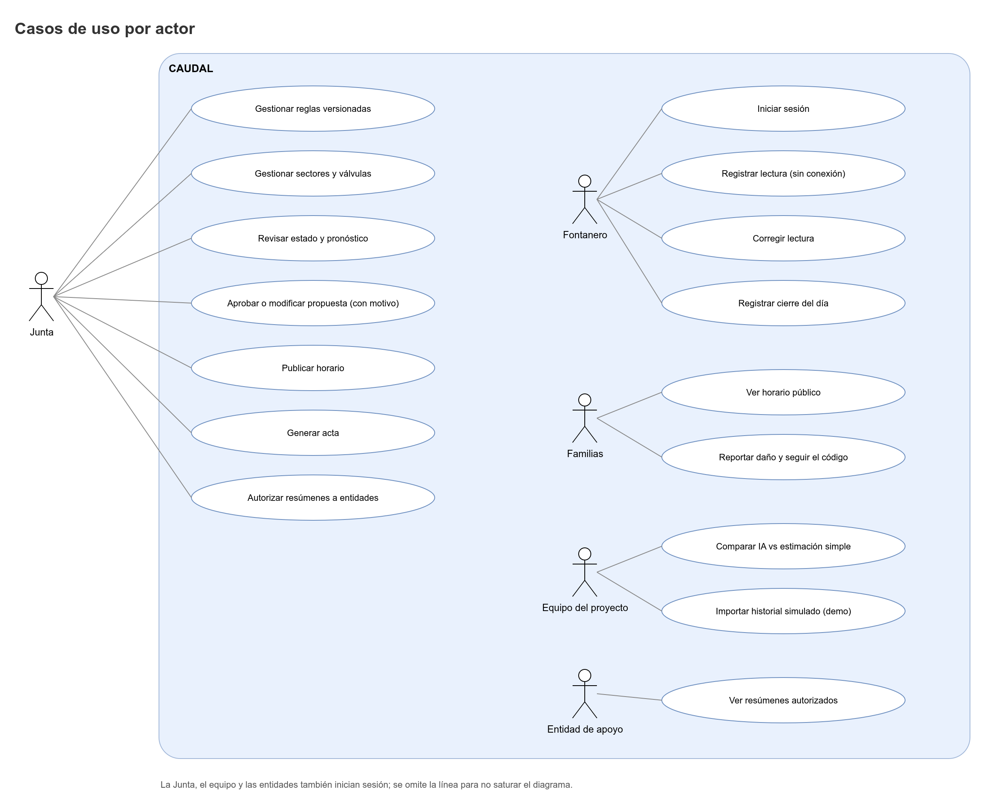

# Actores y permisos

Este documento define quién usa CAUDAL, qué necesita cada actor, en qué condiciones usa el sistema y qué puede hacer. La matriz de permisos es la fuente para el código: los roles y los códigos de permiso se guardan en la base de datos (`iam.roles`, `iam.permissions`, `iam.role_permissions`), y el código solo verifica códigos.

## 1. Actores humanos

| Actor | Rol en el sistema | Objetivo | Necesidades | Contexto de uso | Canales |
|---|---|---|---|---|---|
| Presidente o administrador de la Junta | `BOARD_ADMIN` | Que el agua llegue a todos los sectores con reglas claras y sin conflictos. | Ver el estado del tanque, aprobar la propuesta, publicar, generar actas, autorizar resúmenes, administrar usuarios. | Computador o celular, en casa o en reuniones de la Junta. Puede tener poco tiempo y no ser experto en tecnología. | Panel web (PWA) en navegador; página pública; WhatsApp (texto para copiar). |
| Miembro de la Junta | `BOARD_MEMBER` | Participar en las decisiones y revisar la evidencia. | Crear borradores de reglas, generar y decidir la propuesta, publicar, generar actas. No administra usuarios. | Celular, a veces sin señal estable en la vereda. Revisa después de las reuniones. | Panel web (PWA); página pública. |
| Fontanero | `OPERATOR` | Anotar el estado del tanque y cumplir los turnos publicados. | Registrar una lectura en pocos pasos, saber si el dato se guardó, corregir sus propias lecturas, cerrar el día. | Celular en campo, junto al tanque, con sol, manos ocupadas y frecuentemente sin señal. Pantalla pequeña. Poca experiencia con formularios complejos. | App instalada (PWA) con cola offline; sincronización al volver la señal. |
| Familia (vecino del acueducto) | Público, sin login | Saber cuándo llega el agua a su sector y reportar un daño. | Ver el horario sin registrarse, copiar el mensaje de WhatsApp, reportar una fuga o agua sucia y poder seguir el reporte. | Celular personal o cartel impreso en un lugar de paso (lugar por definir). Pueden ser adultos mayores. | Página pública; botón de WhatsApp; cartel PDF; formulario de reporte de daño. |
| Equipo del proyecto | `PROJECT_TEAM` | Mantener el sistema, medir si la IA ayuda y probar con datos simulados. | Ver salud técnica y evaluación, importar historial simulado en el acueducto demo, registrar dispositivos, consultar auditoría. | Computador con Docker, GitHub y herramientas de desarrollo. | Panel web; API (Swagger); repositorios. |
| Entidad de apoyo | `SUPPORT_ENTITY` | Conocer la gestión del acueducto para apoyar (ejemplo: alcaldía o entidad de salud, por definir). | Ver resúmenes y actas que la Junta autorice, solo mientras la autorización esté vigente. | Computador de oficina. Visita el sistema pocas veces. | Panel web con acceso de solo lectura a resúmenes autorizados. |
| Dispositivo (sensor o válvula) | Sistema, no persona | Enviar telemetría y recibir comandos firmados. | Firmar cada petición con su clave privada; recibir solo comandos aprobados. | Hardware en campo (propuesto, no se construye en esta versión). Se simula con `caudal-simulador`. | API `/api/v1/devices/*` con firmas Ed25519. |

Notas:

- Las familias no tienen cuenta. Su acceso es público, limitado por tasas (rate limits) y con honeypot en el formulario.
- El equipo del proyecto no toma decisiones operativas. Su acceso a datos reales es el mismo que el de cualquier rol, pero no puede publicar ni aprobar.
- Un integrante de la Junta puede tener rol de fontanero en otro acueducto. La pertenencia es por acueducto (membresía).

## 2. Roles del sistema (RBAC)

| Código | Nombre en español | Descripción | MFA |
|---|---|---|---|
| `BOARD_ADMIN` | Presidente o administrador de la Junta | Gestiona usuarios, reglas, decisiones, actas y autorizaciones. Tiene todos los permisos de la Junta. | Opcional (recomendado). |
| `BOARD_MEMBER` | Miembro de la Junta | Crea borradores de reglas, genera y decide propuestas, publica y genera actas. Solo `BOARD_ADMIN` activa las reglas. | No. |
| `OPERATOR` | Fontanero | Registra lecturas, corrige las suyas, cierra el día. | No. |
| `PROJECT_TEAM` | Equipo del proyecto | Ve evaluación, salud técnica y auditoría; importa historial simulado; registra dispositivos. | Opcional. |
| `SUPPORT_ENTITY` | Entidad de apoyo | Ve solo resúmenes autorizados y vigentes. | No. |

Notas sobre el MFA: los hechos canónicos indican TOTP opcional para `BOARD_ADMIN` y `PROJECT_TEAM`. La recomendación de activarlo para `BOARD_ADMIN` es una propuesta, por definir.

Duración de la sesión por rol: 7 días de refresh token, y 30 días para `OPERATOR` (ver [Requerimientos.md](Requerimientos.md), RNF-02).

## 3. Permisos

### 3.1 Convenciones

- Los códigos son `UPPER_SNAKE_CASE` en inglés (`^[A-Z][A-Z0-9_]*$`, tabla `iam.permissions`).
- Un permiso se marca **canon** si aparece en la matriz de los hechos canónicos, y **propuesto** si lo introduce este documento. Los propuestos están marcados "propuesto, por definir" y deben validarse antes de implementarse.
- Las acciones sin login (público) no tienen permiso: pasan por el `PublicScheduleProxy` o por el formulario público con sus límites.
- Las acciones solo sobre la propia cuenta (cambiar contraseña, cerrar sesión, MFA propio, aceptar el aviso de privacidad, consultar `GET /auth/me` y catálogos) requieren estar autenticado, sin permiso adicional.

### 3.2 Matriz completa

Sí = el rol tiene el permiso. No = no lo tiene. "Propio" = solo sobre sus propios registros (regla de objeto, ver sección 4).

| Permiso | Origen | Acción y endpoints | `BOARD_ADMIN` | `BOARD_MEMBER` | `OPERATOR` | `PROJECT_TEAM` | `SUPPORT_ENTITY` | Público |
|---|---|---|---|---|---|---|---|---|
| `USER_MANAGE` | canon | Usuarios y membresías: `GET/POST /users`, `PATCH /users/{id}`, `POST /users/{id}/reset-grants`, `GET/POST/DELETE /memberships` | Sí | No | No | No | No | No |
| `NETWORK_MANAGE` | propuesto | Tanques, sectores y válvulas: `POST /tanks`, `POST /sectors`, `PATCH /sectors/{id}`, `POST /sectors/{id}/valves`, `PATCH /valves/{id}` | Sí | No | No | No | No | No |
| `NETWORK_VIEW` | propuesto | Ver tanques, sectores y válvulas: `GET /tanks`, `GET /sectors`, `GET /sectors/{id}/valves` | Sí | Sí | Sí | Sí | No | No |
| `RULESET_VIEW` | propuesto | Ver reglas vigentes e históricas: `GET /rule-sets/current`, `GET /rule-sets`, `GET /rule-sets/{id}` | Sí | Sí | Sí | Sí | No | No |
| `RULESET_DRAFT` | canon | Crear y editar borradores: `POST /rule-sets`, `PATCH /rule-sets/{id}` (solo borrador) | Sí | Sí (crear y editar borradores) | No | No | No | No |
| `RULESET_ACTIVATE` | canon | Activar una versión con motivo: `POST /rule-sets/{id}/activate` | Sí | No | No | No | No | No |
| `READING_CREATE` | canon | Registrar lecturas: `POST /readings`, `POST /readings/batch` | Sí | No | Sí | No | No | No |
| `READING_VIEW` | propuesto | Ver lecturas y su estado de validación: `GET /readings`, `GET /readings/{id}` | Sí | Sí | Sí | Sí | No | No |
| `READING_CORRECT` | canon | Corregir una lectura con motivo: `POST /readings/{id}/corrections`. El fontanero solo puede corregir lecturas propias (regla de objeto). | Sí | Sí | Propio | No | No | No |
| `DAY_CLOSE` | canon | Registrar la ejecución de turnos y el cierre del día: `POST /schedule-items/{id}/execution`, `GET/POST /days/{date}/closure` | Sí | No | Sí | No | No | No |
| `STATUS_VIEW` | canon | Ver estado y pronóstico, y anomalías: `GET /tanks/{id}/status`, `GET /tanks/{id}/forecasts/latest`, `GET /anomalies` | Sí | Sí | Sí | Sí | No | No |
| `FORECAST_RUN` | propuesto | Recalcular pronóstico: `POST /tanks/{id}/forecasts` (límite 10/h por acueducto) | Sí | Sí | No | No | No | No |
| `ANOMALY_REVIEW` | propuesto | Confirmar o descartar una anomalía: `PATCH /anomalies/{id}` | Sí | Sí | No | No | No | No |
| `PROPOSAL_GENERATE` | canon | Generar una propuesta de turnos: `POST /schedule-proposals` | Sí | Sí | No | No | No | No |
| `PROPOSAL_VIEW` | propuesto | Ver propuestas y su historial: `GET /schedule-proposals`, `GET /schedule-proposals/{id}` | Sí | Sí | No | No | No | No |
| `PROPOSAL_DECIDE` | canon | Aprobar, modificar o rechazar: `POST /schedule-proposals/{id}/approve`, `/modify`, `/reject` | Sí | Sí | No | No | No | No |
| `SCHEDULE_PUBLISH` | canon | Publicar un horario aprobado: `POST /schedule-proposals/{id}/publish` | Sí | Sí | No | No | No | No |
| `SCHEDULE_VIEW` | propuesto | Ver el horario publicado en el panel: lectura de `ops.publications` por la API privada | Sí | Sí | Sí | Sí | No | Sí (por la vía pública, sin login) |
| `INCIDENT_CREATE` | propuesto | Registrar un daño desde el panel: `POST /incidents` | Sí | Sí | Sí | Sí | No | Sí (por `POST /public/{aqueductSlug}/damage-reports`) |
| `INCIDENT_VIEW` | propuesto | Ver reportes de daño: `GET /incidents` | Sí | Sí | Sí | Sí | No | No |
| `INCIDENT_MANAGE` | propuesto | Cambiar el estado de un incidente: `PATCH /incidents/{id}/status` | Sí | Sí | No | No | No | No |
| `MINUTES_GENERATE` | canon | Generar acta: `POST /minutes`, `GET /minutes/{id}/pdf` | Sí | Sí | No | No | No | No |
| `MINUTES_VIEW` | propuesto | Ver actas: `GET /minutes/{id}` | Sí | Sí | No | No | No | No |
| `SUMMARY_SHARE_MANAGE` | canon | Autorizar y revocar resúmenes: `POST /summary-shares`, `DELETE /summary-shares/{id}` | Sí | No | No | No | No | No |
| `SUMMARY_VIEW` | canon | Ver resúmenes autorizados: `GET /summaries`. La entidad solo ve los autorizados y vigentes. | Sí | Sí | No | No | Sí (autorizados y vigentes) | No |
| `EVALUATION_VIEW` | canon | Evaluación IA vs simple y salud técnica: `GET /forecast-evaluation` | Sí | No | No | Sí | No | No |
| `IMPORT_SIMULATED` | canon | Importar historial simulado: `POST /imports/readings`, `POST /imports/shift-executions`, `POST /imports/incidents`. Solo en acueducto demo (regla de objeto). | No | No | No | Sí | No | No |
| `DEVICE_MANAGE` | canon | Registrar dispositivos y claves: `POST /devices`, `POST /devices/{id}/keys` | Sí | No | No | Sí | No | No |
| `VALVE_COMMAND_MANUAL` | propuesto | Comando manual de válvula con motivo: `POST /valve-commands/manual` | Sí | No | No | No | No | No |
| `AUDIT_VIEW` | canon | Bitácora y eventos de seguridad: `GET /audit-log`, `GET /security-events` | Sí | No | No | Sí | No | No |

Notas de la matriz:

- **Diferencia con los hechos canónicos.** En la sección 9 de los hechos, la fila "Ver horario publicado / reportar daño" marca `SUPPORT_ENTITY` como "No". Esta matriz lo mantiene para el panel autenticado. La vía pública (sin login) está abierta a cualquiera, incluida una entidad. Por definir si la entidad debe tener además una vista de horario dentro del panel.
- **Comandos de válvula desde turnos aprobados.** La generación de comandos al publicar un horario se ejecuta como acción del sistema, no como permiso de un rol. Por definir cómo se registra en `devices.valve_command_events` y `audit.audit_log` (actor `SYSTEM`).
- **Permisos de cuenta propia.** `POST /auth/change-password`, `POST /auth/logout`, `POST /auth/logout-all`, `POST /auth/mfa/*`, `POST /privacy-notice/accept`, `GET /auth/me`, `GET /meta/constraints`, `GET /catalogs/{catalog}` y `GET /privacy-notice/current` requieren autenticación y no tienen código de permiso.

### 3.3 Permisos por rol (semilla de `iam.role_permissions`)

| Rol | Permisos |
|---|---|
| `BOARD_ADMIN` | Todos, excepto `IMPORT_SIMULATED`. |
| `BOARD_MEMBER` | `NETWORK_VIEW`, `RULESET_VIEW`, `RULESET_DRAFT`, `READING_VIEW`, `READING_CORRECT`, `STATUS_VIEW`, `FORECAST_RUN`, `ANOMALY_REVIEW`, `PROPOSAL_GENERATE`, `PROPOSAL_VIEW`, `PROPOSAL_DECIDE`, `SCHEDULE_PUBLISH`, `SCHEDULE_VIEW`, `INCIDENT_CREATE`, `INCIDENT_VIEW`, `INCIDENT_MANAGE`, `MINUTES_GENERATE`, `MINUTES_VIEW`, `SUMMARY_VIEW`. |
| `OPERATOR` | `NETWORK_VIEW`, `RULESET_VIEW`, `READING_CREATE`, `READING_VIEW`, `READING_CORRECT` (propio), `DAY_CLOSE`, `STATUS_VIEW`, `SCHEDULE_VIEW`, `INCIDENT_CREATE`, `INCIDENT_VIEW`. |
| `PROJECT_TEAM` | `NETWORK_VIEW`, `RULESET_VIEW`, `READING_VIEW`, `STATUS_VIEW`, `SCHEDULE_VIEW`, `INCIDENT_CREATE`, `INCIDENT_VIEW`, `EVALUATION_VIEW`, `IMPORT_SIMULATED`, `DEVICE_MANAGE`, `AUDIT_VIEW`. |
| `SUPPORT_ENTITY` | `SUMMARY_VIEW`. |

El administrador de la Junta tiene todos los permisos de la Junta, pero no `IMPORT_SIMULATED`: la importación es una herramienta del equipo del proyecto.

## 4. Reglas de autorización por objeto

La autorización tiene tres capas, en este orden. Si una falla, se rechaza (deny-by-default).

1. **Autenticación.** El access token (JWT HS256, 15 min) debe ser válido: `alg` explícito, `iss`, `aud`, `exp` y `nbf` con tolerancia de 30 s. El claim `tv` (token_version) debe coincidir con `iam.users.token_version`. Si no coincide, responde `401`.
2. **Permiso por acueducto.** Se busca la membresía vigente del usuario en el acueducto del token (`iam.memberships` con `valid_from <= now()` y `valid_to` nulo o mayor que `now()`). El rol de esa membresía determina los permisos (`iam.role_permissions`). Sin membresía vigente: `403 FORBIDDEN`.
3. **Chequeo por objeto.** Todo recurso pertenece a un acueducto (`aqueduct_id`). Un recurso de otro acueducto se responde como si no existiera (`404 RESOURCE_NOT_FOUND`, propuesto) para no revelar su existencia. Las reglas adicionales son:

| Regla | Aplica a | Detalle |
|---|---|---|
| Lectura propia | `READING_CORRECT` con rol `OPERATOR` | `ops.readings.created_by` debe ser el usuario actual. Si no, `403 FORBIDDEN`. Los demás roles con este permiso corrigen cualquier lectura de su acueducto. |
| Autorización vigente | `SUMMARY_VIEW` con rol `SUPPORT_ENTITY` | Solo filas de `reporting.summary_shares` con `grantee_user_id` igual al usuario, `revoked_at` nulo y `expires_at > now()`. Ver también [Historias-de-usuario.md](Historias-de-usuario.md) (HU-32). |
| Solo acueducto demo | `IMPORT_SIMULATED` | `org.aqueducts.is_demo = true`. En otro acueducto, `403 DEMO_ONLY` y evento `IMPORT_REJECTED` en `iam.security_events`. |
| Sin datos personales en lo público | Rutas `/api/v1/public/*` | Responden solo desde `PublicScheduleProxy` y `incidents` sin `reporter_ip_hmac`. No se hace join con `iam.users`. |
| Cambio de rol o desactivación | Todos | Incrementa `token_version`, revoca refresh tokens (`revoked_reason = ROLE_CHANGED`) y el acceso se corta en el siguiente request. |
| Membresía vencida | Todos | Una membresía con `valid_to` pasado no da permisos aunque el rol siga guardado. |

### 4.1 Seguridad a nivel de base de datos (RLS)

- Las tablas con `rls: true` en `schema.yaml` (por ejemplo `iam.memberships`, `org.tanks`, `ops.readings`, `ops.schedule_proposals`, `reporting.minutes`, `reporting.summary_shares`, `ops.incidents`) tienen `ENABLE` y `FORCE ROW LEVEL SECURITY`.
- La política filtra por `aqueduct_id = current_setting('app.aqueduct_id')::uuid`. La aplicación fija la variable con `SET LOCAL` al inicio de cada transacción, a partir del claim `aqueduct_id`.
- El rol `caudal_app` solo tiene `INSERT` y `SELECT` en tablas append-only, `UPDATE` en las columnas permitidas y no tiene `DELETE` salvo purgas por funciones `SECURITY DEFINER`.
- Los datos sensibles tienen permisos por columna: `iam.users.password_hash`, `iam.refresh_tokens.token_hash` y los secretos MFA no son legibles por `caudal_readonly`.
- La RLS es una segunda barrera. La primera es la verificación de la capa 2 en la aplicación, con pruebas que la cubren (ver [Requerimientos.md](Requerimientos.md), RNF-07).

## 5. Diagrama de casos de uso

El diagrama [casos-de-uso.png](images/casos-de-uso.png) muestra los casos de uso agrupados por actor y la relación entre ellos (por ejemplo, "Publicar horario" incluye "Aprobar propuesta"). La fuente es `docs/images/casos-de-uso.drawio`.

Relacionados: [Caudal.md](Caudal.md) · [Historias-de-usuario.md](Historias-de-usuario.md) · [Requerimientos.md](Requerimientos.md) · [Glosario.md](Glosario.md)
