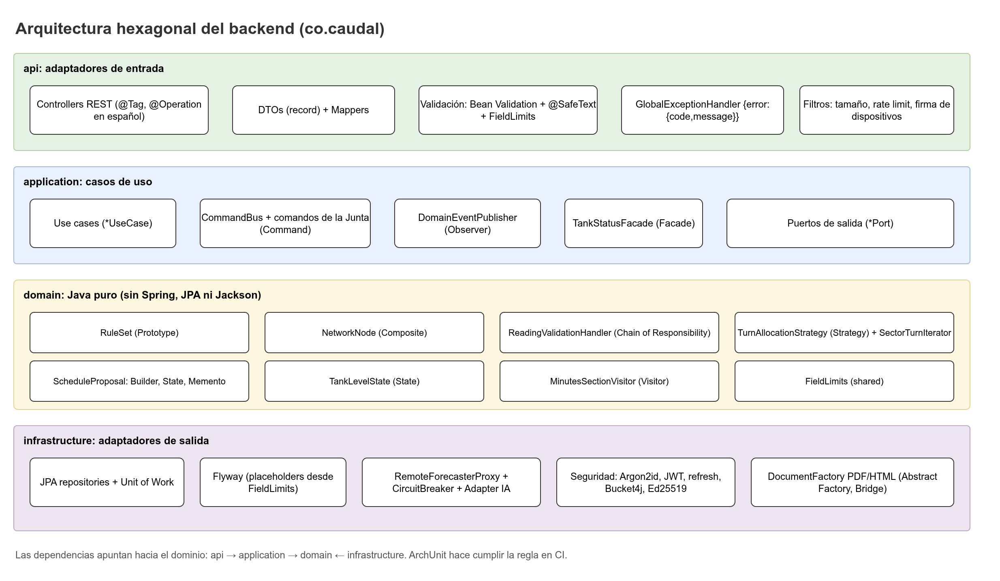
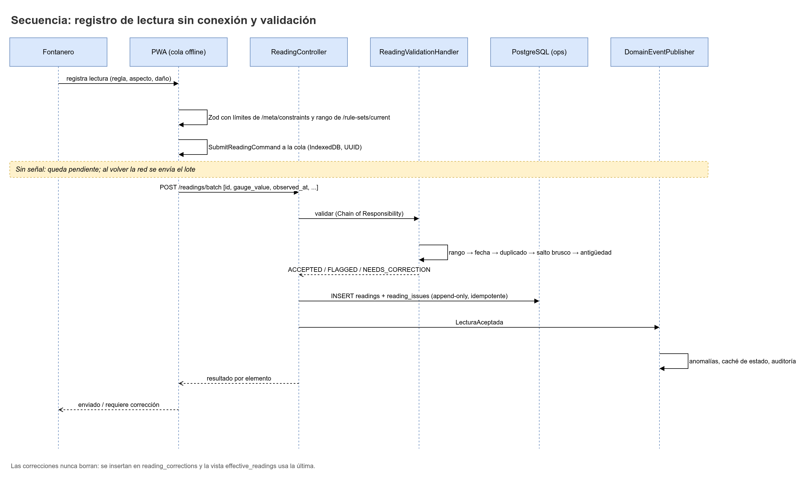
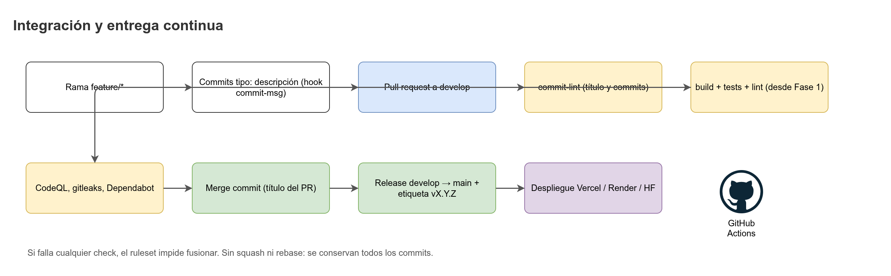
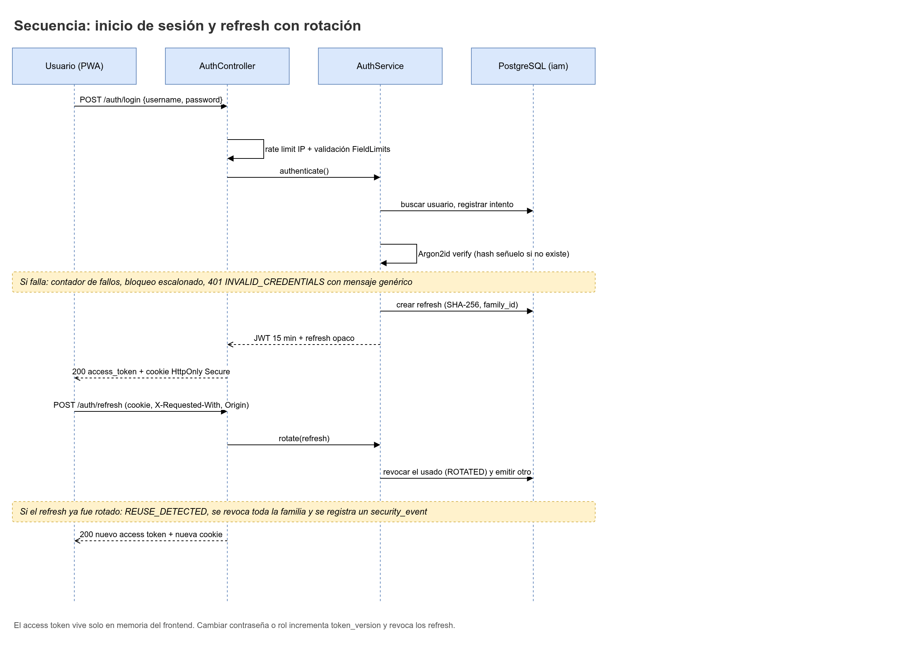
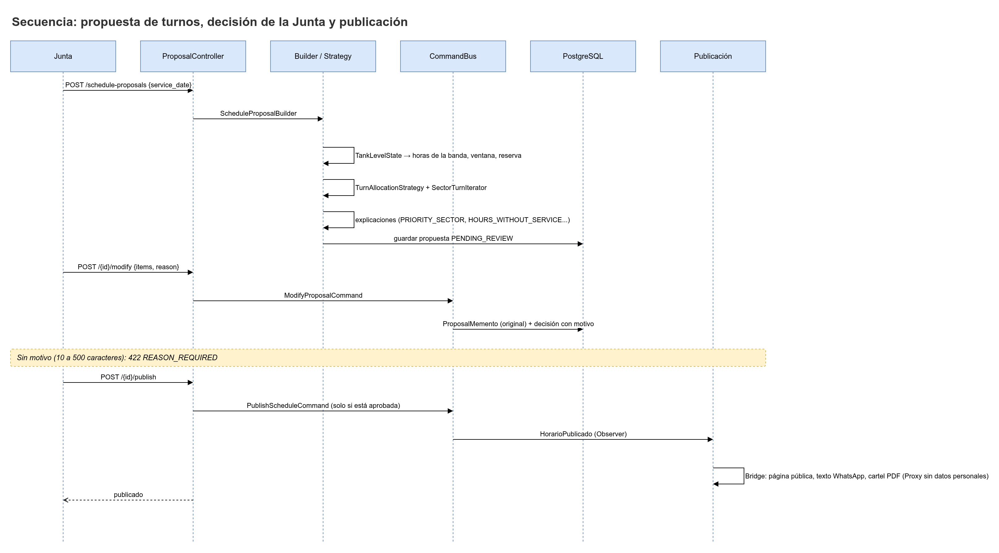
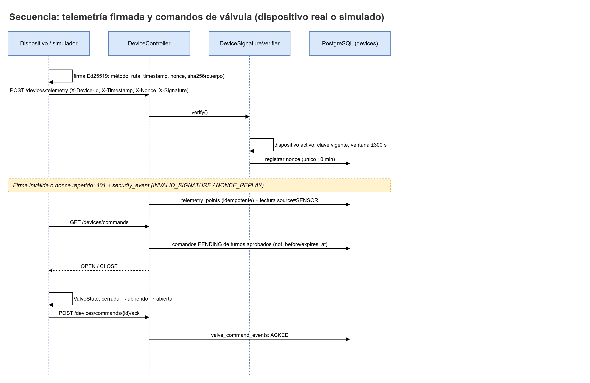

# Arquitectura de CAUDAL

> Documento de referencia de la arquitectura del sistema y, en detalle, del backend (`caudal-backend`). Los hechos canónicos (stack, cifras, nombres de endpoints) viven en la especificación del proyecto. Lo que aún no está decidido se marca "verificar" o "por definir".

## 1. Vista general

CAUDAL ayuda a la Junta de una vereda a repartir el agua por turnos con registros digitales, un pronóstico del nivel del tanque y decisiones explicadas y aprobadas por personas. La arquitectura separa tres piezas de producto (la app, la API y la base de datos) de dos servicios de apoyo (la IA y el simulador de datos).

### 1.1 Contexto del sistema (C4 nivel 1)


| Actor o sistema externo | Qué hace con CAUDAL | Canal |
|---|---|---|
| Fontanero (`OPERATOR`) | Registra lecturas del tanque, cierra el día y reporta novedades. Trabaja sin señal. | PWA offline |
| Junta (`BOARD_ADMIN`, `BOARD_MEMBER`) | Activa reglas, revisa y aprueba propuestas de turnos, publica horarios y genera actas. | PWA |
| Familias y comunidad | Consultan el horario y reportan daños sin iniciar sesión. | Página pública, WhatsApp, cartel impreso |
| Equipo del proyecto (`PROJECT_TEAM`) | Mantiene el sistema, compara la IA con la estimación simple e importa historial simulado. | PWA y API |
| Entidades de apoyo (`SUPPORT_ENTITY`) | Ven solo resúmenes autorizados y vigentes. | PWA |
| Simulador (`caudal-simulador`) | Produce datos simulados: lecturas, telemetría, reportes y turnos ejecutados. | API (JWT, firmas Ed25519, importación) |
| Servicio de pronóstico (`caudal-ia`) | Calcula el pronóstico con Chronos. No guarda datos. | HTTP interno con token de servicio |

Todos los datos del campo son simulados. La UI, la página pública, el mensaje de WhatsApp, el cartel y las actas muestran "Datos simulados".

### 1.2 Contenedores (C4 nivel 2)


| Contenedor | Tecnología | Plataforma | Responsabilidad |
|---|---|---|---|
| PWA (`caudal-frontend`) | React 19, Vite, TypeScript, Dexie | Vercel | Interfaz de todos los roles, cola offline, página pública. |
| API (`caudal-backend`) | Java 25 LTS, Spring Boot 4.1.x | Render (Docker) | Reglas de negocio, seguridad, auditoría, orquestación del pronóstico. |
| Base de datos | PostgreSQL 18 | Neon (local: Docker Compose) | Fuente de verdad, 7 esquemas, RLS por acueducto. |
| Servicio IA (`caudal-ia`) | Python 3.12, FastAPI, Chronos | Hugging Face Spaces (Docker, CPU) o Render (verificar) | Pronóstico probabilístico sin estado. |
| Simulador (`caudal-simulador`) | Python 3.12, Typer, FastAPI, tablero Vite/React | Local | Gemelo digital del acueducto, modos `generate`, `backfill`, `live` y `demo`. |
| CI/CD | GitHub Actions, CodeQL, gitleaks, Dependabot | GitHub | Validación de commits, pruebas, análisis de seguridad. |

Protocolos principales:

| Desde | Hacia | Protocolo | Autenticación |
|---|---|---|---|
| PWA | API | HTTPS, JSON, `/api/v1/*` | JWT de acceso en memoria, refresh en cookie `HttpOnly` |
| Página pública | API | HTTPS, `/api/v1/public/*` | Ninguna (límites de tasa, honeypot) |
| API | Servicio IA | HTTPS, `POST /v1/forecasts` | `Authorization: Bearer <IA_SERVICE_TOKEN>` |
| API | PostgreSQL | TLS (`sslmode=verify-full`) | Roles `caudal_app`, `caudal_migrator`, `caudal_readonly` |
| Simulador | API | HTTPS | JWT (como fontanero), firma Ed25519 (como dispositivo) |

## 2. Arquitectura hexagonal del backend

El backend sigue arquitectura hexagonal (puertos y adaptadores). El dominio no conoce Spring, JPA ni Jackson. Las dependencias apuntan hacia el dominio.



### 2.1 Paquetes y responsabilidades

Paquete base: `co.caudal`.

| Paquete | Contiene | No contiene |
|---|---|---|
| `co.caudal.api` | Controladores REST (`*Controller`), DTOs de entrada y salida (`*Request`, `*Response`, `record`), mapeadores DTO-caso de uso, manejador global de errores (`@RestControllerAdvice`), filtros HTTP de identificador de petición. | Reglas de negocio, consultas a la BD, llamadas a la IA. |
| `co.caudal.application` | Casos de uso (`*UseCase`), puertos de salida (`*Port`), `CommandBus` y comandos de la Junta (`*Command`), publicación de eventos (`DomainEventPublisher`), `UnitOfWork`, fachadas (`TankStatusFacade`) y puertos de lectura pública. | Detalles de HTTP, JPA o de un proveedor externo. |
| `co.caudal.domain` | Modelo puro en Java: agregados (`RuleSet`, `ScheduleProposal`, `Reading`), value objects, reglas (cadena de validación, estrategias de asignación), estados, eventos de dominio, excepciones de negocio, patrones de dominio (Builder, Prototype, Composite, Memento, Visitor, Iterator, State). | Anotaciones de Spring, JPA o Jackson. Acceso a red, reloj del sistema o archivos. |
| `co.caudal.infrastructure` | Adaptadores de persistencia (`*PersistenceAdapter`, `*JpaRepository`, entidades `*Entity`), cliente de la IA (`IaForecastClientAdapter`), proxy y respaldo de pronóstico, seguridad (filtros JWT, Argon2id, Bucket4j), generación de PDF y HTML (`DocumentFactory`), criptografía de dispositivos (Ed25519, AES-256-GCM), configuración (`@Configuration`), logging. | Reglas de negocio. Lógica que deba probarse sin base de datos. |
| `co.caudal.shared` | Constantes de límites (`FieldLimits`), utilidades sin estado (`SystemClock`, plantillas de mensajes `MessageTemplate`), errores base (`ErrorCode`, `DomainException`). | Dependencias hacia `api`, `application`, `domain` o `infrastructure`. |

### 2.2 Reglas de dependencia

```text
api  ──────────►  application  ──────────►  domain
                      ▲                       ▲
                      │ implementa puertos     │ no depende de nada
                      │                       │ de la capa externa
               infrastructure ────────────────┘
```

| Regla | Sentido permitido |
|---|---|
| `api` usa `application` | Sí. Los controladores llaman casos de uso y fachadas. |
| `api` usa `infrastructure` | No. |
| `application` usa `domain` | Sí. |
| `application` usa `infrastructure` | No. La infraestructura implementa los puertos. |
| `infrastructure` implementa puertos de `application` y usa `domain` | Sí. |
| `domain` usa cualquier otro paquete de `co.caudal` | No. Solo `java.*` y `shared`. |
| `shared` usa otros paquetes de `co.caudal` | No. |

Los casos de uso reciben entradas de tipo `*Input` (records definidos en `application`). Los controladores transforman `*Request` en `*Input` con un mapeador. Así la API nunca expone objetos del dominio.

### 2.3 Reglas ArchUnit concretas

Las reglas viven en la clase `ArchitectureTest` (paquete `co.caudal.architecture`), con `archunit-junit5`. Cada regla es una prueba que falla el build si se incumple.

| Id | Regla | Expresión conceptual |
|---|---|---|
| `ARCH-01` | El dominio no depende de Spring, JPA ni Jackson. | `noClasses().that().resideInAPackage("co.caudal.domain..").should().dependOnClassesThat().resideInAnyPackage("org.springframework..", "jakarta.persistence..", "com.fasterxml.jackson..")` |
| `ARCH-02` | El dominio no depende de otras capas de CAUDAL. | El dominio no depende de `co.caudal.api..`, `co.caudal.application..` ni `co.caudal.infrastructure..`. |
| `ARCH-03` | La aplicación no depende de la API ni de la infraestructura. | `noClasses().that().resideInAPackage("co.caudal.application..").should().dependOnClassesThat().resideInAnyPackage("co.caudal.api..", "co.caudal.infrastructure..")` |
| `ARCH-04` | La API no depende de la infraestructura ni del dominio. Solo usa `application` y `shared`. | `noClasses().that().resideInAPackage("co.caudal.api..").should().dependOnClassesThat().resideInAnyPackage("co.caudal.infrastructure..", "co.caudal.domain..")` |
| `ARCH-05` | No hay ciclos entre los paquetes de primer nivel bajo `co.caudal`. | `slices().matching("co.caudal.(*)..").should().beFreeOfCycles()` |
| `ARCH-06` | Los controladores están en `api` y su nombre termina en `Controller`. | Clases anotadas con `@RestController` pertenecen a `co.caudal.api..` y terminan en `Controller`. |
| `ARCH-07` | Las entidades JPA y los repositorios de Spring Data viven solo en `infrastructure.persistence`. | Clases con `@Entity` o que extienden `JpaRepository` solo en `co.caudal.infrastructure.persistence..`. |
| `ARCH-08` | Los adaptadores de salida se llaman `*Adapter` o `*Proxy` y viven en `infrastructure`. | Clases que implementan un `*Port` se llaman `*Adapter` o `*Proxy` y están en `co.caudal.infrastructure..`. No hay excepciones. |
| `ARCH-09` | `shared` no depende de otros paquetes de `co.caudal`. | `noClasses().that().resideInAPackage("co.caudal.shared..").should().dependOnClassesThat().resideInAnyPackage("co.caudal.api..", "co.caudal.application..", "co.caudal.domain..", "co.caudal.infrastructure..")` |
| `ARCH-10` | Los puertos de salida son interfaces en `application.port.out` y su nombre termina en `Port`. | Interfaces en `co.caudal.application.port.out..` terminan en `Port`. |
| `ARCH-11` | Solo `SystemClock` lee la hora del sistema. | Regla con `callMethod` sobre `Instant.now`, `LocalDate.now`, `LocalDateTime.now`, `ZonedDateTime.now` y `System.currentTimeMillis`, con excepción de `co.caudal.shared.time.SystemClock` (verificar la API de ArchUnit). |

No hay excepciones a `ARCH-08`. Cualquier excepción nueva requiere revisión del líder de patrones.

### 2.4 Árbol de carpetas propuesto

Propuesta de estructura del proyecto Maven. Se confirma en la Fase 1 (verificar).

```text
caudal-backend/
├── .agents/                       # Guías operativas para agentes (ver docs de .agents)
├── .githooks/commit-msg           # Validación del formato de commits
├── .github/                       # Plantillas, CODEOWNERS, workflows
├── docs/                          # Documentación canónica del proyecto
│   └── images/                    # Fuentes .drawio y exportaciones .png
├── .env.example                   # Variables de entorno con marcadores seguros
├── CONTRIBUTING.md
├── Dockerfile                     # Build multi-etapa
├── docker-compose.yml             # PostgreSQL 18 local
├── mvnw, mvnw.cmd, .mvn/          # Maven Wrapper
├── pom.xml
└── src/
    ├── main/
    │   ├── java/co/caudal/
    │   │   ├── CaudalApplication.java
    │   │   ├── api/
    │   │   │   ├── controller/        # *Controller
    │   │   │   ├── dto/
    │   │   │   │   ├── request/       # *Request (record)
    │   │   │   │   └── response/      # *Response (record)
    │   │   │   ├── mapper/            # DTO <-> *Input / resultado
    │   │   │   └── error/             # ApiExceptionHandler, ErrorResponse
    │   │   ├── application/
    │   │   │   ├── usecase/           # *UseCase por área (reading, rules, proposal, ...)
    │   │   │   ├── port/out/          # *Port (repositorios, IA, reloj, almacenamiento)
    │   │   │   ├── command/           # *Command (Junta), Command, CommandHandler, CommandBus
    │   │   │   ├── event/             # DomainEventPublisher
    │   │   │   ├── facade/            # TankStatusFacade
    │   │   │   ├── publication/       # Notice, PublicationChannel, PublicSchedulePort
    │   │   │   └── uow/               # UnitOfWork
    │   │   ├── domain/
    │   │   │   ├── reading/           # Reading, ReadingValidationHandler y subclases
    │   │   │   ├── rules/             # RuleSet, LevelBand, copyForNewVersion()
    │   │   │   ├── schedule/          # ScheduleProposal, ProposalState, SectorTurnIterator, strategies
    │   │   │   ├── tank/              # TankLevelState, TrendStrategy
    │   │   │   ├── network/           # NetworkNode, SectorNode, ValveNode
    │   │   │   ├── minutes/           # MinutesBuilder, EpistemicRecord, MinutesSectionVisitor
    │   │   │   ├── catalog/           # CatalogItem y fábrica flyweight
    │   │   │   ├── event/             # ReadingAccepted, RuleSetActivated, SchedulePublished
    │   │   │   └── exception/         # Subclases de DomainException (la base está en shared/error)
    │   │   ├── infrastructure/
    │   │   │   ├── persistence/       # *Entity, *JpaRepository, *PersistenceAdapter, UnitOfWork
    │   │   │   ├── forecast/          # IaForecastClientAdapter, NaivePersistenceForecastAdapter, RemoteForecasterProxy, CircuitBreakerState
    │   │   │   ├── security/          # Filtros JWT, Argon2id, Bucket4j, MFA
    │   │   │   ├── device/            # DeviceTelemetryAdapter, verificación Ed25519
    │   │   │   ├── document/          # DocumentRenderingAdapter, DocumentGenerator, DocumentFactory, DocumentGeneratorCreator
    │   │   │   ├── publication/       # PublicScheduleProxy, PublicPageChannel, WhatsAppChannel, PosterChannel
    │   │   │   ├── event/             # Publicación de eventos tras el commit
    │   │   │   ├── time/              # Configuración del reloj
    │   │   │   └── config/            # @Configuration, propiedades tipadas
    │   │   └── shared/
    │   │       ├── FieldLimits.java
    │   │       ├── time/SystemClock.java
    │   │       ├── text/MessageTemplate.java
    │   │       └── error/ErrorCode.java, DomainException.java
    │   └── resources/
    │       ├── application.yml        # Configuración con ${VAR}
    │       ├── messages_es.properties # Textos de error en español
    │       └── db/migration/          # V*__*.sql (Flyway)
    └── test/
        └── java/co/caudal/
            ├── domain/                # Pruebas unitarias sin Spring
            ├── application/           # Casos de uso con puertos simulados
            ├── api/                   # @WebMvcTest (validación, seguridad)
            ├── infrastructure/        # Testcontainers PostgreSQL
            ├── architecture/          # ArchitectureTest
            └── drift/                 # Pruebas de deriva BD vs FieldLimits
```


## 3. Flujo de escritura: registrar una lectura del fontanero

Caso: el fontanero anota el número de la regla pintada en el tanque, si el agua se ve normal o con barro, y si notó daño. El celular puede estar sin señal. La petición es `POST /api/v1/readings` y es idempotente por el UUID que genera el cliente.



Pasos:

1. **Filtros HTTP.** Se asigna `request_id` (cabecera `X-Request-Id` o UUID nuevo). Se rechaza el cuerpo mayor a 64 KiB (`MAX_JSON_BODY_BYTES`, con `413 PAYLOAD_TOO_LARGE`) y la cabecera `Authorization` mayor a 2 KiB antes de parsear.
2. **Autenticación.** El filtro de Spring Security valida el JWT: algoritmo `HS256` explícito, `iss`, `aud`, `exp` y `nbf` con tolerancia de 30 s. Verifica que `tv` (token_version) coincida con `iam.users.token_version`. Si no, responde `401`.
3. **Límite de tasa.** Bucket4j consume un token de `API 120/min/usuario`. Si se agota, responde `429` y registra `RATE_LIMITED` en `iam.security_events`.
4. **Validación de forma.** `ReadingController` recibe `@RequestBody @Valid CreateReadingRequest`. Bean Validation aplica los límites de `FieldLimits` (longitud de la nota, `gauge_value` con máximo dos decimales, `observed_at` como ISO-8601 con zona). Jackson rechaza campos desconocidos (`FAIL_ON_UNKNOWN_PROPERTIES`) y no hace coerción de tipos. Si falla, responde `400 VALIDATION_ERROR`, según `API.md`. Un campo desconocido recibe el mismo código.
5. **Mapeo.** El mapeador convierte `CreateReadingRequest` en `RecordReadingInput`, un record de `application`. El controlador no conoce el dominio.
6. **Caso de uso.** `RecordReadingUseCase.execute(input)` abre la unidad de trabajo (`UnitOfWork.execute`). Dentro de la transacción:
   1. Fija el acueducto de la sesión con `SET LOCAL app.aqueduct_id = '<uuid>'`. Al terminar la transacción, PostgreSQL descarta el valor, así que una conexión del pool no conserva el acueducto anterior.
   2. Carga la membresía vigente del usuario (`iam.memberships`) y verifica el permiso `READING_CREATE` leyendo `iam.role_permissions`. Nada está escrito en el código.
   3. Verifica el objeto: el tanque pertenece al acueducto de la membresía. RLS vuelve a comprobarlo en la BD.
   4. Idempotencia: busca `ops.readings` con ese `id`. Si existe con el mismo contenido, responde `200` con el resultado original y `idempotent_replay: true`, sin duplicar. Si el contenido cambió, responde `409 DUPLICATE_READING`.
   5. Carga la versión vigente de reglas (`org.rule_sets` con `status = 'ACTIVE'`) y el rango del tanque (`org.tanks.gauge_min`, `gauge_max`).
7. **Dominio.** `Reading.record(...)` construye el agregado. Luego se ejecuta la cadena de validación (P12), en este orden:
   1. `RangeCheckHandler`: el valor está entre `gauge_min` y `gauge_max`. Si no, responde `422 GAUGE_OUT_OF_RANGE` y la lectura no se guarda. La app pide corregir antes de reenviar (ver `Reglas-de-negocio.md`, sección 8).
   2. `DateCheckHandler`: `observed_at` no es futuro (más de 5 min) y no es anterior a `max_backdate_days`. Si es futuro, `FUTURE_TIMESTAMP`. Si es antiguo, `TOO_OLD`. Ambos responden `422` y no se guardan.
   3. `DuplicateCheckHandler`: mismo tanque y mismo valor dentro de `duplicate_window_minutes`. Si coincide, se guarda con estado `FLAGGED` y el problema `DUPLICATE`.
   4. `JumpCheckHandler`: el cambio por hora supera `max_level_change_per_hour`. Si es así, `SUDDEN_JUMP` con estado `FLAGGED` (la lectura se acepta marcada).
   5. `AgeCheckHandler`: calcula si la lectura ya es vieja para el estado (`stale_reading_hours`). Esto no genera una fila en `reading_issues`. Solo produce el aviso `STALE` en el estado del tanque y la anomalía `STALE_DATA`.
   
   `MISSING_TIMESTAMP` se detecta antes, en la validación de forma (paso 4), y responde `422` sin persistir nada. `STALE` no es una incidencia persistida, porque no está en el `CHECK` de `reading_issues.issue_code`.
8. **Persistencia.** `ReadingPersistenceAdapter` inserta en `ops.readings` (append-only, con `validation_status`) y en `ops.reading_issues` por cada problema. Si la lectura viene en un lote offline, también enlaza `sync_batch_id`. No hay `UPDATE` ni `DELETE` sobre `readings`. Las correcciones van a `ops.reading_corrections`.
9. **Eventos.** El agregado registra `ReadingAccepted` (solo si la lectura queda `ACCEPTED` o `FLAGGED`). El evento se publica después del commit (ver sección 5).
10. **Commit.** Si todo va bien, la transacción confirma. Si algo falla, se revierte completo y no hay eventos publicados.
11. **Respuesta.** `201 Created` con cabecera `Location: /api/v1/readings/{id}` y cuerpo `ReadingResponse` (estado de validación y lista de incidencias). Si la petición era una repetición idempotente, responde `200` con el mismo cuerpo.
12. **Registro.** Un log JSON por petición con `request_id`, usuario, acueducto y resultado. Nunca registra la nota, `Authorization` ni cookies.

Si el cliente no tiene señal, la app guarda la lectura en IndexedDB y la envía después con `POST /api/v1/readings/batch`. Un lote con el mismo identificador y otro contenido responde `409 CONFLICT`. Cada elemento del lote pasa por los mismos pasos 6 a 9, y el lote registra `items_received`, `items_accepted` e `items_rejected` en `ops.sync_batches`.

## 4. Flujo de lectura: estado del tanque con pronóstico

Caso: la Junta abre el tablero y ve el último nivel, cuántas horas hace que se tomó, si viene bajando y el nivel probable en 1 a 3 días con un rango.


Pasos:

1. `GET /api/v1/tanks/{id}/status` llega al `TankStatusController`, que delega en `TankStatusFacade` (P10).
2. La fachada pide cuatro cosas, sin que el controlador conozca cada consulta:
   - La última lectura efectiva de `ops.effective_readings` (la vista usa la última corrección de cada lectura).
   - La antigüedad de la lectura, comparada con `stale_reading_hours` de la regla vigente.
   - La tendencia: `TrendStrategy` compara la variación diaria contra `trend_threshold_per_day`.
   - El último pronóstico de `ops.forecast_runs` con sus puntos en `ops.forecast_points`.
3. La lectura del estado no llama a la IA. Si no hay pronóstico, la respuesta lo indica. Recalcular es un acto explícito: `POST /api/v1/tanks/{id}/forecasts` (límite de 10 por hora y por acueducto).
4. El cálculo (al invocar el POST) pasa por `ForecastPort`. La implementación es `RemoteForecasterProxy` (P11), que llama a `IaForecastClientAdapter` (P06) con timeouts de conexión de 2 s y de lectura de 10 s (`IA_CONNECT_TIMEOUT_MS` e `IA_READ_TIMEOUT_MS`). Si la llamada falla o el circuito está abierto (P18), el proxy usa la estimación simple (`NaivePersistenceForecastAdapter`) ("seguirá igual que hoy") con el rango empírico de cambios diarios históricos. Así se guardan ambos pronósticos en `ops.forecast_runs` para compararlos después en M10: la IA con `is_fallback = false`, y la estimación simple con `is_fallback = false` y `fallback_reason = SHADOW_BASELINE` (pronóstico en sombra). Cuando la IA falla, la estimación simple reemplaza a la IA y se guarda con `is_fallback = true`.
5. Respuesta: `TankStatusResponse` con `level`, `level_hours_ago`, `trend`, `forecast` (lista de `{target_date, p10, p50, p90}`), `is_fallback`, `model_name` y `epistemic_status` (`OBSERVED` para la lectura, `ESTIMATED` para el pronóstico). Si el acueducto es demo, incluye `data_source = "SIMULATED"` y la UI muestra "Datos simulados".
6. Los números salen en formato del servidor (punto decimal). La UI los muestra con coma ("2,1").

## 5. Eventos de dominio

Los eventos de dominio describen hechos ocurridos en el dominio. Se nombran en inglés, en tiempo pasado. Las etiquetas en español (por ejemplo, "Lectura aceptada") solo sirven como texto visible.

| Evento (clase) | Cuándo se genera | Quién reacciona (ejemplos) |
|---|---|---|
| `ReadingAccepted` | Una lectura queda `ACCEPTED` o `FLAGGED`. | Recalcular el estado del tanque, marcar la evidencia de anomalías (`anomalies`). |
| `RuleSetActivated` | La Junta activa una versión de reglas. | Invalida la propuesta de turnos abierta de esa fecha, registra auditoría. |
| `SchedulePublished` | Se publica el horario de un día. | Genera el texto de WhatsApp y el cartel; actualiza la página pública. |

Eventos propuestos (verificar antes de implementarlos): `ProposalDecided`, `ForecastCalculated`, `IncidentReported`, `DeviceTelemetryReceived`.

Implementación:

- El agregado no llama a Spring. Registra sus eventos en una lista interna.
- `DomainEventPublisher` (puerto en `application.event`) recibe los eventos al final del caso de uso.
- `SpringDomainEventPublisher` (adaptador en `infrastructure.event`) los publica con `ApplicationEventPublisher`.
- Los oyentes usan `@TransactionalEventListener(phase = AFTER_COMMIT)`. Así un evento nunca se publica para una transacción revertida.
- Los oyentes que actualizan datos abren su propia unidad de trabajo.

P17 (Observer) se aplica aquí. Spring ofrece la misma infraestructura, pero el puerto propio deja el dominio y los casos de uso sin dependencia de Spring, y permite probar la emisión sin contexto.

## 6. Transacciones y Unit of Work

- Cada caso de uso de escritura se ejecuta dentro de un `UnitOfWork` (puerto en `application.uow`). Su adaptador `SpringUnitOfWork` usa `TransactionTemplate`.
- Un caso de uso no abre transacciones directamente. Así la regla "una transacción por caso de uso" se verifica en un único lugar.
- Dentro de la transacción, el primer paso es fijar el acueducto: `SET LOCAL app.aqueduct_id`. Es local a la transacción, por lo que no se filtra a otra petición que use la misma conexión del pool.
- Nivel de aislamiento: `READ COMMITTED` (valor por defecto de PostgreSQL, verificar). Las reglas de solape (`EXCLUDE`) y de unicidad (`UNIQUE`) se resuelven en la BD; el código traduce la violación a un error de negocio.
- Límites de sesión por rol en PostgreSQL: `statement_timeout` 5 s, `lock_timeout` 3 s, `idle_in_transaction_session_timeout` 10 s.
- Bloqueo optimista: `schedule_proposals.lock_version`. Si dos personas de la Junta cambian la misma propuesta, la segunda recibe `409`.
- Los eventos se publican después del commit (sección 5).

El patrón Repository se aplica en los adaptadores de persistencia: el puerto (`ReadingPort`) habla en términos del dominio y el adaptador (`ReadingPersistenceAdapter`) usa `ReadingJpaRepository` y las entidades `ReadingEntity`.

## 7. Manejo de errores

Todas las respuestas de error tienen el mismo formato:

```json
{
  "error": {
    "code": "GAUGE_OUT_OF_RANGE",
    "message": "La lectura está fuera del rango de la regla del tanque (0,00 a 5,00).",
    "details": { "gauge_min": "0,00", "gauge_max": "5,00", "value": "8,00" },
    "request_id": "7f0c2a1e-5b8d-4c1f-9a3e-2d6b8e4f1a90"
  }
}
```

Reglas:

- `code` está en inglés y en mayúsculas (`ErrorCode`). `message` está en español y sale de `messages_es.properties`.
- `details` solo contiene datos que el usuario puede corregir. Nunca contiene trazas, consultas SQL, rutas internas ni datos de otros usuarios.
- `request_id` es el mismo que aparece en los logs.
- Las excepciones de negocio extienden `DomainException`, que lleva un `ErrorCode`. `ApiExceptionHandler` (`@RestControllerAdvice`) las convierte en el formato anterior.
- Los mensajes de inicio de sesión son genéricos: "Usuario o contraseña incorrectos", sin revelar si el usuario existe.
- Códigos de ejemplo: `GAUGE_OUT_OF_RANGE`, `MISSING_TIMESTAMP`, `FUTURE_TIMESTAMP`, `TOO_OLD`, `DUPLICATE_READING`, `INVALID_STATE_TRANSITION`, `CONFLICT` y `RATE_LIMITED`. La lista completa y sus estados HTTP están en [`API.md`](API.md). La IA usa `INSUFFICIENT_HISTORY` e `INVALID_SERIES` (422) y `MODEL_NOT_READY` (503); el backend responde `IA_UNAVAILABLE` (503) solo si también falla la estimación simple.

Tabla de mapeo general (según `API.md`):

| Situación | HTTP | Ejemplo de `code` |
|---|---|---|
| Formato, tipo, longitud o campo desconocido | `400` | `VALIDATION_ERROR` |
| Cursor de paginación inválido | `400` | `CURSOR_INVALID` |
| Sin sesión o token inválido | `401` | `UNAUTHORIZED` (sesión revocada: `SESSION_REVOKED`) |
| Sin permiso, o recurso de otro acueducto | `403` | `FORBIDDEN` |
| Recurso inexistente o fuera del acueducto (no se distingue) | `404` | `NOT_FOUND` |
| Versión, estado, lock o idempotencia en conflicto | `409` | `CONFLICT`, `INVALID_STATE_TRANSITION`, `DUPLICATE_READING`, `RULE_SET_IMMUTABLE` |
| Regla de negocio no cumplida (no se guarda nada) | `422` | `GAUGE_OUT_OF_RANGE`, `MISSING_TIMESTAMP`, `FUTURE_TIMESTAMP`, `TOO_OLD`, `REASON_REQUIRED` |
| Cuerpo demasiado grande | `413` | `PAYLOAD_TOO_LARGE` |
| Límite de tasa | `429` | `RATE_LIMITED` (con `Retry-After`) |
| IA no disponible y sin estimación simple | `503` | `IA_UNAVAILABLE` |
| Error no esperado | `500` | `INTERNAL_ERROR` (sin detalles) |

## 8. Hora y zona

- En la base de datos toda marca de tiempo es `timestamptz` en UTC.
- En Java, el tiempo se maneja con `Instant` y el reloj se inyecta. `SystemClock` (P01) es la única instancia de reloj del sistema; las pruebas usan un reloj fijo.
- La API devuelve instantes en ISO-8601 con zona (`2026-10-09T14:30:00Z`).
- Las fechas de servicio (`service_date`, `day_of_week` de las ventanas) se interpretan en la zona del acueducto (`aqueducts.timezone`, por defecto `America/Bogota`, UTC-5).
- La UI convierte a la zona del acueducto y muestra la hora en formato de 24 horas.
- Un día de servicio empieza a las 00:00 de la zona del acueducto. Los turnos que cruzan la medianoche se verifican en pruebas (verificar la regla de negocio).

## 9. Frontend, IA y simulador (alto nivel)

Los detalles de cada repositorio viven en su propio repositorio. Aquí solo se resume su relación con el backend.

| Repositorio | Rol en la arquitectura | Relación con el backend | Documentación |
|---|---|---|---|
| [`caudal-frontend`](https://github.com/NicoalsD/caudal-frontend/blob/develop/README.md) | PWA por capas (`app`, `features`, `state`, `services`, `core`, `ui`). Cola offline en IndexedDB con Dexie. | Consume `/api/v1/*` con tipos generados desde `/v3/api-docs`. Nunca guarda secretos en `localStorage`. | Ver `docs/` del repositorio (verificar). |
| [`caudal-ia`](https://github.com/NicoalsD/caudal-ia/blob/develop/README.md) | Servicio sin estado con Chronos. Recibe series, devuelve cuantiles. | Solo `POST /v1/forecasts`, con token de servicio. No accede a la BD. | Ver `docs/` del repositorio (verificar). |
| [`caudal-simulador`](https://github.com/NicoalsD/caudal-simulador/blob/develop/README.md) | Gemelo digital de la vereda. Genera datos y reproduce el campo en vivo. | Como fontanero (JWT), como dispositivo (Ed25519) en `/api/v1/devices/*`, como comunidad en `/api/v1/public/*` y como importador en `/api/v1/imports/*` (solo acueducto demo). | Ver `docs/` del repositorio (verificar). |

La regla de separación es: el simulador no conoce la base de datos. Todo lo que el sistema "ve" del campo entra por la API, como lo haría un dispositivo real.

## 10. Despliegue


| Componente | Plataforma | Notas |
|---|---|---|
| PWA | Vercel | Despliegue por rama `main` (producción) y vistas previas por PR. |
| API | Render (servicio web con Docker) | Imagen construida desde el `Dockerfile` multi-etapa. Health check en `/actuator/health`. |
| PostgreSQL 18 | Neon | Rama de producción y rama de desarrollo. Conexión TLS `verify-full`. PITR de Neon como respaldo. |
| Servicio IA | Hugging Face Spaces (Docker, CPU) | Alternativa: Render si la memoria alcanza (verificar). |
| Simulador | Local | No se despliega. Se ejecuta en la máquina del equipo. |

Detalles de configuración en [`.agents/deployment.md`](../.agents/deployment.md).

## 11. CI/CD



Estado actual: existe el workflow `commit-lint` (valida el título del PR y cada commit con `.githooks/commit-msg`). Los demás workflows son propuestos y deben confirmarse (verificar):

| Workflow | Disparador | Qué hace |
|---|---|---|
| `commit-lint` | PR abierto o editado | Valida título y commits (existente). |
| `ci` | PR hacia `develop` y `main` | Compilación, Spotless, Checkstyle, pruebas, JaCoCo, SpotBugs, ArchUnit. |
| `codeql` | PR y semanal | Análisis estático de seguridad. |
| `secrets` | PR y push | gitleaks sobre el historial del PR. |
| `dependabot` | Semanal | Actualiza acciones de GitHub y dependencias (existente). |

Reglas del repositorio: PR obligatorio hacia `develop`, check `commit-lint` requerido, sin force-push ni borrado de ramas, solo merge commit.

## 12. Decisiones de arquitectura

Cada decisión sigue el formato corto: contexto, decisión y consecuencias.

### ADR-01: Arquitectura hexagonal en el backend

- **Contexto.** El proyecto es académico, con reglas de negocio que deben probarse sin base de datos, y con varios adaptadores (BD, IA, PDF, dispositivos).
- **Decisión.** Separar `api`, `application`, `domain`, `infrastructure` y `shared`. Verificar las reglas con ArchUnit.
- **Consecuencias.** Más clases (puertos, adaptadores, mapeadores). Las pruebas del dominio son rápidas y no necesitan Spring.

### ADR-02: Spring Boot 4.1.x con Java 25 LTS

- **Contexto.** Se necesita un framework maduro para API REST, seguridad, JPA, validación y actuator, y un lenguaje con `record` y `sealed`.
- **Decisión.** Spring Boot 4.1.x sobre Java 25 LTS, con Maven Wrapper.
- **Consecuencias.** Se usa la misma stack que la materia pide en Java. El framework aporta inyección, proxies y filtros, pero la lógica de negocio no depende de ellos.

### ADR-03: PostgreSQL 18 con RLS por acueducto

- **Contexto.** El sistema es multiacueducto por diseño. Un error de filtro en código no debe exponer datos de otro acueducto.
- **Decisión.** RLS con `FORCE ROW LEVEL SECURITY` y la variable de sesión `app.aqueduct_id` (transaccional). Además, verificación por objeto en el caso de uso.
- **Consecuencias.** Dos capas de defensa. Las pruebas de integración deben cubrir RLS. Las tablas sin `aqueduct_id` o sin RLS se listan en el modelo de datos.

### ADR-04: Refresh token en cookie

- **Contexto.** El access token no debe guardarse en almacenamiento persistente del navegador. La sesión debe durar días para el fontanero.
- **Decisión.** El access token (JWT, 15 min) vive solo en memoria del frontend. El refresh token es opaco de 256 bits, guardado como SHA-256 en BD, con rotación y detección de reutilización, en cookie `caudal_rt` (`HttpOnly; Secure; SameSite=None; Path=/api/v1/auth`).
- **Consecuencias.** Frontend (Vercel) y API (Render) son sitios distintos, así que la cookie usa `SameSite=None` con la cabecera `X-Requested-With: caudal-web` y verificación de `Origin` contra `CORS_ALLOWED_ORIGINS`. Si algún día comparten dominio, se pasa a `Strict`. Recargar la página obliga a llamar a `/auth/refresh`.

### ADR-05: Servicio de pronóstico externo y sin estado

- **Contexto.** Chronos requiere PyTorch y un modelo con sus propios requisitos de memoria (verificar). El backend no debe cargar ni versionar un modelo.
- **Decisión.** `caudal-ia` es un servicio FastAPI sin estado y sin acceso a la BD. El backend envía la serie y recibe cuantiles. Si falla, el backend usa la estimación simple.
- **Consecuencias.** El backend siempre responde (respaldo). La evaluación IA contra la estimación simple requiere que el backend guarde ambos pronósticos.

### ADR-06: Simulador como proceso separado

- **Contexto.** No hay datos reales de la región. Los datos deben entrar al sistema como lo harían los dispositivos y el fontanero.
- **Decisión.** `caudal-simulador` es un repositorio y un proceso propios. Se comunica solo por la API pública del backend y el token de cada tipo de actor. Las verdades de terreno no salen del simulador.
- **Consecuencias.** Hay un costo de integración, pero el backend no puede depender de atajos del simulador. Las importaciones quedan trazadas en `sim.import_batches` y solo se aceptan en el acueducto demo.


## 13. Diagramas de secuencia

| Secuencia | Imagen | Qué muestra |
|---|---|---|
| Inicio de sesión |  | Login, bloqueo, emisión de JWT y refresh en cookie. |
| Lectura |  | Escritura de una lectura con validación en cadena (sección 3). |
| Pronóstico |  | Llamada a la IA, respaldo y guardado de ambos pronósticos (sección 4). |
| Propuesta |  | Generación, decisión de la Junta y publicación. |
| Telemetría |  | Telemetría firmada de un dispositivo. |

Relacionados: [Modelo de datos](Modelo-de-datos.md), [Patrones de diseño](Patrones-de-diseno.md), [Arquitectura operativa para agentes](../.agents/architecture.md), [Pruebas del backend](../.agents/testing-plan.md)
