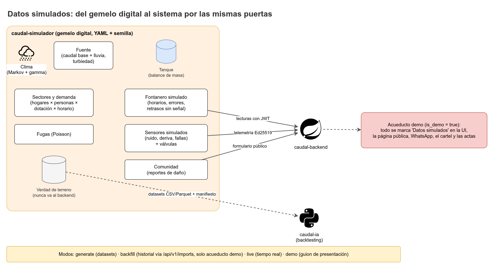

# Datos simulados

CAUDAL no tiene datos reales de la región todavía. Todo lo que en el futuro llegaría del campo (niveles del tanque, turnos cumplidos, fugas, reportes de la comunidad, fallas de sensores) se genera con `caudal-simulador`. Este documento explica por qué, cómo funciona, qué supuestos contiene, cómo lo trata el backend y cómo se reemplazaría por datos reales.



## 1. Por qué se simula

| Necesidad | Por qué no basta con esperar datos reales |
|---|---|
| Probar el pronóstico y su evaluación | La IA necesita historia diaria del nivel. Sin historia no hay pronóstico ni evaluación (ver `Modulo-IA.md`). |
| Probar propuestas de turnos y cierres | Las reglas de la Junta deben probarse con todas las bandas de nivel, incluido el nivel crítico. |
| Probar el manejo de errores | Datos fuera de rango, duplicados, datos viejos y fallas de la IA deben aparecer a voluntad, no por azar. |
| Demostrar el sistema a la Junta y a la materia | La demostración necesita un guion repetible. |
| Mantener el proyecto avanzando sin acceso al campo | Las veredas están lejos y el equipo no puede esperar a tener sensores instalados. |

El simulador **no reemplaza** la validación en campo. Un resultado obtenido con datos simulados prueba el sistema, no el acueducto.

## 2. Principio: mismas puertas que la realidad

El simulador entra al sistema **por las mismas APIs** que usaría la realidad:

| Actor simulado | Se conecta como | Endpoints |
|---|---|---|
| Fontanero | Usuario `OPERATOR` con JWT | `POST /api/v1/readings`, `POST /api/v1/readings/batch`, `POST /api/v1/schedule-items/{id}/execution`, `POST /api/v1/days/{date}/closure` |
| Sensor de nivel y actuador de válvula | Dispositivo con firma Ed25519 | `POST /api/v1/devices/telemetry`, `GET /api/v1/devices/commands`, `POST /api/v1/devices/commands/{id}/ack` |
| Comunidad | Sin login | `POST /api/v1/public/{aqueductSlug}/damage-reports` |
| Importador de historial | Usuario `PROJECT_TEAM` | `POST /api/v1/imports/readings`, `POST /api/v1/imports/shift-executions`, `POST /api/v1/imports/incidents` |
| Junta (solo en modo `live` con `--auto-junta`) | Usuario simulado con rol `BOARD_ADMIN` o `BOARD_MEMBER` | Flujo normal de propuesta y decisión |

Consecuencias:

- El backend no tiene rutas "de simulación". La única excepción es la importación de historial, y solo en el acueducto demo.
- Si un dato simulado entra por una puerta, la validación de lecturas, la cadena de decisiones y la auditoría se ejecutan igual que con datos reales.
- Cambiar el simulador por datos reales no cambia el backend: cambian quien llama a la API y el origen de los datos.

## 3. Qué se simula

El simulador es un **gemelo digital** del acueducto. Sus parámetros viven en archivos YAML con semilla fija (no en el código). Cada componente tiene un modelo y un conjunto de parámetros.


| Componente | Modelo | Parámetros principales (YAML) | Estado de los valores |
|---|---|---|---|
| **Clima** | Cadena de Markov de dos estados (húmedo y seco) por mes. En días húmedos, la lluvia sigue una distribución gamma. | Matriz de transición mensual; forma y escala de la gamma; régimen bimodal andino de Nariño. | Supuesto, verificar con datos meteorológicos de la zona. |
| **Fuente** | Caudal base más respuesta a la lluvia con retardo. Turbiedad que sube tras lluvias fuertes y genera la condición "agua con barro". | Caudal base (L/s); ganancia y retardo de la respuesta; umbral de turbiedad. | Por definir con la Junta y medición en campo. |
| **Tanque** | Balance de masa (ecuación en la sección 3.1). Nivel acotado a la regla del tanque. | Capacidad y área (`A`); nivel máximo; rango de la regla (`gauge_min`, `gauge_max`, `gauge_step`). | Regla 0 a 5 de la semilla (ejemplo); área y capacidad por medir. |
| **Sectores** | Demanda = hogares × personas × dotación × perfil horario. El agua sale solo con la válvula abierta. | Número de hogares por sector; personas por hogar (3 a 4, supuesto); dotación en L/hab/día (valor de referencia RAS 0330/2017 para más de 2.000 msnm, verificar); perfil horario (fracción diaria por hora). | Supuesto, verificar. |
| **Turnos** | Sigue los horarios publicados. Cada turno termina en cumplido, a medias o no cumplido con probabilidades dadas. | `p_completed`, `p_partial`, `p_not_executed` (suman 1). | Supuesto. |
| **Fugas** | Proceso de Poisson con tasa `λ` por mes. Una fuga suma caudal de salida hasta que se repara. Las familias reportan con una probabilidad por día. | `λ` (fugas por mes); caudal de la fuga; distribución del tiempo de reparación; probabilidad de reporte. | Supuesto, verificar con la historia del acueducto. |
| **Fontanero** | Lee a horas fijas con variación y redondeo al `gauge_step`. Errores humanos: ruido, dígito mal leído, valor fuera de rango, duplicados. Sin señal, guarda y envía horas después. | Horas de lectura y su variación; desviación típica del error; tasas de cada error; retraso máximo sin señal. | Supuesto. |
| **Sensores** | Ruido, deriva lineal, valor pegado, picos, caídas de datos. Batería solar que puede dejar huecos de datos. | Desviación del ruido; tasa de deriva por día; probabilidad de valor pegado, pico y caída; voltaje de batería. | Supuesto; ajustar con la ficha del sensor real (ver `Simulador-y-hardware.md`). |
| **Comunidad** | Reportes de daño por el formulario público, con probabilidad que depende de si hay fuga o agua sucia. | Probabilidad por evento; categorías del catálogo (fuga, tubo roto, sin agua, agua sucia, falla de válvula, otro). | Supuesto. |

### 3.1 Balance de masa del tanque

Para cada paso de tiempo `Δt`:

```
V(t + Δt) = V(t) + [ Q_entrada(t) - Q_salida(t) ] * Δt - Q_rebose(t) * Δt

Q_salida(t) = Σ_sectores  Q_sector(t) * open_sector(t)  +  Q_fuga(t)

Q_rebose(t) = max(0, V_pre(t+Δt) - V_max) / Δt

h(t) = V(t) / A
```

- `V` es el volumen en el tanque (L o m³), `h` el nivel en metros y `A` el área de la sección horizontal.
- `V_pre` es el volumen antes de aplicar el rebose. Si `V_pre` supera `V_max`, el exceso sale por rebose y `V` queda en `V_max`.
- El volumen nunca es negativo. Si la salida pedida supera el volumen disponible, la salida se recorta al volumen existente.
- `h` se recorta al rango de la regla pintada del tanque (`gauge_min`, `gauge_max`) antes de generar la lectura del fontanero.
- `Q_sector(t)` depende de la demanda del sector en la hora `t` y de su perfil horario.

### 3.2 Turnos y ejecución

- Los turnos salen de las propuestas **publicadas** de la BD (o de los horarios del escenario en `generate`).
- Un turno cumplido abre la válvula en su ventana. Uno a medias la cierra antes de tiempo. Uno no cumplido no la abre.
- El fontanero registra la ejecución al final del día (`COMPLETED`, `PARTIAL`, `NOT_EXECUTED`). El simulador tiene las mismas probabilidades que el fontanero real y puede equivocarse en el registro.

## 4. Verdad de terreno

La **verdad de terreno** es todo lo que el simulador sabe y el sistema no debe saber: nivel real del tanque, fugas activas, demanda real y errores de lectura cometidos.

- Se guarda en archivos separados (propuesta: carpeta `truth/` con Parquet por corrida).
- **Nunca** se envía al backend. Ninguna petición de la API incluye esos campos.
- Sirve para tres cosas: comparar lo que el sistema estimó con lo que pasó (por ejemplo, la estimación simple con el nivel real), medir qué tan bien detecta el sistema las fugas, y verificar que el simulador hace lo que dice.
- Una prueba automática revisa que los payloads enviados no contengan columnas de la verdad de terreno.

## 5. Modos del simulador

| Modo | Qué hace | Entrada | Salida | Destino |
|---|---|---|---|---|
| `generate` | Genera datasets de un escenario, sin red. | Escenario YAML y semilla. | Archivos CSV o Parquet de lecturas, turnos, incidentes y verdad de terreno, más un manifiesto con la semilla, la versión y los hashes. | Disco local. Para la IA, pruebas y evaluación offline. |
| `backfill` | Carga historial simulado en el acueducto demo. | Escenario, semilla, acueducto demo. | Lotes de lecturas, ejecuciones e incidentes. | Backend, por `/api/v1/imports/*`. Queda registro en `sim.import_batches`. |
| `live` | Simula el acueducto en tiempo real: lecturas, telemetría, turnos, reportes. | Escenario, acueducto demo, credenciales de cada actor simulado. | Eventos en tiempo real. | Backend y tablero del simulador (SSE). |
| `demo` | Ejecuta el guion de la sección 6 paso a paso, con pausas para mostrar cada efecto. | Escenario `presentation` y semilla. | Eventos del guion y lista de comprobación. | Backend (acueducto demo). |

- En `live`, la Junta es una **persona** en el frontend. La opción `--auto-junta` aprueba propuestas con un usuario simulado y solo se usa en corridas largas. Esas aprobaciones quedan marcadas en la auditoría como simuladas.
- Los lotes de `backfill` tienen un máximo de 5.000 filas o 1 MiB por petición (límite de importación de la API). El simulador parte el archivo en lotes.
- Todas las ejecuciones guardan la semilla y la versión del simulador. Con la misma semilla y escenario, el resultado es idéntico.

## 6. Guion del modo `demo`

El guion muestra los casos que el sistema debe manejar. Se ejecuta sobre el acueducto demo con reglas de la versión vigente y un historial corto cargado con `backfill`. La duración del historial es por definir.

| Paso | Qué ocurre | Qué debe verse en el sistema |
|---|---|---|
| 1. Preparación | El acueducto demo tiene `is_demo = true`, reglas vigentes, sectores, válvulas, un tanque con regla 0 a 5 y el historial cargado. | Banner "Datos simulados" en toda la UI. |
| 2. Lectura normal | El fontanero simulado registra una regla (por ejemplo, 3,4) con agua normal. | Lectura `ACCEPTED`. El estado del tanque muestra el último nivel y hace cuántas horas se tomó. |
| 3. Dato 8 que pide corrección | El fontanero escribe 8 en una regla de 0 a 5. | La API responde `422 GAUGE_OUT_OF_RANGE` y la lectura no se guarda. La app pide corregir antes de reenviar. La corrección exige motivo (10 a 500 caracteres) y el dato original se conserva. |
| 4. Agua con barro | El fontanero anota que el agua se ve con barro tras una lluvia fuerte. | La nota aparece en la lectura y en el cierre del día. Si la Junta lo confirma, se registra como novedad. |
| 5. Fuga y anomalía | Una fuga aumenta la salida. La caída del nivel supera lo esperado. | El sistema crea una anomalía con estatus `INFERRED`. La familia reporta por la página pública y el reporte pasa por `REPORTED`, `VERIFYING` y `CONFIRMED`. |
| 6. Sensor sin señal | El sensor se queda sin señal y llega una lectura con hora vieja. | La lectura entra con aviso `STALE` en el estado del tanque. Si la hora supera `max_backdate_days`, se rechaza con `TOO_OLD`. |
| 7. IA caída | El servicio de IA se detiene. | El circuito pasa a abierto. El pronóstico es la estimación simple con `fallback_reason = CIRCUIT_OPEN`. La UI lo indica. |
| 8. Propuesta y decisión | El sistema propone turnos. La Junta aprueba con un cambio, con motivo obligatorio. | Estados `PENDING_REVIEW` a `APPROVED_WITH_CHANGES`. La versión original queda en `proposal_snapshots`. |
| 9. Publicación | La Junta publica el horario. | Página pública, mensaje de WhatsApp y cartel muestran "Datos simulados". |
| 10. Cierre y acta | El fontanero registra la ejecución al final del día. La Junta genera el acta. | Turnos `COMPLETED` o `PARTIAL`. El acta separa observado, estimado, inferido y confirmado. |

## 7. Escenarios

| Escenario | Propósito | Cambios principales respecto al normal |
|---|---|---|
| `normal-year` (nombre propuesto) | Operación típica. Línea base. | Régimen bimodal con lluvias moderadas. |
| `dry-year` (nombre propuesto) | Prueba de racionamiento severo (tipo El Niño). | Menos lluvia; nivel bajo por más días; bandas críticas frecuentes. |
| `rainy-year` (nombre propuesto) | Prueba de desbordes y agua con barro (tipo La Niña). | Más lluvia; rebose; más turbiedad. |
| `frequent-leaks` (nombre propuesto) | Prueba de anomalías y reportes de la comunidad. | `λ` alto. |
| `defective-sensors` (nombre propuesto) | Prueba de datos viejos, valores pegados y picos. | Más deriva, valores pegados y caídas. |
| `presentation` (nombre propuesto) | Guion de la sección 6. | Eventos programados en pasos fijos. |

Los escenarios son archivos YAML validados con Pydantic. Ninguno contiene credenciales ni claves privadas: esas van en `.env` o en un directorio de claves ignorado por git.

## 8. Cómo lo trata el backend

| Aspecto | Regla |
|---|---|
| Marca | `org.aqueducts.is_demo = true` identifica el acueducto demo. Es simulado por definición. |
| Importación | Solo `POST /api/v1/imports/readings`, `/imports/shift-executions` y `/imports/incidents`, y solo si el acueducto tiene `is_demo = true`. Un trigger de `sim.import_batches` lo valida. |
| Permiso | Solo `PROJECT_TEAM` puede importar (permiso `IMPORT_DEMO_DATA` en la matriz de roles de `iam.role_permissions`, nombre de permiso propuesto). |
| Antigüedad | La importación en el acueducto demo puede traer datos más viejos que `max_backdate_days`. Es la única excepción de la regla de fechas. |
| Trazabilidad | Cada importación crea una fila en `sim.import_batches` con `kind`, `scenario_name`, `seed`, `simulator_version`, `rows_received`, `rows_accepted`, `rows_rejected`, `file_sha256`, `imported_by` e `imported_at`. Es append-only. |
| Etiqueta | "Datos simulados" aparece en la UI, la página pública, el mensaje de WhatsApp, el cartel y las actas de un acueducto demo. La etiqueta depende de `is_demo`, no de una bandera manual. |
| Aislamiento | Un acueducto demo nunca se mezcla con uno real. Los datos de `is_demo = true` no se copian a un acueducto real. |

Tabla `sim.import_batches` (resumen; especificación completa en `Diccionario-de-datos.md`): `id`, `aqueduct_id`, `kind` (`READINGS`, `SHIFT_EXECUTIONS`, `INCIDENTS`), `scenario_name`, `seed`, `simulator_version`, `rows_received`, `rows_accepted`, `rows_rejected`, `file_sha256`, `imported_by`, `imported_at`.

## 9. Supuestos

Todo valor que no viene de medición se marca **supuesto, verificar**. Esta lista se actualiza cuando se mide algo en campo.

| Supuesto | Valor de partida | Estado |
|---|---|---|
| Ubicación: Guaitarilla (Nariño) a unos 2.600 msnm | 2.600 msnm | Supuesto, verificar. |
| Hogares de 3 a 4 personas | 3 a 4 | Supuesto, verificar con censo local. |
| Dotación de referencia para más de 2.000 msnm | Valor de la RAS 0330/2017 | Supuesto, verificar en la norma vigente. |
| Régimen de lluvia bimodal andino | Dos temporadas de lluvia al año | Supuesto, verificar con datos del IDEAM o estación cercana. |
| Regla pintada del tanque 0 a 5 con paso de precisión | Semilla de ejemplo | La Junta define el rango real. |
| Capacidad, área y cota del tanque | Por medir | Por definir en campo. |
| Número de sectores y válvulas | Por definir | Por definir con la Junta. |
| Perfil horario de consumo | Pico matutino y vespertino | Supuesto, verificar con la Junta. |
| Probabilidades de cumplimiento de turnos | Por definir | Supuesto. |
| Tasa de fugas (`λ`) | Por definir | Supuesto. |
| Errores del fontanero | Por definir | Supuesto. |
| Fallas de sensor (deriva, picos, caídas) | Por definir | Supuesto; ajustar con la ficha del sensor. |

## 10. Cómo reemplazar los datos simulados por reales

El diseño permite el cambio sin tocar el backend. Los pasos son:

1. **Crear el acueducto real** con `is_demo = false`. Sus datos nunca vienen del simulador.
2. **Conectar los actores reales** por las mismas APIs: la app del fontanero (cola offline), los sensores reales (telemetría firmada) y la comunidad (formulario público).
3. **Cargar el historial real** si se necesita. La importación está restringida al acueducto demo. Cargar el historial de papel es un flujo distinto, que **por definir** y que debe quedar auditado.
4. **Recalibrar los parámetros** del simulador con los datos reales: área del tanque, caudales, demanda, tasa de fugas y lluvia. Los parámetros cambian en el YAML del escenario, no en el código.
5. **Mantener el simulador** como herramienta de pruebas y de demostración. Sus datos no se mezclan con los reales.
6. **Retirar etiquetas** de forma automática: la etiqueta "Datos simulados" depende de `is_demo`, así que desaparece sola en un acueducto real.

## 11. Validación del simulador

El simulador se valida con pruebas de propiedades (Hypothesis) además de ejemplos fijos.

| Propiedad | Prueba |
|---|---|
| Balance de masa | Para cualquier escenario generado, `Σ entradas - Σ salidas - rebose = ΔV` dentro de una tolerancia numérica por definir. |
| Rango del nivel | `0 <= h <= H_max`, y `h` dentro de `[gauge_min, gauge_max]` en las lecturas generadas. |
| Agua solo con válvula abierta | Ningún sector tiene salida con su válvula cerrada. |
| Sin volumen negativo | `V >= 0` en todo el horizonte. |
| Reproducibilidad | Misma semilla y escenario producen el mismo hash de archivo. |
| Frecuencias de eventos | Sobre muchos años simulados, la tasa empírica de fugas se acerca a `λ`. La proporción de días húmedos se acerca a la estacionaria de la cadena de Markov. |
| Ruido de sensor | Los residuos del sensor simulado siguen la desviación configurada. |
| Errores del fontanero | Las tasas de cada error coinciden con la configuración dentro de la tolerancia. |
| Contrato con la API | Cada payload valida contra los modelos Pydantic del simulador y contra el OpenAPI del backend. |
| Sin verdad de terreno en payloads | Ningún payload enviado contiene columnas de la verdad de terreno. |
| Guion `demo` | Ejecutar el guion de la sección 6 contra el backend levantado con Docker Compose y comprobar los efectos esperados. |

Las pruebas de integración del guion requieren el backend y la base de datos locales. Corren en el flujo de CI del simulador (propuesta).

Relacionados: [Simulador-y-hardware.md](Simulador-y-hardware.md), [Modulo-IA.md](Modulo-IA.md), [Roles-y-planeacion.md](Roles-y-planeacion.md), [Diccionario-de-datos.md](Diccionario-de-datos.md)
