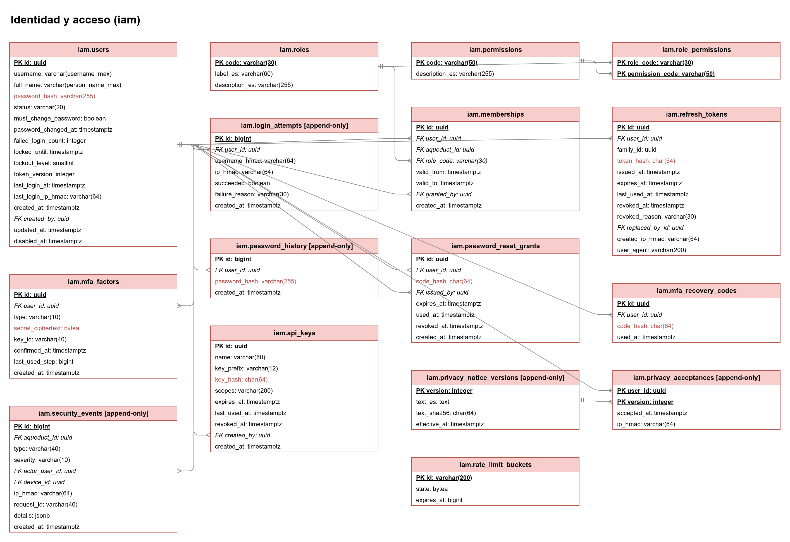
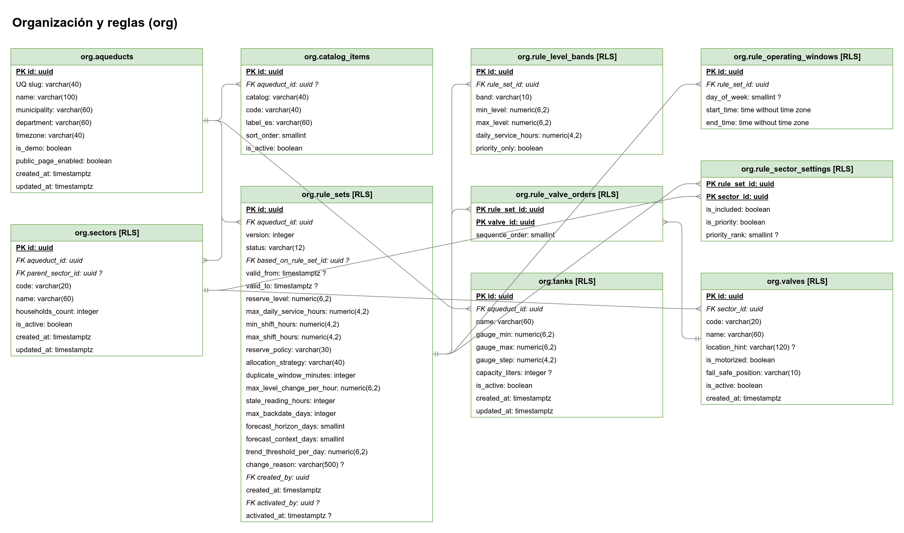
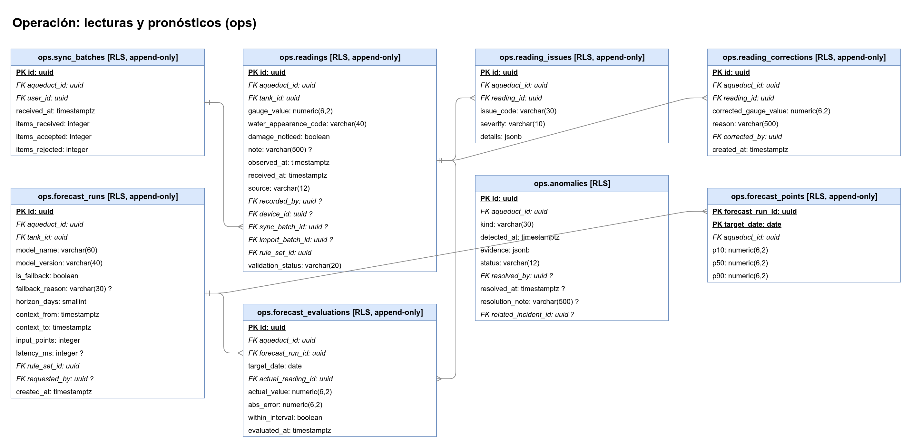
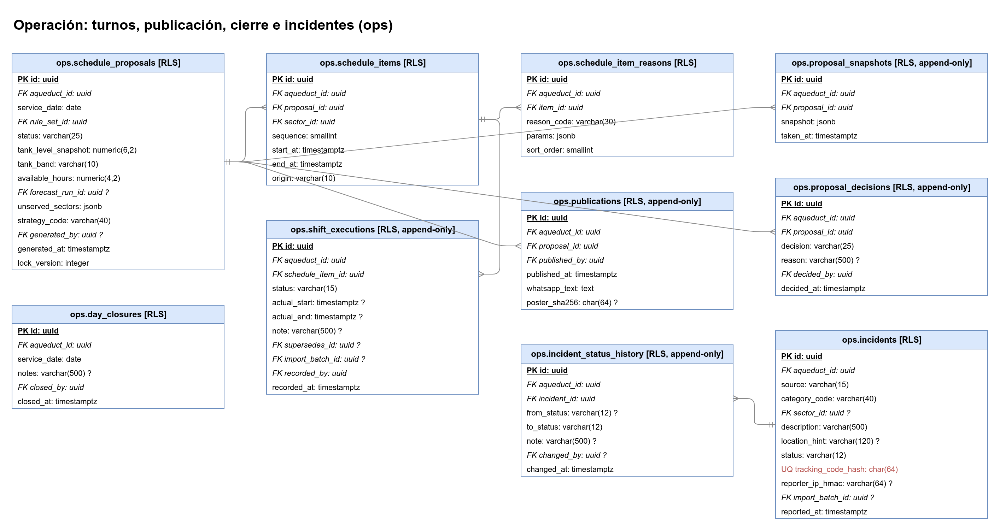
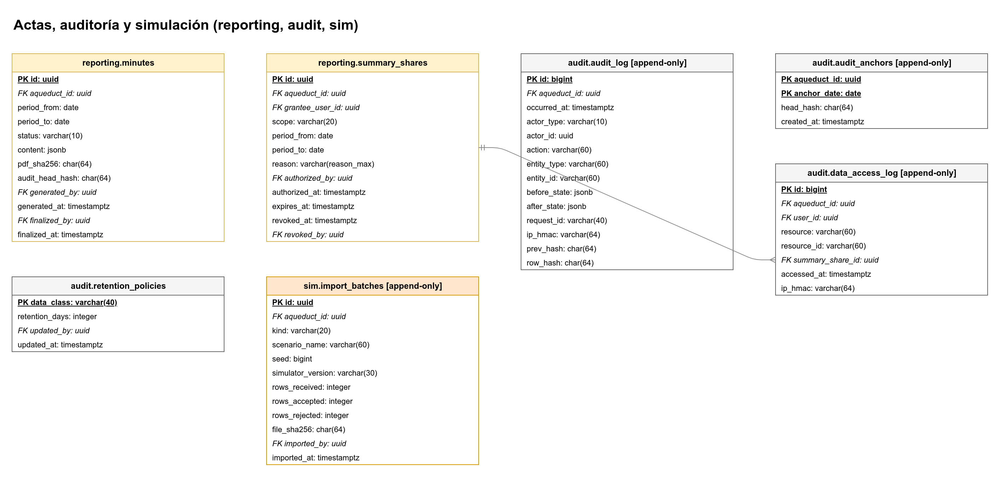
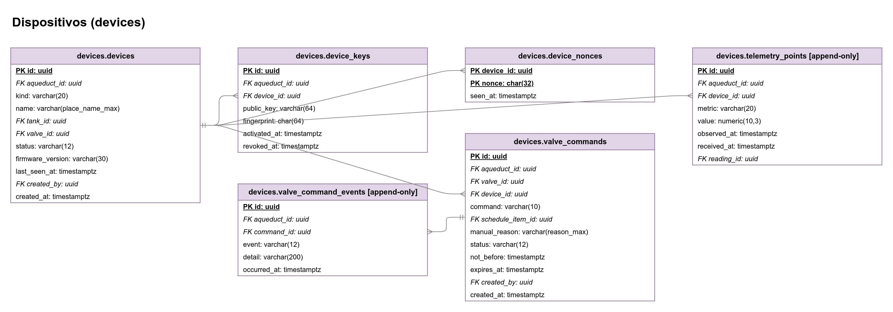

# Modelo de datos de CAUDAL

> PostgreSQL 18 con 7 esquemas y 57 tablas. Este documento explica la estructura, las convenciones y las decisiones de la base de datos. El detalle de cada columna (tipo, banderas, clasificación y restricciones) está en el [Diccionario de datos](Diccionario-de-datos.md), que genera otra persona del equipo a partir de la especificación del esquema.

## 1. Visión general

La base de datos es la fuente de verdad del sistema. Está organizada en siete esquemas por responsabilidad. Cada esquema agrupa tablas que cambian juntas y tienen el mismo nivel de sensibilidad.

| Esquema | Tablas | Para qué sirve |
|---|---|---|
| `iam` | 16 | Identidad, acceso y seguridad: cuentas, roles, permisos, membresías, sesiones, MFA, bloqueos, aviso de privacidad y eventos de seguridad. |
| `org` | 10 | Organización del acueducto: acueductos, tanques, sectores, válvulas, catálogos y versiones de reglas de la Junta. |
| `ops` | 18 | Operación diaria: lecturas, validación, correcciones, anomalías, pronósticos, propuestas de turnos, decisiones, publicación, ejecución de turnos, cierre del día e incidentes. |
| `reporting` | 2 | Actas y autorizaciones de resúmenes para entidades de apoyo. |
| `devices` | 6 | Dispositivos de campo (sensores, actuadores, gateways), claves públicas, nonces, telemetría y comandos de válvula. |
| `audit` | 4 | Auditoría con cadena de hashes, anclas diarias, registro de accesos a datos sensibles y políticas de retención. |
| `sim` | 1 | Trazabilidad de las importaciones de datos simulados. Solo acepta acueductos con `is_demo = true`. |

Dependencias entre esquemas (de quién depende cada uno):

```text
org.aqueducts  <-- casi todas las tablas tienen aqueduct_id
iam.users      <-- created_by, recorded_by, decided_by, ... (auditoría de autor)
org            <-- ops, devices, reporting
sim            <-- ops.readings, ops.incidents, ops.shift_executions (importaciones)
devices        <-- ops.readings.device_id, iam.security_events.device_id
ops            <-- devices.telemetry_points, devices.valve_commands, reporting
audit          <-- solo registra; no es referenciado por el dominio
```

La ERD muestra las relaciones de cada esquema en páginas separadas:


| Página | Imagen | Contenido |
|---|---|---|
| Visión general |  | Los siete esquemas y sus dependencias. |
| `iam` |  | Cuentas, roles, permisos, membresías, sesiones, MFA y privacidad. |
| `org` |  | Acueducto, tanques, sectores, válvulas, catálogos y reglas. |
| `ops` (lecturas) |  | Lotes, lecturas, incidencias, correcciones, anomalías y pronósticos. |
| `ops` (turnos) |  | Propuestas, turnos, decisiones, publicaciones, ejecuciones, cierres e incidentes. |
| `reporting`, `audit` y `sim` |  | Actas, resúmenes, auditoría, accesos e importaciones. |
| `devices` |  | Dispositivos, claves, nonces, telemetría y comandos. |

Nota: la especificación cuenta 7 páginas. Las seis páginas por esquema más la visión general suman 7, pero `ops` se divide en dos páginas. Los nombres coinciden con los archivos que ya existen en `docs/images/`.

## 2. Tablas por esquema

Cada tabla indica su propósito, si es append-only (solo se insertan filas, sin `UPDATE` ni `DELETE`), si tiene RLS por acueducto y sus relaciones principales (FK). Las columnas de cada tabla están en el diccionario de datos.

Totales: 57 tablas. 23 son append-only. 37 tienen RLS.

#### Esquema `iam` (16 tablas)

| Tabla | Propósito | Append-only | RLS | Relaciones principales (FK) |
|---|---|---|---|---|
| `users` | Cuentas de personas que inician sesión (Junta, fontanero, equipo, entidades). | No | No | `created_by` → `iam.users` |
| `roles` | Catálogo de roles del sistema. | No | No | Ninguna |
| `permissions` | Permisos finos que el código verifica. | No | No | Ninguna |
| `role_permissions` | Matriz rol-permiso guardada en datos (sin quemar en código). | No | No | `role_code` → `iam.roles`; `permission_code` → `iam.permissions` |
| `memberships` | Pertenencia de un usuario a un acueducto con un rol y una vigencia. | No | Sí | `user_id` → `iam.users`; `aqueduct_id` → `org.aqueducts`; `role_code` → `iam.roles`; `granted_by` → `iam.users` |
| `refresh_tokens` | Sesiones (refresh tokens opacos con rotación y detección de reutilización). | No | No | `user_id` → `iam.users`; `replaced_by_id` → `iam.refresh_tokens` |
| `login_attempts` | Intentos de inicio de sesión para bloqueo y monitoreo (retención limitada). | Sí | No | `user_id` → `iam.users` |
| `password_history` | Hashes anteriores para impedir reutilizar contraseñas. | Sí | No | `user_id` → `iam.users` |
| `password_reset_grants` | Códigos de un solo uso que emite la Junta para restablecer una contraseña. | No | No | `user_id` → `iam.users`; `issued_by` → `iam.users` |
| `mfa_factors` | Segundo factor TOTP opcional. | No | No | `user_id` → `iam.users` |
| `mfa_recovery_codes` | Códigos de respaldo del segundo factor. | No | No | `user_id` → `iam.users` |
| `api_keys` | Llaves para tareas internas (por ejemplo, cron de evaluación). | No | No | `created_by` → `iam.users` |
| `privacy_notice_versions` | Versiones del aviso de privacidad (Ley 1581 de 2012). | Sí | No | Ninguna |
| `privacy_acceptances` | Aceptación del aviso de privacidad por usuario. | Sí | No | `user_id` → `iam.users`; `version` → `iam.privacy_notice_versions` |
| `security_events` | Eventos de seguridad para monitoreo (bloqueos, reutilización de token, firma inválida, etc.). | Sí | No | `aqueduct_id` → `org.aqueducts`; `actor_user_id` → `iam.users`; `device_id` → `devices.devices` |
| `rate_limit_buckets` | Estado de Bucket4j en PostgreSQL para límites compartidos entre instancias. | No | No | Ninguna |

#### Esquema `org` (10 tablas)

| Tabla | Propósito | Append-only | RLS | Relaciones principales (FK) |
|---|---|---|---|---|
| `aqueducts` | Acueductos veredales. El acueducto demo (is_demo) contiene solo datos simulados. | No | No | Ninguna |
| `tanks` | Tanques y el rango de su regla pintada (fuente única del rango válido de una lectura). | No | Sí | `aqueduct_id` → `org.aqueducts` |
| `sectors` | Sectores que reciben agua por turnos (jerarquía para el patrón Composite). Sin datos personales. | No | Sí | `aqueduct_id` → `org.aqueducts`; `parent_sector_id` → `org.sectors` |
| `valves` | Válvulas físicas de cada sector. | No | Sí | `sector_id` → `org.sectors` |
| `catalog_items` | Opciones de listas (aspecto del agua, categorías de daño) con etiqueta en español. | No | No | `aqueduct_id` → `org.aqueducts` |
| `rule_sets` | Versiones de las reglas de la Junta. `reserve_policy` (`NONE`, `REDUCE_TO_CRITICAL_BAND` por defecto, `PRIORITY_ONLY`) y `change_reason` (obligatorio al activar). Inmutables una vez activas (trigger). | No | Sí | `aqueduct_id` → `org.aqueducts`; `based_on_rule_set_id` → `org.rule_sets`; `created_by` → `iam.users`; `activated_by` → `iam.users` |
| `rule_level_bands` | Bandas de nivel con horas de servicio. Sin solapes (EXCLUDE con numrange). | No | Sí | `rule_set_id` → `org.rule_sets` |
| `rule_sector_settings` | Prioridad e inclusión de cada sector por versión de reglas. | No | Sí | `rule_set_id` → `org.rule_sets`; `sector_id` → `org.sectors` |
| `rule_valve_orders` | Orden de apertura de las válvulas por versión de reglas. | No | Sí | `rule_set_id` → `org.rule_sets`; `valve_id` → `org.valves` |
| `rule_operating_windows` | Horarios en los que se puede operar, por versión de reglas. | No | Sí | `rule_set_id` → `org.rule_sets` |

#### Esquema `ops` (18 tablas)

| Tabla | Propósito | Append-only | RLS | Relaciones principales (FK) |
|---|---|---|---|---|
| `sync_batches` | Lotes de sincronización enviados por la app sin conexión. | Sí | Sí | `aqueduct_id` → `org.aqueducts`; `user_id` → `iam.users` |
| `readings` | Lecturas del tanque (append-only). Estatus epistémico OBSERVED. | Sí | Sí | `aqueduct_id` → `org.aqueducts`; `tank_id` → `org.tanks`; `recorded_by` → `iam.users`; `device_id` → `devices.devices`; `sync_batch_id` → `ops.sync_batches`; `import_batch_id` → `sim.import_batches`; `rule_set_id` → `org.rule_sets` |
| `reading_issues` | Problemas que detectó la cadena de validación. | Sí | Sí | `aqueduct_id` → `org.aqueducts`; `reading_id` → `ops.readings` |
| `reading_corrections` | Correcciones sin borrar el dato original (la vista effective_readings usa la última). | Sí | Sí | `aqueduct_id` → `org.aqueducts`; `reading_id` → `ops.readings`; `corrected_by` → `iam.users` |
| `anomalies` | Sospechas inferidas por reglas (estatus INFERRED hasta confirmarse). | No | Sí | `aqueduct_id` → `org.aqueducts`; `resolved_by` → `iam.users`; `related_incident_id` → `ops.incidents` |
| `forecast_runs` | Cada pronóstico calculado (IA o estimación simple). Estatus ESTIMATED. | Sí | Sí | `aqueduct_id` → `org.aqueducts`; `tank_id` → `org.tanks`; `rule_set_id` → `org.rule_sets`; `requested_by` → `iam.users` |
| `forecast_points` | Cuantiles p10, p50 y p90 por día pronosticado. | Sí | Sí | `forecast_run_id` → `ops.forecast_runs`; `aqueduct_id` → `org.aqueducts` |
| `forecast_evaluations` | Error de cada punto cuando llega el dato real (IA y estimación simple). | Sí | Sí | `aqueduct_id` → `org.aqueducts`; `forecast_run_id` → `ops.forecast_runs`; `actual_reading_id` → `ops.readings` |
| `schedule_proposals` | Propuesta de turnos de un día (máquina de estados). Sectores sin turno con su motivo en `unserved_sectors` (jsonb). | No | Sí | `aqueduct_id` → `org.aqueducts`; `rule_set_id` → `org.rule_sets`; `forecast_run_id` → `ops.forecast_runs`; `generated_by` → `iam.users` |
| `schedule_items` | Turnos por sector. Sin solapes (EXCLUDE con tstzrange). | No | Sí | `aqueduct_id` → `org.aqueducts`; `proposal_id` → `ops.schedule_proposals`; `sector_id` → `org.sectors` |
| `schedule_item_reasons` | Explicaciones estructuradas de cada turno (código y parámetros). | No | Sí | `aqueduct_id` → `org.aqueducts`; `item_id` → `ops.schedule_items` |
| `proposal_snapshots` | Memento de la propuesta original antes de que la Junta la cambie. | Sí | Sí | `aqueduct_id` → `org.aqueducts`; `proposal_id` → `ops.schedule_proposals` |
| `proposal_decisions` | Decisión de la Junta (append-only). Modificar o rechazar exige motivo. | Sí | Sí | `aqueduct_id` → `org.aqueducts`; `proposal_id` → `ops.schedule_proposals`; `decided_by` → `iam.users` |
| `publications` | Publicación de un horario aprobado. | Sí | Sí | `aqueduct_id` → `org.aqueducts`; `proposal_id` → `ops.schedule_proposals`; `published_by` → `iam.users` |
| `shift_executions` | Lo que pasó realmente en cada turno (CONFIRMED). Se reemplaza con supersedes_id. | Sí | Sí | `aqueduct_id` → `org.aqueducts`; `schedule_item_id` → `ops.schedule_items`; `supersedes_id` → `ops.shift_executions`; `import_batch_id` → `sim.import_batches`; `recorded_by` → `iam.users` |
| `day_closures` | Cierre del día de servicio. | No | Sí | `aqueduct_id` → `org.aqueducts`; `closed_by` → `iam.users` |
| `incidents` | Reportes de daño (públicos, del fontanero o derivados de anomalías). Sin datos personales. | No | Sí | `aqueduct_id` → `org.aqueducts`; `sector_id` → `org.sectors`; `import_batch_id` → `sim.import_batches` |
| `incident_status_history` | Historial de estados de un incidente. | Sí | Sí | `aqueduct_id` → `org.aqueducts`; `incident_id` → `ops.incidents`; `changed_by` → `iam.users` |

#### Esquema `reporting` (2 tablas)

| Tabla | Propósito | Append-only | RLS | Relaciones principales (FK) |
|---|---|---|---|---|
| `minutes` | Actas por periodo con secciones observado, estimado, inferido y confirmado. | No | Sí | `aqueduct_id` → `org.aqueducts`; `generated_by` → `iam.users`; `finalized_by` → `iam.users` |
| `summary_shares` | Autorizaciones de la Junta para que una entidad vea resúmenes. | No | Sí | `aqueduct_id` → `org.aqueducts`; `grantee_user_id` → `iam.users`; `authorized_by` → `iam.users`; `revoked_by` → `iam.users` |

#### Esquema `devices` (6 tablas)

| Tabla | Propósito | Append-only | RLS | Relaciones principales (FK) |
|---|---|---|---|---|
| `devices` | Sensores de nivel, actuadores de válvula y gateways. | No | Sí | `aqueduct_id` → `org.aqueducts`; `tank_id` → `org.tanks`; `valve_id` → `org.valves`; `created_by` → `iam.users` |
| `device_keys` | Claves públicas Ed25519 con rotación (la privada nunca llega al servidor). | No | Sí | `aqueduct_id` → `org.aqueducts`; `device_id` → `devices.devices` |
| `device_nonces` | Nonces ya vistos (anti-repetición); se purgan según retention_policies. | No | No | `device_id` → `devices.devices` |
| `telemetry_points` | Telemetría cruda de los dispositivos (idempotente por id del punto). | Sí | Sí | `aqueduct_id` → `org.aqueducts`; `device_id` → `devices.devices`; `reading_id` → `ops.readings` |
| `valve_commands` | Comandos de válvula, solo desde turnos aprobados o manuales con motivo. | No | Sí | `aqueduct_id` → `org.aqueducts`; `valve_id` → `org.valves`; `device_id` → `devices.devices`; `schedule_item_id` → `ops.schedule_items`; `created_by` → `iam.users` |
| `valve_command_events` | Historial de entrega y confirmación de cada comando. | Sí | Sí | `aqueduct_id` → `org.aqueducts`; `command_id` → `devices.valve_commands` |

#### Esquema `audit` (4 tablas)

| Tabla | Propósito | Append-only | RLS | Relaciones principales (FK) |
|---|---|---|---|---|
| `audit_log` | Registro append-only con cadena de hashes (cada fila incluye el hash de la anterior). | Sí | Sí | `aqueduct_id` → `org.aqueducts` |
| `audit_anchors` | Hash cabeza diario de la cadena (se imprime en las actas). | Sí | No | `aqueduct_id` → `org.aqueducts` |
| `data_access_log` | Quién vio o exportó datos sensibles o autorizados. | Sí | Sí | `aqueduct_id` → `org.aqueducts`; `user_id` → `iam.users`; `summary_share_id` → `reporting.summary_shares` |
| `retention_policies` | Días de retención por tipo de dato (parámetro en BD, no en código). | No | No | `updated_by` → `iam.users` |

#### Esquema `sim` (1 tablas)

| Tabla | Propósito | Append-only | RLS | Relaciones principales (FK) |
|---|---|---|---|---|
| `import_batches` | Importaciones de historial simulado (solo acueductos con is_demo = true). | Sí | Sí | `aqueduct_id` → `org.aqueducts`; `imported_by` → `iam.users` |


### 2.1 Tablas con `aqueduct_id` pero sin RLS

Estas tablas tienen la columna de acueducto y, según la especificación, no tienen RLS. Se documentan tal cual están escritas y deben revisarse antes de la Fase 2 (verificar):

| Tabla | Situación | Riesgo y decisión pendiente |
|---|---|---|
| `iam.security_events` | `aqueduct_id` nullable, sin RLS. | Un evento de seguridad de otro acueducto podría verse si la consulta no filtra por código. Verificar si se activa RLS o si el acceso queda solo en el módulo de auditoría. |
| `audit.audit_anchors` | `aqueduct_id` es parte de la clave primaria, sin RLS. | Las anclas se imprimen en actas. `Seguridad-de-la-base-de-datos.md` propone activar RLS (propuesta). La decisión queda abierta. |
| `org.catalog_items` | `aqueduct_id` nullable. Nulo significa catálogo global. | Una fila global no debe filtrarse por RLS. Verificar la política: `aqueduct_id IS NULL OR aqueduct_id = app.aqueduct_id`. |

Otras tablas sin RLS no tienen acueducto: son globales o de cuenta (`iam.users`, `iam.roles`, `iam.permissions`, `iam.role_permissions`, `iam.refresh_tokens`, `iam.login_attempts`, `iam.password_history`, `iam.password_reset_grants`, `iam.mfa_factors`, `iam.mfa_recovery_codes`, `iam.api_keys`, `iam.privacy_notice_versions`, `iam.privacy_acceptances`, `iam.rate_limit_buckets`, `org.aqueducts`, `devices.device_nonces`, `audit.retention_policies`). La protección de estas tablas recae en los roles de BD y en la aplicación.

## 3. Relaciones clave

### 3.1 Acueducto como raíz

`org.aqueducts` es la raíz de la jerarquía de datos. Casi todas las tablas de negocio tienen `aqueduct_id` como FK. La membresía (`iam.memberships`) conecta a un usuario con un acueducto y un rol con vigencia. Un usuario puede tener membresías en varios acueductos, pero las consultas siempre filtran por el acueducto de la sesión.

### 3.2 Reglas versionadas

`org.rule_sets` es una versión de reglas. Sus hijos (`rule_level_bands`, `rule_sector_settings`, `rule_valve_orders`, `rule_operating_windows`) pertenecen a esa versión. Una versión activa es inmutable: un trigger impide cambiarla. Para cambiar una regla se crea un borrador copiando la versión vigente (`based_on_rule_set_id`), se edita y se activa. Las lecturas, propuestas y pronósticos guardan `rule_set_id`, así siempre se sabe qué reglas estaban vigentes.

### 3.3 Cadena de lecturas

```text
ops.readings (append-only, valor original)
   ├── ops.reading_issues       (problemas guardados: DUPLICATE, SUDDEN_JUMP; los rechazos 422 no se guardan)
   ├── ops.reading_corrections  (correcciones, sin borrar el original)
   ├── ops.forecast_evaluations (error del pronóstico cuando llega el dato real)
   └── devices.telemetry_points.reading_id (lectura generada desde telemetría)

ops.effective_readings (vista) = lectura original + última corrección
```

### 3.4 Pronóstico y evaluación

`ops.forecast_runs` guarda cada pronóstico (IA o estimación simple). `ops.forecast_points` guarda los cuantiles p10, p50 y p90 por día. `ops.forecast_evaluations` compara el p50 contra la lectura real. Con eso se calcula el skill de la IA frente a la estimación simple (M10).

### 3.5 Propuesta, decisión y turnos

```text
ops.schedule_proposals (máquina de estados)
   ├── ops.proposal_snapshots     (memento: propuesta original)
   ├── ops.proposal_decisions     (decisiones de la Junta, con motivo si cambian)
   ├── ops.publications           (1 a 1, UNIQUE en proposal_id)
   └── ops.schedule_items         (turnos por sector, sin solapes)
          ├── ops.schedule_item_reasons   (explicaciones: código y parámetros)
          └── ops.shift_executions        (lo que pasó; se reemplaza con supersedes_id)
```

Un turno no se edita después de ejecutado. Si hay que corregir lo que pasó, se inserta una nueva `shift_executions` que apunta a la anterior con `supersedes_id`.

### 3.6 Incidentes y anomalías

`ops.incidents` guarda reportes de daño de la comunidad, del fontanero o de anomalías. Su historial de estados está en `ops.incident_status_history` (append-only). `ops.anomalies` son sospechas inferidas por reglas y pueden enlazarse a un incidente (`related_incident_id`).

### 3.7 Dispositivos y comandos

`devices.devices` son sensores, actuadores y gateways. Sus claves públicas Ed25519 viven en `devices.device_keys` (con rotación). `devices.device_nonces` guarda nonces para evitar repeticiones. Los comandos de válvula (`devices.valve_commands`) solo nacen de un turno aprobado (`schedule_item_id`) o de un motivo manual del `BOARD_ADMIN` (`manual_reason`).

### 3.8 Actas, resúmenes y accesos

`reporting.minutes` guarda el contenido de un acta (secciones observado, estimado, inferido y confirmado). Un acta `FINAL` es inmutable. `reporting.summary_shares` es la autorización de la Junta para que una entidad vea un resumen, con vencimiento obligatorio. Cada vez que una entidad lo usa, se registra en `audit.data_access_log`, con la autorización usada (`summary_share_id`).

### 3.9 Auditoría

`audit.audit_log` es un registro append-only donde cada fila guarda `prev_hash` (la fila anterior del mismo acueducto) y `row_hash` (SHA-256 del contenido y del `prev_hash`). Un trigger calcula el hash. `audit.audit_anchors` guarda la cabeza de la cadena cada día. Ese valor se imprime en las actas para demostrar que no se modificó el registro.

## 4. Vista `ops.effective_readings`

La vista devuelve una fila por lectura, con el valor efectivo: el valor corregido más reciente si existe, o el valor original si no hay correcciones. Todo el estado del tanque y los pronósticos usan esta vista, no la tabla `ops.readings` directamente.

Decisiones propuestas (verificar):

- La vista se crea con `WITH (security_invoker = true)` (disponible en PostgreSQL 15 y superiores). Así la RLS de las tablas base se aplica a quien consulta la vista. Sin esa opción, la vista se ejecuta con el dueño y saltaría la RLS.
- Las lecturas guardadas tienen `validation_status` `ACCEPTED` o `FLAGGED`. Una lectura inválida (`422`) no se guarda, así que la vista no necesita filtrar rechazadas.
- La vista expone `corrected_by` y la fecha de la corrección (`created_at` de `reading_corrections`) para la traza. El motivo de la corrección (`reason`) solo se muestra a la Junta (verificar).

## 5. Convenciones

| Tema | Convención | Ejemplo |
|---|---|---|
| Idioma | Nombres de esquemas, tablas, columnas y valores de código en inglés, `snake_case`. Las etiquetas visibles en español van en columnas `label_es` o `description_es`. | `ops.schedule_items`, `label_es` |
| Identificadores | `uuid` generado en la BD con `uuidv7()` (nativo en PostgreSQL 18). El cliente puede proponer el UUID en tablas de idempotencia (`ops.readings`, `ops.sync_batches`, `devices.telemetry_points`). | `id uuid PRIMARY KEY DEFAULT uuidv7()` |
| Tiempo | `timestamptz` en UTC. Las fechas de servicio son `date` y se interpretan en la zona del acueducto. | `observed_at timestamptz NOT NULL` |
| Auditoría de filas | `created_at` y `updated_at` en tablas mutables. `updated_at` lo actualiza un trigger. Las tablas append-only tienen solo la marca de creación (por ejemplo, `recorded_at`, `decided_at`). | `created_at timestamptz NOT NULL DEFAULT now()` |
| Estados | Columna `varchar` con `CHECK (status IN (...))`. Las listas de opciones que puede editar la Junta viven en `org.catalog_items`, no en un `CHECK`. | `CHECK (status IN ('DRAFT', 'ACTIVE', ...))` |
| Niveles del tanque | `numeric(6,2)`. El paso de lectura va en `gauge_step numeric(4,2)`. | `gauge_value numeric(6,2)` |
| Horas | `numeric(4,2)`, en horas decimales. | `daily_service_hours numeric(4,2)` |
| Textos | `varchar(n)` con el límite de `FieldLimits`, por placeholder de Flyway. Texto libre largo: `text` con límite por `CHECK` de longitud. | `varchar(${person_name_max})` |
| Clasificación de columnas | Cada columna se clasifica en `P` (pública), `I` (interna), `C` (confidencial) o `S` (secreta). Las columnas `S` (por ejemplo `password_hash`, `token_hash`) no tienen permiso de lectura para `caudal_readonly`. | `password_hash` es `S` |
| Claves foráneas | `ON DELETE RESTRICT` en todas. Nada se borra en cascada; los datos se retiran con purgas controladas por funciones `SECURITY DEFINER`. | `REFERENCES org.aqueducts(id) ON DELETE RESTRICT` |
| Unicidad y solapes | `UNIQUE` para identificadores de negocio. `EXCLUDE` con `btree_gist` para bandas (`numrange`) y turnos (`tstzrange`). | `EXCLUDE USING gist (...)` |
| Datos personales | Ninguna tabla de `ops` ni `org` guarda teléfonos de familias. Los nombres (`users.full_name`) son `C` y nunca salen en lo público. | `users.full_name` es `C` |

## 6. Roles de base de datos

| Rol | Uso | Privilegios |
|---|---|---|
| `caudal_migrator` | Dueño del esquema. Solo lo usa Flyway. | DDL completo. Nunca lo usa la aplicación. |
| `caudal_app` | Usuario de la API. | DML mínimo: `SELECT` y `INSERT` en tablas append-only, `UPDATE` solo en columnas permitidas, sin `DELETE` salvo purgas por funciones `SECURITY DEFINER`. Sin acceso a columnas `S` salvo lo necesario. |
| `caudal_readonly` | Vistas de reportes. | `SELECT` sobre vistas. Sin `password_hash` ni `token_hash`. |

Por rol se configuran los tiempos: `statement_timeout` 5 s, `lock_timeout` 3 s y `idle_in_transaction_session_timeout` 10 s.

### 6.1 Purgas por retención

| Tabla | Tratamiento | Quién purga |
|---|---|---|
| `iam.login_attempts`, `iam.security_events`, `audit.data_access_log`, `devices.telemetry_points` | Append-only con plazo de retención. | Función `SECURITY DEFINER` de purga. |
| `devices.device_nonces`, `iam.refresh_tokens` | No son append-only. Se purgan por plazo. | Función de purga. |

Reglas:
- La función lee el plazo de `audit.retention_policies` (clases `LOGIN_ATTEMPTS`, `DEVICE_NONCES`, `SECURITY_EVENTS`, `REFRESH_TOKENS`, `DATA_ACCESS_LOG`, `TELEMETRY_POINTS`).
- Antes de borrar, escribe un registro `PURGE` en `audit.audit_log` con la clase de dato, la fecha de corte y el número de filas.
- `caudal_app` no tiene `DELETE` directo. Los valores iniciales de retención están en la semilla (sección 21 de los hechos).

## 7. Migraciones

### 7.1 Herramienta y reglas

- Flyway con archivos en `src/main/resources/db/migration/`. Nombre: `V<NNNN>__<descripcion_en_minusculas>.sql`, con cuatro dígitos (ejemplo de `Seguridad-de-la-base-de-datos.md`: `V0007__iam_users.sql`).
- Una migración por grupo de tablas (propuesta de la sección 7.2). Dentro de una migración, el orden de creación respeta las claves foráneas.
- Las migraciones aplicadas nunca se editan. Un cambio se hace con una migración nueva. Si Flyway detecta un cambio de checksum, el arranque falla. Reparar (`flyway repair`) solo con aprobación de quien mantiene la BD.
- Los límites de longitud y de caracteres vienen de `FieldLimits` como placeholders (`${person_name_max}`). El valor no se escribe a mano en SQL. Las constantes siguen `<CAMPO>_MIN`, `_MAX` y `_PATTERN`; el placeholder es el mismo nombre en minúsculas (ver [Configuración sin valores quemados](Configuracion-sin-valores-quemados.md)). La deriva entre `FieldLimits` y la BD se prueba (ver `.agents/testing-plan.md`).
- Flyway se conecta con `FLYWAY_URL` y `FLYWAY_USER` (`caudal_migrator`), siempre por la conexión directa de Neon, no por el pooler (verificar).
- Los datos de semilla van en migraciones separadas de la estructura, para poder revisarlos por aparte.

### 7.2 Orden propuesto de migraciones

La secuencia cruza esquemas. Por ejemplo, `org.rule_sets` depende de `iam.users`, y `iam.memberships` depende de `org.aqueducts`. Por eso el orden se fija por grupo. Propuesta (verificar al implementar la Fase 2):

| Versión | Grupo | Tablas principales | Dependencias que resuelve |
|---|---|---|---|
| `V0001` | Base | Extensiones `pgcrypto` y `btree_gist`, esquemas, roles de BD, función de `updated_at`. | Ninguna. |
| `V0002` | Identidad base | `iam.roles`, `iam.permissions`, `iam.role_permissions`, `iam.users`, `iam.password_history`, `iam.refresh_tokens`, `iam.login_attempts`, `iam.mfa_factors`, `iam.mfa_recovery_codes`, `iam.password_reset_grants`, `iam.api_keys`, `iam.privacy_notice_versions`, `iam.privacy_acceptances`, `iam.rate_limit_buckets`. | `users.created_by` se refiere a la misma tabla. |
| `V0003` | Organización | `org.aqueducts`, `iam.memberships`, `org.tanks`, `org.sectors`, `org.valves`, `org.catalog_items`, `org.rule_sets` y sus hijos (`rule_level_bands`, `rule_sector_settings`, `rule_valve_orders`, `rule_operating_windows`). | `memberships` necesita `aqueducts`. `rule_sets` necesita `users`. |
| `V0004` | Dispositivos y seguridad | `sim.import_batches`, `devices.devices`, `devices.device_keys`, `devices.device_nonces`, `iam.security_events`, `audit.retention_policies`. | `security_events` referencia `devices.devices`, por eso va después de `devices`. |
| `V0005` | Operación de lecturas | `ops.sync_batches`, `ops.readings`, `ops.reading_issues`, `ops.reading_corrections`, `ops.incidents`, `ops.incident_status_history`, `ops.anomalies`, `ops.forecast_runs`, `ops.forecast_points`, `ops.forecast_evaluations`, vista `ops.effective_readings`. | `readings` referencia `devices` y `sim`. `anomalies` referencia `incidents`, por eso `incidents` va primero. |
| `V0006` | Operación de turnos | `ops.schedule_proposals`, `ops.schedule_items`, `ops.schedule_item_reasons`, `ops.proposal_snapshots`, `ops.proposal_decisions`, `ops.publications`, `ops.shift_executions`, `ops.day_closures`. | `shift_executions` se autorreferencia (`supersedes_id`). |
| `V0007` | Telemetría y comandos | `devices.telemetry_points`, `devices.valve_commands`, `devices.valve_command_events`. | Necesitan `ops.readings` y `ops.schedule_items`. |
| `V0008` | Reportes y auditoría | `reporting.minutes`, `reporting.summary_shares`, `audit.audit_log`, `audit.audit_anchors`, `audit.data_access_log`. | `data_access_log` referencia `summary_shares`. |
| `V0009` | Triggers, RLS y privilegios | Funciones y triggers de inmutabilidad, cadena de hashes, rango de lecturas, `updated_at`; políticas RLS; `GRANT` y `REVOKE` por columna. | Todas las tablas ya existen. |
| `V0010` | Semilla demo | Acueducto demo, reglas y catálogos iniciales. | Requiere todo lo anterior. |

Los triggers y las políticas van en una migración aparte (`V0009`) para que sean fáciles de revisar y de auditar.

## 8. Semilla del acueducto demo

La semilla crea un acueducto ficticio con datos simulados. Su propósito es permitir la demo y las pruebas de integración sin datos reales. Todo lo que contiene tiene `is_demo = true` y se muestra como "Datos simulados".

| Elemento | Contenido | Estado |
|---|---|---|
| Acueducto | `slug` de ejemplo `demo-guaitarilla`, `municipality` "Guaitarilla", `department` "Nariño", `timezone` `America/Bogota`, `is_demo = true`, `public_page_enabled = true`. Nombre visible: por definir. | Nombre por definir. |
| Tanque | Regla de la semilla de 0 a 5 (`gauge_min = 0`, `gauge_max = 5`). Paso de lectura `gauge_step`: por definir. | Parcial. |
| Versión de reglas | Versión 1, estado `ACTIVE`, `reserve_level = 1.0`, `reserve_policy = REDUCE_TO_CRITICAL_BAND` (por defecto). | Confirmado. |
| Bandas | `HIGH`: desde 3,5 con 16 horas. `LOW`: de 1,5 a 3,5 con 8 horas. `CRITICAL`: menos de 1,5 con 3 horas y `priority_only = true`. | Valores de ejemplo de la Junta. El límite superior de `HIGH` incluye `gauge_max` (ver nota). |
| Otros parámetros de reglas | `duplicate_window_minutes`, `max_level_change_per_hour`, `stale_reading_hours`, `max_backdate_days`, `forecast_horizon_days` (1 a 3), `forecast_context_days`, `trend_threshold_per_day`, `max_daily_service_hours`, `min_shift_hours`, `max_shift_hours`, `allocation_strategy` (`PRIORITY_THEN_LONGEST_WAIT`). | Por definir. Solo `PRIORITY_THEN_LONGEST_WAIT` está confirmado. |
| Sectores | Sectores de ejemplo con código `^[A-Z0-9-]+$`, uno marcado como prioritario (por ejemplo, la escuela) mediante `rule_sector_settings`. Nombres y cantidad: por definir. | Por definir. |
| Válvulas y orden | Válvulas por sector y su `rule_valve_orders`. | Por definir. |
| Ventanas de operación | Horario en que se puede operar, por día de la semana. | Por definir. |
| Catálogos | `WATER_APPEARANCE` (normal, con barro) y `DAMAGE_CATEGORY` (fuga, tubo roto, sin agua, agua sucia, falla de válvula, otro) con etiquetas en español. | Confirmado por la especificación. |
| Roles y permisos | Los cinco roles (`BOARD_ADMIN`, `BOARD_MEMBER`, `OPERATOR`, `PROJECT_TEAM`, `SUPPORT_ENTITY`) y la matriz de la especificación. | Confirmado. Los códigos de permiso adicionales (por ejemplo `RULESET_ACTIVATE`, `PROPOSAL_DECIDE`) siguen la lista de la especificación y pueden completarse. |
| Usuarios de demo | Cuentas de la Junta, fontanero y equipo. Se crean con código de activación de un solo uso (se muestra una vez), `must_change_password = true`, y nunca se guardan contraseñas en el repositorio. | Alta con código de activación. |

Nota sobre la banda superior: las bandas son `[min_level, max_level)`, pero la banda cuyo `max_level` es `gauge_max` incluye ese valor. Así el valor exacto 5,00 cae en `HIGH`.

Valores de ejemplo de la especificación de la Junta, que aparecen en la semilla y en las pruebas:

| Concepto | Valor de ejemplo |
|---|---|
| Rango de la regla | 0 a 5 |
| Banda alta | desde 3,5, 16 horas de servicio al día |
| Banda baja | de 1,5 a 3,5, 8 horas |
| Banda crítica | menos de 1,5, 3 horas, solo prioritarios |
| Reserva | 1,0 |
| Lectura de ejemplo que pide corrección | 8 (fuera de 0 a 5) |

Las pruebas que usan la semilla deben cargar sus datos desde una fixture propia, no desde la semilla de producción.

## 9. Diccionario de datos y ERD

- [Diccionario de datos](Diccionario-de-datos.md): columna por columna (tipo, banderas, clasificación y descripción). Lo genera otra persona del equipo a partir de la especificación.
- ERD de 7 páginas: `images/modelo-de-datos.png` y las páginas por esquema listadas en la sección 1.
- La fuente de las columnas es la especificación del esquema. Si el diccionario y esta página no coinciden, la especificación manda y se corrige el documento afectado.

Relacionados: [Arquitectura](Arquitectura.md), [Seguridad de la base de datos](Seguridad-de-la-base-de-datos.md), [Diccionario de datos](Diccionario-de-datos.md), [Patrones de diseño](Patrones-de-diseno.md), [Pruebas del backend](../.agents/testing-plan.md)
