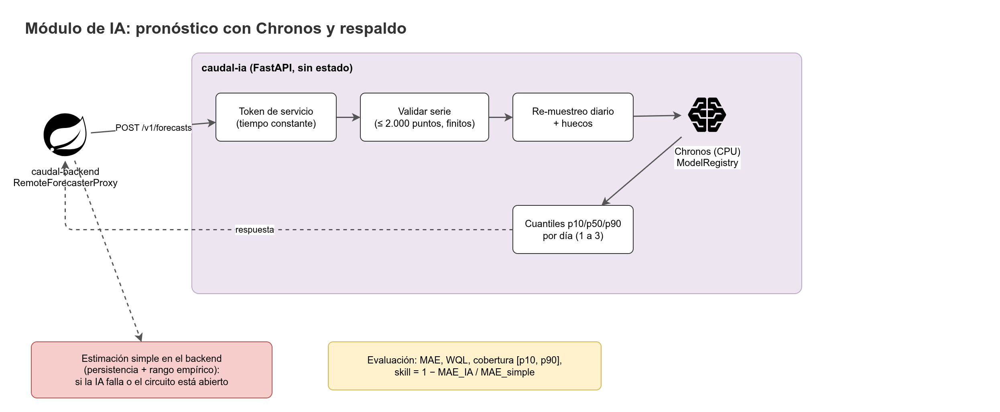
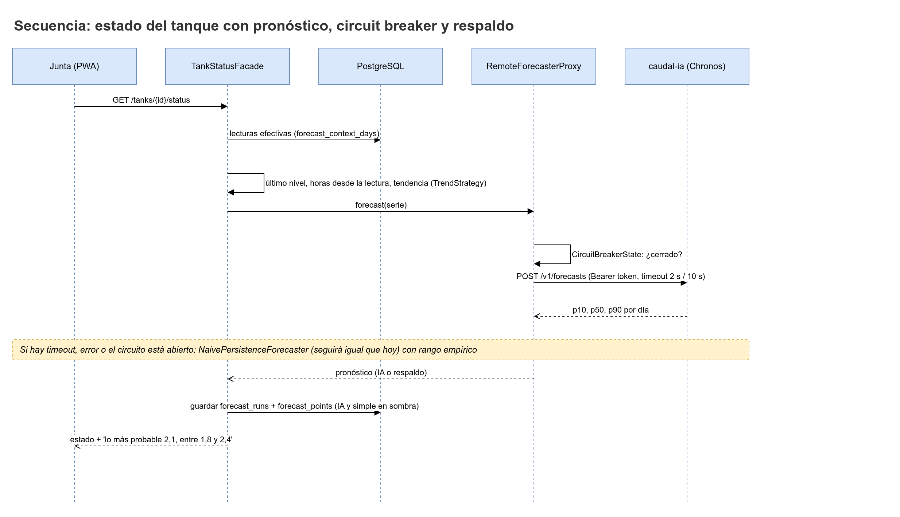

# Módulo de pronóstico (IA)

Este documento describe el módulo de pronóstico desde el sistema: qué pregunta responde, qué modelo lo responde, cómo se comunica con el backend, qué pasa cuando falla y cómo se decide si de verdad ayuda. La implementación del servicio vive en `caudal-ia` y la del cliente en `caudal-backend`.



## 1. Qué pregunta responde

> **Dado el historial diario del nivel de un tanque, ¿cuál es el nivel más probable dentro de 1, 2 y 3 días, y en qué rango puede estar?**

Ejemplo de lo que ve la Junta: "Lo más probable es 2,1 dentro de 2 días, pero podría estar entre 1,8 y 2,4 (unidades de la regla del tanque)".

El módulo **no** decide turnos, **no** escribe en la base de datos y **no** publica nada. Solo entrega una estimación con rango. La propuesta de turnos la calcula el backend con las reglas de la Junta (ver `Stack-tecnologico.md` y la lógica de M5 en el backend).

| Pregunta | Respuesta del módulo | Quién decide |
|---|---|---|
| ¿Cuál es el nivel probable en 1, 2 y 3 días? | `p50` por día, con `p10` y `p90` como rango. | La Junta, al revisar la propuesta. |
| ¿La IA le gana a la estimación simple? | No responde esto en tiempo real: lo calcula la evaluación (sección 9). | Equipo del proyecto y Junta. |

## 2. Modelo: Chronos

El modelo es **Chronos** (`chronos-forecasting`), un modelo de series de tiempo preentrenado que se usa en modo *zero-shot*: no se entrena con los datos del acueducto.

### 2.1 Familias y modelos por defecto

| Familia | Modelo por defecto | Tamaño | Cuantiles | Notas |
|---|---|---|---|---|
| **Chronos-2** | `autogluon/chronos-2-small` | 28M parámetros | Niveles configurables en la petición (`quantile_levels`). Verificar en la documentación de `chronos-forecasting`. | Admite covariables conocidas en el futuro (ver sección 11), que el MVP no usa. |
| **Chronos-Bolt** | `amazon/chronos-bolt-small` | 48M parámetros | **Cuantiles fijos** entre 0.1 y 0.9 (los que entrega el modelo). | Según su documentación, con inferencia más rápida (verificar). Antes de usarlo, verificar que el conjunto fijo incluya 0.1, 0.5 y 0.9. |

- El modelo se elige por variable de entorno (por ejemplo, `IA_MODEL_NAME`, nombre propuesto). El valor por defecto es `autogluon/chronos-2-small`.
- El campo `model.name` de la respuesta y `model_name` de `ops.forecast_runs` guardan el nombre del modelo usado (por ejemplo, `chronos-2-small`).
- Otros tamaños (base, large, etc.) se pueden probar en la fase de evaluación, pero no están en el alcance del MVP.

### 2.2 Ejecución en CPU

- El servicio usa **PyTorch CPU**. No requiere GPU.
- Se pronostica por tanque cuando el backend lo necesita (frecuencia por definir; propuesta: una vez al día y a petición de la Junta). El recálculo a petición tiene límite de 10 por hora por acueducto en el backend.
- La latencia real en CPU se mide en la prueba de memoria y tiempo (sección 13). Ningún valor de latencia se da por cierto antes de medirlo.

### 2.3 Cuantiles

- El contrato pide `quantile_levels: [0.1, 0.5, 0.9]`, que se convierten en `p10`, `p50` y `p90`.
- `p50` es la mediana, lo más probable. `p10` y `p90` forman el rango.
- La BD exige `p10 <= p50 <= p90` en `ops.forecast_points`. Propuesta: si el modelo devuelve cuantiles cruzados, el servicio los reordena y lo registra en el log.

## 3. Arquitectura del servicio y del cliente

| Repo | Pieza | Patrón | Responsable |
|---|---|---|---|
| `caudal-ia` | `ModelRegistry` (carga del modelo, una sola vez) | P01 Singleton | nicomora70 |
| `caudal-ia` | `ForecasterCreator` según `IA_MODEL_NAME` | P02 Factory Method | nicomora70 |
| `caudal-ia` | `Forecaster` (interfaz) y estrategias | P19 Strategy | nicomora70 |
| `caudal-ia` | `ChronosForecasterAdapter` | P06 Adapter | nicomora70 |
| `caudal-ia` | `CachingForecaster`, `TimingForecaster` | P09 Decorator | nicomora70 |
| `caudal-ia` | `ForecastPipeline` (preprocesado, inferencia, posprocesado) | P20 Template Method | nicomora70 |
| `caudal-ia` | `RollingWindowIterator` (ventanas de contexto) | P14 Iterator | nicomora70 |
| `caudal-ia` | `Backtest` (evaluación offline) | P20 Template Method | nicomora70 |
| `caudal-backend` | `IaForecastClientAdapter` (HTTP al servicio) | P06 Adapter | Drako2305 |
| `caudal-backend` | `RemoteForecasterProxy` (remoto más respaldo) | P11 Proxy | Drako2305 |
| `caudal-backend` | `CircuitBreakerState` (Cerrado, Abierto, Semiabierto) | P18 State | Drako2305 |
| `caudal-backend` | `TankStatusFacade` (estado del tanque para la UI) | P10 Facade | Drako2305 |

El servicio **no tiene estado** y **no accede a la base de datos**. Todo lo que el sistema necesita para decidir (historial, reglas, respaldo) vive en el backend.

## 4. Contrato backend a IA

Endpoint: `POST /v1/forecasts`. Autenticación: `Authorization: Bearer <IA_SERVICE_TOKEN>`.

### 4.1 Petición

| Campo | Tipo | Regla |
|---|---|---|
| `series_id` | UUID | Identificador de la serie. En el MVP corresponde al `tank_id` (propuesta). |
| `timestamps` | arreglo de texto ISO-8601 con zona | Estrictamente crecientes. Máximo 2.000 elementos. |
| `values` | arreglo de número (`float`) | Mismo largo que `timestamps`. Todos finitos (sin `NaN` ni infinitos). |
| `prediction_length` | entero | De 1 a 30 (límite técnico). El producto usa 1 a 3. |
| `quantile_levels` | arreglo de número | Para el MVP: `[0.1, 0.5, 0.9]`. |

Ejemplo de petición (abreviado; en producción el backend envía los puntos de `forecast_context_days`):

```json
{
  "series_id": "7d3e2b10-4c1f-7a9e-8b25-5f0c9d6a1e42",
  "timestamps": [
    "2026-09-01T00:00:00-05:00",
    "2026-09-02T00:00:00-05:00",
    "2026-09-03T00:00:00-05:00",
    "2026-09-04T00:00:00-05:00",
    "2026-09-05T00:00:00-05:00",
    "2026-09-06T00:00:00-05:00",
    "2026-09-07T00:00:00-05:00",
    "2026-09-08T00:00:00-05:00"
  ],
  "values": [2.8, 2.7, 2.7, 2.5, 2.4, 2.4, 2.2, 2.1],
  "prediction_length": 3,
  "quantile_levels": [0.1, 0.5, 0.9]
}
```

Las zonas horarias van con offset explícito (`-05:00`, zona `America/Bogota`). Los valores están en la escala de la regla del tanque (unidades de la regla, verificar; los decimales van con punto en la API; la UI los muestra con coma).

### 4.2 Respuesta exitosa (`200`)

| Campo | Tipo | Nota |
|---|---|---|
| `model.name` | texto | Por ejemplo, `chronos-2-small`. |
| `model.version` | texto | Versión del modelo o del servicio (verificar formato). |
| `generated_at` | ISO-8601 con zona | Momento de la inferencia. |
| `frequency` | texto | Siempre `D` (diaria). |
| `points[].timestamp` | ISO-8601 con zona | Día pronosticado, a las 00:00 de `America/Bogota`. |
| `points[].p10`, `p50`, `p90` | número | Cuantiles. `p10 <= p50 <= p90`. |

Ejemplo de respuesta:

```json
{
  "model": { "name": "chronos-2-small", "version": "verificar" },
  "generated_at": "2026-09-09T06:00:00-05:00",
  "frequency": "D",
  "points": [
    { "timestamp": "2026-09-10T00:00:00-05:00", "p10": 1.95, "p50": 2.05, "p90": 2.20 },
    { "timestamp": "2026-09-11T00:00:00-05:00", "p10": 1.85, "p50": 2.00, "p90": 2.25 },
    { "timestamp": "2026-09-12T00:00:00-05:00", "p10": 1.80, "p50": 1.95, "p90": 2.30 }
  ]
}
```

Los números del ejemplo son ilustrativos. No son una predicción.

### 4.3 Errores

Formato de error propuesto para el servicio, alineado con el backend (`error.code` en inglés, `message` en español). Verificar con el equipo de `caudal-ia` antes de implementar.

```json
{
  "error": {
    "code": "INSUFFICIENT_HISTORY",
    "message": "Historia insuficiente: se recibieron 4 puntos válidos y se requieren al menos 7.",
    "details": { "received": 4, "required": 7 },
    "request_id": "9b1e6c0a-2f4d-4e8b-a1c3-6d7f0e5b2a90"
  }
}
```

| HTTP | `code` | Cuándo | Qué hace el backend |
|---|---|---|---|
| `422` | `INSUFFICIENT_HISTORY` | Menos puntos válidos que el mínimo (después de re-muestreo y huecos). | No cuenta como fallo del servicio. Usa la estimación simple con `fallback_reason = INSUFFICIENT_HISTORY`. |
| `422` | `INVALID_SERIES` | Largo distinto de `timestamps` y `values`, valores no finitos, timestamps no crecientes, más de 2.000 puntos, `prediction_length` fuera de 1 a 30, o cuantiles fuera de lo soportado. | Error de integración: se registra y se usa la estimación simple con `fallback_reason = IA_ERROR`. Cuenta como fallo. |
| `401` | `UNAUTHORIZED` (propuesta) | Token ausente, malformado o no vigente. | Usa la estimación simple con `IA_ERROR` y genera alerta de configuración (posible rotación pendiente). Cuenta como fallo. |
| `503` | `MODEL_NOT_READY` | El modelo aún se está cargando (ver `GET /v1/ready`). | Usa la estimación simple con `IA_ERROR`. Cuenta como fallo. |
| `5xx` u otro | `INTERNAL_ERROR` (propuesta) | Error inesperado del servicio. | Usa la estimación simple con `IA_ERROR`. Cuenta como fallo. |
| Sin respuesta en 2 s (conexión) o 10 s (lectura) | No aplica | Timeout del cliente. | Usa la estimación simple con `IA_TIMEOUT`. Cuenta como fallo. |
| Circuito abierto | No aplica | El cliente no llama al servicio. | Usa la estimación simple con `CIRCUIT_OPEN`. No se llama al servicio. |

### 4.4 Salud

| Endpoint | Uso |
|---|---|
| `GET /v1/health` | El proceso responde. No carga el modelo. |
| `GET /v1/ready` | Modelo cargado y listo. Responde `503 MODEL_NOT_READY` mientras carga. |
| `GET /v1/models` | Modelos disponibles y el activo. |

Propuesta: el backend consulta `GET /v1/ready` antes de enviar un pronóstico cuando el circuito está en semiabierto (ver sección 7).

## 5. Preprocesado

El pipeline de `caudal-ia` (`ForecastPipeline`) recibe la serie cruda y produce la serie diaria que se envía al modelo.

| Paso | Regla | Estado |
|---|---|---|
| 1. Orden y duplicados | Ordenar por `timestamp`. Si hay dos puntos en el mismo instante, conservar el último (propuesta). | Propuesta. |
| 2. Zona horaria | Convertir a `America/Bogota` antes de agrupar por día. Los días se cortan a medianoche de esa zona (propuesta). | Propuesta. |
| 3. Agregación diaria | Un valor por día. Por defecto, el **último valor del día** (`IA_DAILY_AGGREGATION = last`, nombre propuesto). Alternativa: `mean`. | Por decidir con la evaluación. |
| 4. Re-muestreo | Reindexar a frecuencia diaria desde el primer hasta el último día de la serie. Los días sin lectura quedan como `NaN`. | Definido. |
| 5. Huecos | Verificar si Chronos admite `NaN` en el contexto. **Verificar.** Si no lo admite: rellenar hacia adelante hasta `N` días (`IA_MAX_FFILL_DAYS`, nombre propuesto) y, si el hueco es mayor, devolver `INSUFFICIENT_HISTORY`. | Verificar. |
| 6. Mínimo de puntos | Contar los días válidos (no `NaN`). Si son menos que `IA_MIN_HISTORY_POINTS` (nombre propuesto; valor **por definir**), responder `422 INSUFFICIENT_HISTORY`. | Valor por definir. |
| 7. Validación final | Valores finitos, timestamps estrictamente crecientes, no más de 2.000 puntos. Si falla, `422 INVALID_SERIES`. | Definido. |
| 8. Horizonte | Los pronósticos empiezan el día siguiente al último día de la serie. Longitud = `prediction_length`. | Definido. |

El backend envía las **lecturas efectivas** de los últimos `forecast_context_days` días de reglas. Efectivas significa aceptadas o corregidas, nunca rechazadas (propuesta de criterio, a confirmar con la regla de validación de lecturas).

## 6. Estimación simple (persistencia)

La estimación simple es la línea base. Responde "seguirá igual que hoy", con un rango calculado con el historial del propio tanque.

### 6.1 Fórmula

Sea `x_t` el nivel diario del tanque (después del paso 3 del preprocesado) y `L = x_T` el último valor disponible. Los cambios diarios históricos son:

```
d_t = x_t - x_(t-1)        para los días t de la ventana de contexto
```

Entonces:

```
p50 = L
p10 = L + Q(0.10; d)
p90 = L + Q(0.90; d)
```

donde `Q(q; d)` es el cuantil `q` de los cambios diarios históricos de la ventana.

Reglas adicionales:

- Los valores se **acotan a la regla del tanque**: `p10` y `p90` se recortan a `[gauge_min, gauge_max]` de `org.tanks`.
- Si hay menos de `N` cambios válidos en la ventana (`N` por definir), la estimación simple no se calcula y el sistema muestra "sin pronóstico" en vez de un rango inventado.
- **Horizontes de 2 y 3 días:** la fórmula anterior se aplica con los mismos cuantiles diarios para todos los horizontes. Esto subestima la incertidumbre a 2 y 3 días, porque los cambios de varios días no se suman linealmente. Alternativa a evaluar: usar cuantiles de cambios de `h` días (`x_t - x_(t-h)`). **Por definir.**

### 6.2 Ejemplo ilustrativo

Si `L = 2,1` y en la ventana los cuantiles de los cambios diarios son `Q(0,10) = -0,30` y `Q(0,90) = +0,25`:

- `p50 = 2,1`
- `p10 = 2,1 - 0,30 = 1,8`
- `p90 = 2,1 + 0,25 = 2,35`

Lectura: "lo más probable es 2,1; podría estar entre 1,8 y 2,35".

### 6.3 Dónde vive

- Se calcula en el backend (`RemoteForecasterProxy` y el cálculo de respaldo), sin llamar a la IA.
- Se guarda en `ops.forecast_runs` con `model_name = naive-persistence` y en `ops.forecast_points`.

## 7. Circuit breaker y respaldo

El backend nunca depende de la IA para mostrar el estado del tanque. Si la IA falla, responde lento o está en circuito abierto, se usa la estimación simple y todo sigue funcionando.

### 7.1 Estados

| Estado | Comportamiento | Transición |
|---|---|---|
| **Cerrado** | Se llama a la IA normalmente. Cada fallo cuenta. | Pasa a **Abierto** al llegar a 5 fallos consecutivos (`CIRCUIT_BREAKER_FAILURE_THRESHOLD`). |
| **Abierto** | No se llama a la IA. Cada solicitud usa la estimación simple con `CIRCUIT_OPEN`. | Pasa a **Semiabierto** al cumplirse 60 s (`CIRCUIT_BREAKER_OPEN_SECONDS`). |
| **Semiabierto** | Se permiten 2 llamadas de prueba (`CIRCUIT_BREAKER_HALF_OPEN_CALLS`). | Pasa a **Cerrado** si las llamadas de prueba responden bien. Vuelve a **Abierto** ante cualquier fallo. |

### 7.2 Qué cuenta como fallo

| Cuenta como fallo | No cuenta como fallo |
|---|---|
| Timeout de conexión (2 s) o de lectura (10 s). | `422 INSUFFICIENT_HISTORY` (el servicio funciona; los datos no alcanzan). |
| `5xx`, `503 MODEL_NOT_READY`, error de conexión. | Respuesta `200` con datos válidos. |
| `401 UNAUTHORIZED` (propuesta; cuenta como fallo y genera alerta). | |
| `422 INVALID_SERIES` (indica un error del cliente; se registra como fallo para no ocultarlo). | |

### 7.3 Configuración

Todos los umbrales se configuran por variables de entorno en `caudal-backend`, documentadas en `.env.example`. Los valores de la tabla son los iniciales de la especificación y son configurables.

| Variable | Qué controla | Valor canónico o de inicio |
|---|---|---|
| `IA_CONNECT_TIMEOUT_MS` | Timeout de conexión, en milisegundos. | 2000 (canónico). |
| `IA_READ_TIMEOUT_MS` | Timeout de lectura, en milisegundos. | 10000 (canónico). |
| `CIRCUIT_BREAKER_FAILURE_THRESHOLD` | Fallos consecutivos para abrir el circuito. | 5. |
| `CIRCUIT_BREAKER_OPEN_SECONDS` | Tiempo en abierto antes de semiabierto. | 60. |
| `CIRCUIT_BREAKER_HALF_OPEN_CALLS` | Llamadas de prueba en semiabierto. | 2. |
| `IA_SERVICE_URL` | URL del servicio de IA. | Por entorno (ver `.env.example`). |
| `IA_SERVICE_TOKEN` | Token de servicio actual. | Secreto. Nunca en git. |
| `IA_SERVICE_TOKEN_PREVIOUS` | Token anterior durante la rotación. | Secreto. Opcional. |

### 7.4 Estado en memoria

El estado del circuito vive en la memoria de la instancia del backend. Si el backend corre en más de una instancia, cada una tiene su propio circuito (verificar la cantidad de instancias en Render). La decisión de mantenerlo en memoria se revisa si hay más de una.

## 8. Pronóstico en sombra

Siempre se calcula también la estimación simple, aunque la IA responda bien.

- Cada vez que se pide un pronóstico, el backend guarda **dos** corridas en `ops.forecast_runs`: una de la IA (`chronos-2-small`, u otro modelo configurado) y una de `naive-persistence` con los mismos datos de entrada.
- La corrida simple de la sombra lleva `fallback_reason = SHADOW_BASELINE`.
- La UI muestra solo el pronóstico principal (la IA si respondió, la simple si no). La sombra no se muestra al fontanero ni a la Junta como respaldo.
- Ambas corridas se evalúan con los mismos datos reales. Sin esta simetría, la comparación de la sección 9 no vale.

> **Decisión:** la estimación simple de la sombra se guarda con `is_fallback = false` y `fallback_reason = SHADOW_BASELINE`. `is_fallback = true` solo cuando reemplaza a la IA.

## 9. Evaluación

La evaluación responde si la IA ayuda. Se compara con la estimación simple sobre los mismos días reales.

### 9.1 Qué se evalúa

Para cada corrida y cada horizonte `h` en {1, 2, 3} días, cuando llega la lectura real `y` del día objetivo se crea una fila en `ops.forecast_evaluations` con:

- `abs_error = |y - p50|`
- `within_interval = (p10 <= y <= p90)`

### 9.2 Métricas

| Métrica | Fórmula | Lectura |
|---|---|---|
| **MAE** (error absoluto medio del p50) | `MAE_h = (1/n) * Σ |y_t - p50_t|` | Cuánto se equivoca, en promedio, en unidades de la regla. Menor es mejor. |
| **WQL** (pérdida cuantílica ponderada) | Ver abajo. | Calidad de todos los cuantiles a la vez. Menor es mejor. |
| **Cobertura** | `cobertura = (puntos con y dentro de [p10, p90]) / n` | Meta: cerca del 80 %. Un rango que cubre menos o mucho más no es confiable. |
| **Ancho** | `ancho = (1/n) * Σ (p90_t - p10_t)` | Qué tan preciso es el rango. Un rango más angosto con la misma cobertura es mejor. |
| **Skill** | `skill_h = 1 - MAE_IA,h / MAE_simple,h` | Mejora relativa frente a la estimación simple. Mayor a 0 significa que la IA le gana. |

**WQL.** Para el conjunto de cuantiles `Q = {0.1, 0.5, 0.9}`:

```
QL_q(y, ŷ_q) = q * (y - ŷ_q)        si y >= ŷ_q
             = (1 - q) * (ŷ_q - y)  si y <  ŷ_q

WQL = (1/|Q|) * Σ_q [ 2 * Σ_t QL_q(y_t, ŷ_t,q) / Σ_t |y_t| ]
```

El denominador `Σ_t |y_t|` puede ser cero si todos los niveles reales son cero. Caso por definir (por ejemplo, excluir la evaluación del acueducto en esa ventana).

### 9.3 Criterio de "ayuda"

La IA se considera útil para el acueducto si se cumplen las tres condiciones:

1. **Skill positivo y sostenido:** `skill_h > 0` en los horizontes evaluados, de forma sostenida. Qué significa "sostenido" (ventana de evaluación) **por definir**.
2. **Muestra suficiente:** al menos **30 pronósticos evaluados**.
3. **Cobertura calibrada:** la cobertura queda entre **70 % y 90 %**.

Si no se cumple la muestra, la UI muestra "todavía no hay evidencia suficiente". No se muestra un veredicto. Si la IA no ayuda, la Junta sigue con la estimación simple, y el sistema lo indica.

Los datos de evaluación con datos simulados se marcan "Datos simulados" en la UI y en el informe (ver `Datos-simulados.md`). Un resultado de evaluación sobre datos simulados prueba la integración, no la calidad del modelo en el campo.

### 9.4 Dónde se ve

- Endpoint: `GET /api/v1/forecast-evaluation` (roles `BOARD_ADMIN` y `PROJECT_TEAM`).
- Módulo M10 del sistema.
- Backtest offline en `caudal-ia` (`Backtest`) para comparar modelos antes de activarlos.

## 10. Seguridad del servicio

| Control | Regla |
|---|---|
| Autenticación | `Authorization: Bearer <IA_SERVICE_TOKEN>`. Token de al menos 32 bytes aleatorios. |
| Comparación | En tiempo constante (`hmac.compare_digest` u equivalente). |
| Rotación | El servicio acepta el token actual y el anterior (`IA_SERVICE_TOKEN` e `IA_SERVICE_TOKEN_PREVIOUS`). Luego se retira el anterior. |
| Límites | Serie de hasta 2.000 puntos; valores finitos; timestamps crecientes; `prediction_length` de 1 a 30. |
| Tamaño de cuerpo | Límite por definir (orientativo: suficiente para 2.000 puntos con timestamps). |
| Sin almacenamiento | El servicio no guarda series, pronósticos ni tokens de usuario. No tiene acceso a la BD. |
| Logs | Se registran `request_id`, largo de la serie, modelo, latencia y código de respuesta. **No** se registran valores de la serie ni el token. |
| Secretos | `IA_SERVICE_TOKEN` solo en variables de entorno del hosting. Nunca en git. `.env.example` con marcadores. |
| Documentación | Swagger en `/docs`. Solo documenta; ejecutar un pronóstico requiere el token. Apagable por variable si se decide (propuesta). |

## 11. Covariables futuras (a futuro)

Chronos-2 puede usar **covariables conocidas en el futuro**: variables que se saben de antemano para los días a pronosticar. La candidata natural es la **cantidad de horas de servicio planeadas** por día, que sale del horario publicado. Con ese dato el modelo podría relacionar el descenso del nivel con el servicio programado, en vez de inferirlo solo del historial.

Esto **no está en el MVP**. Para incorporarlo:

1. Se extiende el contrato con un campo de covariables futuras (por ejemplo, `future_covariates`). Como cambia el contrato, se versiona (`/v2/forecasts` o equivalente, a decidir).
2. Se evita fuga de información: solo entran covariables que se conocían al momento del pronóstico (horario publicado, no ejecución real).
3. Se compara contra la versión sin covariables con la misma evaluación de la sección 9.

## 12. Despliegue

| Opción | Cuándo | Condición |
|---|---|---|
| **Hugging Face Spaces** (Docker, CPU) | Opción inicial. | Espacio con CPU y memoria suficientes para el modelo elegido. |
| **Render** | Si el modelo cabe en la memoria del plan. | Verificar el límite de memoria del plan antes de elegir. |

- Imagen Docker con PyTorch CPU (sin CUDA).
- Pesos del modelo: descargados al construir la imagen o al iniciar. Decisión por tomar, según el tiempo de arranque y el límite de tamaño del hosting (verificar).
- El servicio arranca con `GET /v1/health` disponible de inmediato y `GET /v1/ready` en `503` hasta que el modelo cargue.

### 12.1 Prueba de memoria y tiempo

Antes de elegir hosting, se mide con el modelo elegido:

1. Memoria máxima (RSS) con el modelo cargado y en reposo.
2. Memoria pico con una petición de 2.000 puntos y `prediction_length = 30`.
3. Tiempo de arranque hasta `GET /v1/ready` en `200`.
4. Latencia de una petición del caso típico (8 a 60 puntos, horizonte 3) y del caso máximo.

Criterio de aceptación: la memoria pico queda por debajo del límite del plan con un margen **por definir**. Los resultados se anotan en el README de `caudal-ia`. Hasta medirlo, ningún valor de latencia ni de memoria de este documento se considera confirmado.

## 13. Responsabilidades

| Pieza | Responsable | Notas |
|---|---|---|
| `caudal-ia` (servicio completo: contrato, preprocesado, Chronos, respaldo del servicio, pruebas y despliegue) | **nicomora70** | Se une más adelante al proyecto. |
| Cliente en el backend (`IaForecastClientAdapter`, `RemoteForecasterProxy`, `CircuitBreakerState`, cálculo de la estimación simple, guardado de corridas y evaluación) | **Drako2305** | Mientras `caudal-ia` no esté lista, el backend se prueba contra un servicio simulado que cumple el mismo contrato (propuesta). |
| Visualización del pronóstico (banda `p10`–`p90` con Recharts) | **NicoalsD** | Componente `visualizacion-pronostico` del frontend. |
| Evaluación, decisión de "ayuda" y revisión de la sección 9 | Equipo, con la Junta para el criterio final | |

Sin `caudal-ia` todavía, el backend funciona con la estimación simple y el circuito en abierto. Esa es la forma en que el proyecto avanza sin bloquearse.

## 14. Diagrama de secuencia



Relacionados: [Simulador-y-hardware.md](Simulador-y-hardware.md), [Datos-simulados.md](Datos-simulados.md), [Stack-tecnologico.md](Stack-tecnologico.md), [Diccionario-de-datos.md](Diccionario-de-datos.md)
