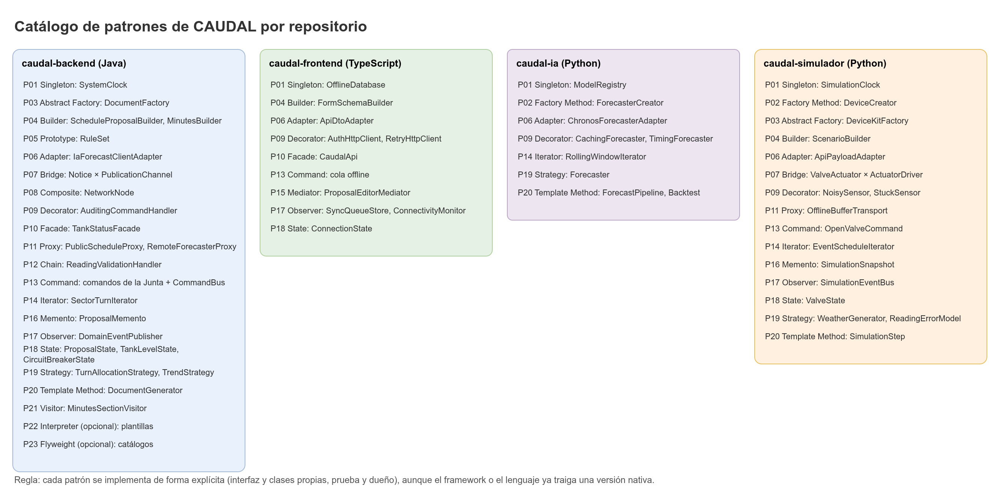
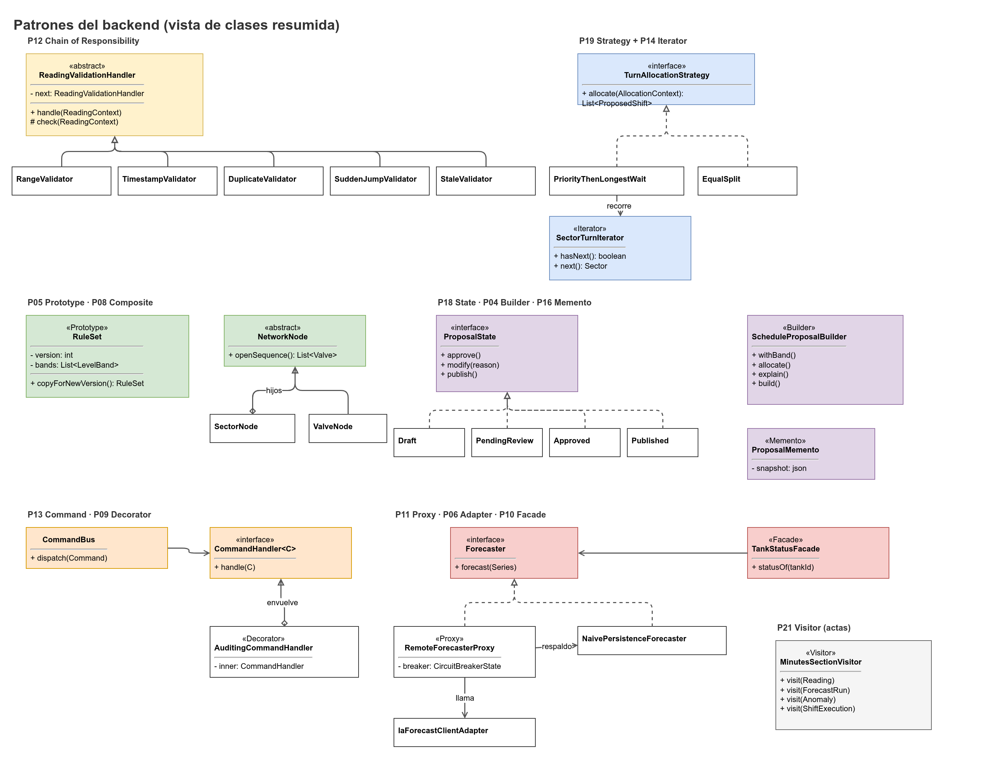

# Patrones de diseño de CAUDAL

> Catálogo global de los patrones del proyecto (P01 a P23) y de los patrones arquitectónicos. Cubre los cuatro repositorios. Este documento es la referencia de intención y de dueño. La guía de implementación para agentes en el backend está en [`.agents/design-patterns.md`](../.agents/design-patterns.md).

## 1. Introducción

### 1.1 Regla: implementación explícita aunque el framework ya lo ofrezca

CAUDAL implementa cada patrón con interfaces y clases propias, aunque el framework o el lenguaje ya traigan una versión del mismo mecanismo. La regla tiene tres razones:

1. **La intención queda en el código del dominio.** Un `ProposalState` con sus transiciones se lee y se revisa; un proxy generado por Spring no.
2. **Las pruebas no dependen del contenedor.** Un patrón explícito se prueba con una prueba unitaria simple. Los beans, los proxies AOP y los decoradores de Spring necesitan contexto.
3. **El framework resuelve el mecanismo, no el problema.** Spring hace singletons y proxies, pero no decide qué cuenta como "lectura válida" ni qué datos personales quita la página pública.

Cada patrón documenta qué ofrece el framework y por qué no lo reemplaza. Cuando un framework ya resuelve un problema de infraestructura y no hay lógica de negocio de por medio, se documenta la excepción. Un ejemplo es Resilience4j: existe, pero no se adopta como dependencia del backend; el circuito de la IA es una máquina de estados propia (P18).

### 1.2 Cómo leer el catálogo

- **Dueño.** Persona responsable del patrón en cada repositorio, según la especificación del proyecto. El líder de seguridad y de patrones en el backend es Drako Salazar (`Drako2305`).
- **Nombres de clase.** En inglés, como manda la regla de idioma del código. Los nombres de los patrones GoF se mantienen.
- **Nombres de prueba.** Son propuestos. Se confirman cuando se implemente cada patrón.
- **Ámbito.** Backend (`caudal-backend`), frontend (`caudal-frontend`), IA (`caudal-ia`) y simulador (`caudal-simulador`). Cuando un patrón no aplica a un repositorio, no aparece.

### 1.3 Tabla resumen

| ID | Patrón | Backend (clase principal) | Otros repositorios | Dueño |
|---|---|---|---|---|
| P01 | Singleton | `SystemClock` | Front `OfflineDatabase`; IA `ModelRegistry`; sim `SimulationClock` | Drako / NicoalsD / nicomora |
| P02 | Factory Method | `DocumentGeneratorCreator` | IA `ForecasterCreator`; sim `DeviceCreator` | NicoalsD / nicomora |
| P03 | Abstract Factory | `DocumentFactory` | Sim `DeviceKitFactory` | NicoalsD / nicomora |
| P04 | Builder | `ScheduleProposalBuilder`, `MinutesBuilder` | Front `FormSchemaBuilder`; sim `ScenarioBuilder` | Drako / NicoalsD / nicomora |
| P05 | Prototype | `RuleSet.copyForNewVersion()` | Ninguno | Drako |
| P06 | Adapter | `IaForecastClientAdapter`, `DeviceTelemetryAdapter` | Front `ApiDtoAdapter`; IA `ChronosForecasterAdapter`; sim `ApiPayloadAdapter` | Drako / NicoalsD / nicomora |
| P07 | Bridge | `Notice` x `PublicationChannel` | Sim `ValveActuator` x `ActuatorDriver` | NicoalsD / nicomora |
| P08 | Composite | `NetworkNode`, `SectorNode`, `ValveNode` | Ninguno | Drako |
| P09 | Decorator | `AuditingCommandHandler` | Front `AuthHttpClient`, `RetryHttpClient`, `LoggingHttpClient`; IA `CachingForecaster`, `TimingForecaster`; sim `NoisySensor`, `StuckSensor`, `DriftingSensor` | Drako / NicoalsD / nicomora |
| P10 | Facade | `TankStatusFacade` | Front `CaudalApi` | Drako / NicoalsD |
| P11 | Proxy | `PublicScheduleProxy`, `RemoteForecasterProxy` | Sim `OfflineBufferTransport` | NicoalsD / Drako / nicomora |
| P12 | Chain of Responsibility | `ReadingValidationHandler` | Ninguno | Drako |
| P13 | Command | Comandos de la Junta y `CommandBus` | Front cola offline (`SubmitReadingCommand`, `CloseDayCommand`); sim `OpenValveCommand`, `CloseValveCommand` | Drako / NicoalsD / nicomora |
| P14 | Iterator | `SectorTurnIterator` | IA `RollingWindowIterator`; sim `EventScheduleIterator` | Drako / nicomora |
| P15 | Mediator | Ninguno (solo frontend) | Front `ProposalEditorMediator` | NicoalsD |
| P16 | Memento | `ProposalMemento` | Sim `SimulationSnapshot` | Drako / nicomora |
| P17 | Observer | `DomainEventPublisher` | Front `SyncQueueStore`, `ConnectivityMonitor`; sim `SimulationEventBus` | Drako / NicoalsD / nicomora |
| P18 | State | `ProposalState`, `TankLevelState`, `CircuitBreakerState` | Front `ConnectionState`; sim `ValveState` | Drako / NicoalsD / nicomora |
| P19 | Strategy | `TurnAllocationStrategy`, `TrendStrategy` | IA `Forecaster`; sim `WeatherGenerator`, `ReadingErrorModel` | Drako / nicomora |
| P20 | Template Method | `DocumentGenerator` | IA `ForecastPipeline`, `Backtest`; sim `SimulationStep` | NicoalsD / nicomora |
| P21 | Visitor | `MinutesSectionVisitor` | Ninguno | Drako |
| P22 | Interpreter (opcional) | Plantillas de mensajes (`MessageTemplate`) | Ninguno | NicoalsD |
| P23 | Flyweight (opcional) | `CatalogItem` compartido | Ninguno | Drako |

Diagramas: el catálogo completo está en `images/catalogo-patrones.png`, y los patrones del backend en `images/patrones-backend.png`.

## 2. Patrones arquitectónicos

| Patrón | Dónde se aplica | Reglas y referencias |
|---|---|---|
| Hexagonal (puertos y adaptadores) | Todo el backend. | Paquetes `api`, `application`, `domain`, `infrastructure`, `shared`. Reglas `ARCH-01` a `ARCH-10` en [Arquitectura](Arquitectura.md), sección 2. |
| Repository + Unit of Work | Persistencia. | Puertos `*Port` en `application.port.out`; adaptadores `*PersistenceAdapter`; `UnitOfWork` con `SpringUnitOfWork`. Ver [Arquitectura](Arquitectura.md), sección 6. |
| DTO y Mapper | API. | Records `*Request` y `*Response` en `api`; mapeadores entre DTO, `*Input` y resultados de aplicación. Ninguna entidad JPA sale de la capa de persistencia. |
| Circuit Breaker | Llamadas a la IA. | `CircuitBreakerState` (P18) y `RemoteForecasterProxy` (P11). Ver [Arquitectura](Arquitectura.md), sección 4. |
| Domain Events | Efectos posteriores al commit. | `DomainEventPublisher` (P17). Eventos en `domain.event`. |
| Idempotency Key | Lecturas, lotes, telemetría. | UUID del cliente como clave primaria en `ops.readings`, `ops.sync_batches` y `devices.telemetry_points`. Repetir la petición no duplica datos. |
| Registro append-only | Lecturas, decisiones, auditoría. | Triggers que impiden `UPDATE` y `DELETE`. Cadena de hashes en `audit.audit_log`. |

## 3. Catálogo de patrones

Cada patrón tiene: intención, problema concreto en CAUDAL, dónde vive, participantes GoF mapeados, qué ofrece el framework o lenguaje y por qué se implementa igual, cómo se prueba y dueño.

### P01. Singleton

- **Intención.** Garantizar una única instancia de un recurso compartido con un punto de acceso conocido.
- **Problema en CAUDAL.** Todo el backend necesita la hora actual. El dominio no puede llamar a `Instant.now()` directamente, porque las reglas de fecha (futuro, antigüedad, ventana de duplicados) deben ser reproducibles en pruebas.
- **Dónde vive.**
  - Backend: `co.caudal.shared.time.SystemClock`.
  - Frontend: `OfflineDatabase` (instancia única de Dexie, en `src/services`).
  - IA: `ModelRegistry` (el modelo de Chronos se carga una sola vez).
  - Simulador: `SimulationClock`.
- **Participantes GoF.** `Singleton` = `SystemClock`, con constructor privado e instancia estática. El reloj se usa a través de `java.time.Clock`, que es la interfaz que reciben los casos de uso.
- **Framework nativo.** Los beans de Spring tienen alcance singleton por defecto. No se usa porque el dominio no depende de Spring, y `SystemClock` debe existir fuera de un contexto.
- **Prueba.** `SystemClockTest` (una sola instancia; reloj en UTC). Los casos de uso se prueban con un reloj fijo, no con `SystemClock`.
- **Dueño.** Drako (backend). NicoalsD (frontend). nicomora70 (IA y simulador).

### P02. Factory Method

- **Intención.** Definir una interfaz para crear un objeto y dejar que las subclases decidan qué clase instanciar.
- **Problema en CAUDAL.** Hay tres tipos de documento de salida (cartel, acta, resumen) con reglas distintas, y el caso de uso no debe conocer cada generador: habla con el puerto `DocumentRenderingPort`, implementado por `DocumentRenderingAdapter`.
- **Dónde vive.**
  - Backend: `co.caudal.infrastructure.document.DocumentGeneratorCreator` y sus subclases `PosterGeneratorCreator`, `MinutesGeneratorCreator`, `SummaryGeneratorCreator`.
  - IA: `ForecasterCreator` (crea el pronosticador configurado, Chronos o ingenuo).
  - Simulador: `DeviceCreator` (crea un sensor, un actuador o un gateway según el tipo).
- **Participantes GoF.** `Creator` = `DocumentGeneratorCreator` (método fábrica abstracto `createGenerator()`). `ConcreteCreator` = cada subclase. `Product` = `DocumentGenerator` (ver P20).
- **Framework nativo.** Spring crea beans con métodos `@Bean` y `@ConditionalOnProperty`. Se usa para el cableado, pero la elección del tipo de documento vive en el código, con nombres propios.
- **Prueba.** `DocumentGeneratorCreatorTest` (cada tipo de documento produce el generador correcto).
- **Dueño.** NicoalsD (backend y frontend). nicomora70 (IA y simulador).

### P03. Abstract Factory

- **Intención.** Crear familias de objetos relacionados sin especificar sus clases concretas.
- **Problema en CAUDAL.** El cartel, el acta y el resumen se producen en PDF (para imprimir) y en HTML (para la página). Cada familia debe usar el mismo encabezado, las mismas secciones y las mismas firmas.
- **Dónde vive.**
  - Backend: `co.caudal.infrastructure.document.DocumentFactory` (interfaz con `createHeader()`, `createSection()` y `createSignatures()`), con `PdfDocumentFactory` (OpenPDF) y `HtmlDocumentFactory`.
  - Simulador: `DeviceKitFactory` (un kit de dispositivos de la misma familia: sensor, actuador y gateway).
- **Participantes GoF.** `AbstractFactory` = `DocumentFactory`. `ConcreteFactory` = `PdfDocumentFactory`, `HtmlDocumentFactory`. `AbstractProduct` = encabezado, sección y firmas. `Product` = sus versiones PDF y HTML.
- **Framework nativo.** Spring selecciona implementaciones por configuración. Se usa explícitamente porque la familia debe ser coherente entre sus piezas, algo que una selección por bean no garantiza.
- **Prueba.** `DocumentFactoryTest` (cada familia produce piezas compatibles entre sí).
- **Dueño.** NicoalsD (backend). nicomora70 (simulador).

### P04. Builder

- **Intención.** Separar la construcción de un objeto complejo de su representación, validando el resultado al final.
- **Problema en CAUDAL.** Una propuesta de turnos tiene reglas, nivel, banda, turnos, razones y estrategia. Un turno no puede solaparse y las horas deben caber en la banda. El acta tiene cuatro secciones obligatorias.
- **Dónde vive.**
  - Backend: `co.caudal.domain.schedule.ScheduleProposalBuilder` y `co.caudal.domain.minutes.MinutesBuilder`.
  - Frontend: `FormSchemaBuilder` (arma el esquema de validación en tiempo de ejecución desde `/api/v1/meta/constraints` y `/api/v1/rule-sets/current`).
  - Simulador: `ScenarioBuilder` (arma un escenario desde YAML y lo valida con Pydantic).
- **Participantes GoF.** `Builder` = `ScheduleProposalBuilder` con métodos `withRuleSet`, `withTurn`, `withReason`. `build()` valida invariantes y devuelve un `ScheduleProposal` inmutable. `Director` = el caso de uso de generación.
- **Framework nativo.** `record` con constructores compactos y Lombok `@Builder`. El builder explícito se usa porque la validación de invariantes es de dominio y debe probarse sin el framework.
- **Prueba.** `ScheduleProposalBuilderTest` (rechaza solapes y horas fuera de banda), `MinutesBuilderTest` (rechaza un acta sin las cuatro secciones).
- **Dueño.** Drako (backend). NicoalsD (frontend). nicomora70 (simulador).

### P05. Prototype

- **Intención.** Crear objetos nuevos copiando uno existente, sin depender de sus clases concretas.
- **Problema en CAUDAL.** Para cambiar una regla, la Junta trabaja sobre un borrador que parte de la versión vigente. El borrador debe copiar bandas, sectores, orden de válvulas y ventanas, y reiniciar estado y número de versión.
- **Dónde vive.** Backend: `RuleSet.copyForNewVersion()` en `co.caudal.domain.rules`.
- **Participantes GoF.** `Prototype` = `RuleSet` con el método de copia. `ConcretePrototype` = el borrador resultante. El cliente es el caso de uso `CreateRuleDraftUseCase`.
- **Framework nativo.** `Cloneable` de Java o copias de Jackson. Se evita `Cloneable` porque la copia profunda necesita reglas de negocio (versión nueva, estado `DRAFT`, `based_on_rule_set_id`).
- **Prueba.** `RuleSetPrototypeTest` (la copia es profunda, el estado es `DRAFT` y el origen no cambia).
- **Dueño.** Drako.

### P06. Adapter

- **Intención.** Convertir la interfaz de un componente externo en la que espera el cliente.
- **Problema en CAUDAL.** La IA responde con un JSON propio (`points`, `p10`, `p50`, `p90`). Los dispositivos envían telemetría firmada. El frontend recibe DTOs de la API. El dominio no debe conocer ninguno de estos formatos.
- **Dónde vive.**
  - Backend: `IaForecastClientAdapter` (implementa `ForecastPort`) y `DeviceTelemetryAdapter` (convierte el payload firmado en `TelemetryPoint`), en `co.caudal.infrastructure`.
  - Frontend: `ApiDtoAdapter` (DTO de la API a modelo de vista).
  - IA: `ChronosForecasterAdapter` (adapta el modelo de Chronos a la interfaz `Forecaster`).
  - Simulador: `ApiPayloadAdapter` (modelo del simulador a cuerpo de la API).
- **Participantes GoF.** `Target` = `ForecastPort`. `Adaptee` = el servicio HTTP de la IA. `Adapter` = `IaForecastClientAdapter`.
- **Framework nativo.** `RestClient` o Jackson con mapeo automático. Se usa un adaptador explícito porque el contrato con la IA tiene reglas (orden de cuantiles, timestamps crecientes) que deben validarse al convertir.
- **Prueba.** `IaForecastClientAdapterTest` (servidor HTTP simulado con respuestas válidas y con los errores `422`, `401` y `503`), `DeviceTelemetryAdapterTest` (firma válida y payload mal formado).
- **Dueño.** Drako (backend). NicoalsD (frontend). nicomora70 (IA y simulador).

### P07. Bridge

- **Intención.** Separar una abstracción de su implementación para que ambas varíen de forma independiente.
- **Problema en CAUDAL.** Un mismo aviso (horario publicado, cambio de turno, reporte de daño) debe salir por la página pública, por WhatsApp y en el cartel impreso. Si cada combinación fuera una clase, habría que duplicar cada aviso por cada canal.
- **Dónde vive.**
  - Backend: abstracción `Notice` (con refinados `ScheduleNotice` y `DamageReportNotice`) en `co.caudal.application.publication`. Implementador `PublicationChannel` con `PublicPageChannel`, `WhatsAppChannel` y `PosterChannel` en `co.caudal.infrastructure.publication`.
  - Simulador: `ValveActuator` (abstracción) y `ActuatorDriver` (implementación: simulado, o GPIO en el futuro).
- **Participantes GoF.** `Abstraction` = `Notice`. `RefinedAbstraction` = `ScheduleNotice`. `Implementor` = `PublicationChannel`. `ConcreteImplementor` = cada canal.
- **Framework nativo.** Spring inyecta canales por `@Qualifier`. La selección explícita se mantiene porque la abstracción tiene reglas propias (sin datos personales, con la marca "Datos simulados" cuando el acueducto es demo).
- **Prueba.** `NoticeChannelBridgeTest` (cada aviso produce el texto correcto en cada canal).
- **Dueño.** NicoalsD (backend). nicomora70 (simulador).

### P08. Composite

- **Intención.** Tratar objetos individuales y compuestos de la misma forma.
- **Problema en CAUDAL.** Un sector puede tener válvulas y subsectores. El agua se reparte en un árbol, y el cálculo de horas y de válvulas debe recorrerlo de forma uniforme.
- **Dónde vive.** Backend: `NetworkNode` (interfaz), `SectorNode` (compuesto) y `ValveNode` (hoja), en `co.caudal.domain.network`.
- **Participantes GoF.** `Component` = `NetworkNode`. `Composite` = `SectorNode`. `Leaf` = `ValveNode`. `Client` = el asignador de turnos.
- **Framework nativo.** `@OneToMany` con `parent_sector_id` en JPA resuelve la persistencia, no el comportamiento. El comportamiento se implementa en el dominio.
- **Prueba.** `NetworkNodeTest` (un sector con subsectores y válvulas suma las válvulas de todo el árbol; una hoja no tiene hijos).
- **Dueño.** Drako.

### P09. Decorator

- **Intención.** Agregar responsabilidades a un objeto dinámicamente, envolviéndolo, sin cambiar su clase.
- **Problema en CAUDAL.** Cada comando de la Junta debe dejar rastro en la auditoría, sin que cada handler lo recuerde. En el frontend, las llamadas HTTP necesitan autenticación, reintentos y registro. En el simulador, un sensor puede tener ruido, quedarse pegado o derivar.
- **Dónde vive.**
  - Backend: `AuditingCommandHandler` (envuelve un `CommandHandler`) en `co.caudal.application.command`.
  - Frontend: `AuthHttpClient`, `RetryHttpClient` y `LoggingHttpClient`, que envuelven `HttpClient`.
  - IA: `CachingForecaster` y `TimingForecaster`.
  - Simulador: `NoisySensor`, `StuckSensor` y `DriftingSensor`, que envuelven un `Sensor`.
- **Participantes GoF.** `Component` = `CommandHandler` (o `HttpClient`, `Sensor`). `ConcreteComponent` = el handler real. `Decorator` = `AuditingCommandHandler`, con la referencia al componente envuelto.
- **Framework nativo.** Spring AOP (`@Aspect`), la cadena de filtros de Spring Security y los decoradores de Python y de JavaScript. Se usa el decorador explícito para la auditoría porque su registro debe ser parte del contrato del comando, no un efecto colateral de un proxy.
- **Prueba.** `AuditingCommandHandlerTest` (un comando exitoso y uno fallido dejan un registro; el handler interno se llama una sola vez).
- **Dueño.** Drako (backend). NicoalsD (frontend). nicomora70 (IA y simulador).

### P10. Facade

- **Intención.** Ofrecer una interfaz simple para un subsistema complejo.
- **Problema en CAUDAL.** El estado del tanque requiere la lectura efectiva, su antigüedad, la tendencia, el último pronóstico y el texto de respaldo. El controlador y el frontend no deben orquestar cuatro consultas.
- **Dónde vive.**
  - Backend: `TankStatusFacade` en `co.caudal.application.facade`.
  - Frontend: `CaudalApi`, la fachada única de los servicios HTTP (`src/services`).
- **Participantes GoF.** `Facade` = `TankStatusFacade`. `Subsystems` = los puertos de lectura, pronóstico y reglas, y las estrategias de tendencia.
- **Framework nativo.** Los servicios de Spring (`@Service`) cumplen una función parecida, pero no definen la forma de la respuesta.
- **Prueba.** `TankStatusFacadeTest` (con la lectura vigente, con la lectura vieja y sin pronóstico).
- **Dueño.** Drako (backend). NicoalsD (frontend).

### P11. Proxy

- **Intención.** Ofrecer un sustituto de un objeto para controlar el acceso a él.
- **Problema en CAUDAL.** Hay dos necesidades distintas. La página pública debe leer solo horarios publicados y sin datos personales. El pronóstico remoto debe responder siempre, aunque la IA falle.
- **Dónde vive.**
  - Backend: `PublicScheduleProxy` (implementa el puerto de lectura pública; quita datos personales y verifica que el horario esté publicado) en `co.caudal.infrastructure.publication`. `RemoteForecasterProxy` (implementa `ForecastPort`; llama al adaptador de la IA y, si falla o el circuito está abierto, usa `NaivePersistenceForecastAdapter`) en `co.caudal.infrastructure.forecast`.
  - Simulador: `OfflineBufferTransport` (guarda los envíos cuando no hay red y los reenvía).
- **Participantes GoF.** `Subject` = `ForecastPort`. `RealSubject` = `IaForecastClientAdapter`. `Proxy` = `RemoteForecasterProxy`.
- **Framework nativo.** Proxies de Spring AOP y proxies dinámicos de Java. Se usan explícitos porque la protección de datos personales y el respaldo son reglas que se prueban y se revisan.
- **Prueba.** `PublicScheduleProxyTest` (no sale ningún nombre ni teléfono; un horario sin publicar responde como inexistente) y `RemoteForecasterProxyTest` (con fallo de la IA responde el respaldo con `is_fallback = true`).
- **Dueño.** NicoalsD (público). Drako (pronóstico). nicomora70 (simulador).

### P12. Chain of Responsibility

- **Intención.** Pasar una petición por una cadena de manejadores, cada uno decide si la resuelve o la pasa al siguiente.
- **Problema en CAUDAL.** Validar una lectura en etapas, con su propio código de problema: rango, fecha, duplicado, salto brusco y antigüedad. Rango, fecha y antigüedad rechazan la lectura (`422`, no se guarda). Duplicado y salto brusco la guardan marcada como `FLAGGED`.
- **Dónde vive.** Backend: `ReadingValidationHandler` (abstracto, con `setNext`) y los manejadores `RangeCheckHandler`, `DateCheckHandler`, `DuplicateCheckHandler`, `JumpCheckHandler` y `AgeCheckHandler`, en `co.caudal.domain.reading.validation`.
- **Participantes GoF.** `Handler` = `ReadingValidationHandler`. `ConcreteHandler` = cada manejador. `Client` = el caso de uso que arma la cadena.
- **Framework nativo.** La cadena de filtros de Spring Security tiene la misma forma, pero está pensada para peticiones HTTP, no para reglas de dominio.
- **Prueba.** `ReadingValidationHandlerTest` y una prueba por manejador (`RangeCheckHandlerTest`, `DuplicateCheckHandlerTest`, etc.). Orden de la cadena: rango, fecha, duplicado, salto brusco, antigüedad.
- **Dueño.** Drako.

### P13. Command

- **Intención.** Encapsular una petición como un objeto, para parametrizarla, registrarla, despacharla y deshacerla.
- **Problema en CAUDAL.** Las decisiones de la Junta (aprobar, modificar, rechazar, publicar, activar reglas) deben ser objetos que se validan (motivo obligatorio), se auditan y se despachan con permisos. En el frontend, las lecturas y los cierres se guardan en una cola offline. En el simulador, abrir y cerrar válvulas son comandos.
- **Dónde vive.**
  - Backend: comandos `ApproveProposalCommand`, `ModifyProposalCommand`, `RejectProposalCommand`, `PublishScheduleCommand` y `ActivateRuleSetCommand`; interfaz `CommandHandler`; `CommandBus` y `SimpleCommandBus`, en `co.caudal.application.command`.
  - Frontend: `SubmitReadingCommand` y `CloseDayCommand` (cola offline).
  - Simulador: `OpenValveCommand` y `CloseValveCommand`.
- **Participantes GoF.** `Command` = interfaz marcador `Command`. `ConcreteCommand` = cada comando de la Junta. `Receiver` = el caso de uso de la decisión. `Invoker` = `CommandBus`. `Client` = el controlador.
- **Alcance.** `CommandBus` solo se usa para los comandos de la Junta. Las lecturas usan un caso de uso (`RecordReadingUseCase`), no el bus.
- **Framework nativo.** Spring `ApplicationEventPublisher` no es un bus de comandos. Se implementa explícitamente porque el registro de comandos es parte de la auditoría.
- **Prueba.** `CommandBusTest` (despacha al handler correcto y rechaza un comando sin handler) y una prueba por handler (por ejemplo, `RejectProposalCommandHandlerTest` exige motivo de 10 a 500 caracteres).
- **Dueño.** Drako (backend). NicoalsD (cola offline). nicomora70 (simulador).

### P14. Iterator

- **Intención.** Recorrer una colección sin exponer su estructura interna.
- **Problema en CAUDAL.** La asignación de turnos recorre los sectores en un orden específico: primero los prioritarios en su orden, luego por horas sin servicio de mayor a menor. El orden no debe reconstruirse en cada uso.
- **Dónde vive.**
  - Backend: `SectorTurnIterator` (implementa `Iterator<SectorCandidate>`) en `co.caudal.domain.schedule`.
  - IA: `RollingWindowIterator` (recorre ventanas de historia).
  - Simulador: `EventScheduleIterator` (recorre los eventos del día en orden).
- **Participantes GoF.** `Iterator` = `SectorTurnIterator`. `Aggregate` = la lista de sectores candidatos.
- **Framework nativo.** `Iterable` y `Stream`. Se usa un iterador propio porque la regla de orden es de dominio y debe probarse por separado.
- **Prueba.** `SectorTurnIteratorTest` (los prioritarios salen primero; entre los demás, el de mayor espera).
- **Dueño.** Drako (backend). nicomora70 (IA y simulador).

### P15. Mediator

- **Intención.** Centralizar las interacciones entre componentes para que no se refieran unos a otros directamente.
- **Problema en CAUDAL.** En el editor de propuestas hay varios campos que se afectan entre sí: horas totales, turnos, motivo obligatorio y validaciones.
- **Dónde vive.** Frontend: `ProposalEditorMediator`. No aplica al backend.
- **Participantes GoF.** `Mediator` = `ProposalEditorMediator`. `Colleague` = los campos del editor.
- **Framework nativo.** React con estado elevado (`useReducer`). Se usa el mediador porque la lógica de validación cruzada no debe quedar en los componentes visuales.
- **Prueba.** `ProposalEditorMediatorTest` (cambiar las horas actualiza el total y exige motivo al modificar).
- **Dueño.** NicoalsD.

### P16. Memento

- **Intención.** Capturar y restaurar el estado interno de un objeto sin violar su encapsulamiento.
- **Problema en CAUDAL.** Cuando la Junta cambia una propuesta, el sistema debe conservar la original para comparar y explicar qué cambió.
- **Dónde vive.**
  - Backend: `ProposalMemento` (inmutable), creado por `ScheduleProposal.createMemento()`, guardado en `ops.proposal_snapshots.snapshot` (`jsonb`).
  - Simulador: `SimulationSnapshot`.
- **Participantes GoF.** `Originator` = `ScheduleProposal`. `Memento` = `ProposalMemento`. `Caretaker` = el caso de uso de decisión, que guarda el memento antes de cambiar la propuesta.
- **Framework nativo.** Serialización de Java. Se usa un memento explícito porque el contenido es un contrato de auditoría.
- **Prueba.** `ProposalMementoTest` (el memento no cambia cuando cambia la propuesta original).
- **Dueño.** Drako (backend). nicomora70 (simulador).

### P17. Observer

- **Intención.** Definir una dependencia uno a muchos, para que los objetos suscritos reciban aviso cuando cambia el sujeto.
- **Problema en CAUDAL.** Cuando se acepta una lectura, cuando se activan reglas y cuando se publica un horario, varias partes del sistema deben reaccionar (recalcular estado, invalidar propuestas, generar el texto de WhatsApp). El caso de uso no debe conocer a cada una.
- **Dónde vive.**
  - Backend: `DomainEventPublisher` (puerto en `application.event`), `SpringDomainEventPublisher` (adaptador en `infrastructure.event`) y los eventos `ReadingAccepted`, `RuleSetActivated` y `SchedulePublished` en `domain.event`.
  - Frontend: `SyncQueueStore` y `ConnectivityMonitor`.
  - Simulador: `SimulationEventBus`.
- **Participantes GoF.** `Subject` = `DomainEventPublisher`. `Observer` = los oyentes (`@TransactionalEventListener`). `ConcreteSubject` = el agregado que registra el evento.
- **Framework nativo.** `ApplicationEventPublisher` y `@TransactionalEventListener`. Se usan a través del puerto propio. El dominio no depende de Spring, y la publicación ocurre después del commit.
- **Prueba.** `DomainEventPublisherTest` (el evento se publica solo tras el commit; una transacción revertida no publica nada).
- **Dueño.** Drako (backend). NicoalsD (frontend). nicomora70 (simulador).

### P18. State

- **Intención.** Permitir que un objeto cambie su comportamiento cuando cambia su estado interno.
- **Problema en CAUDAL.** Tres máquinas de estado: la propuesta (su orden de transiciones es una regla de negocio), la banda del nivel del tanque y el circuito de la IA. En el frontend, la conexión decide si se guarda o se envía.
- **Dónde vive.**
  - Backend: `ProposalState` (con `DRAFT`, `PENDING_REVIEW`, `APPROVED`, `APPROVED_WITH_CHANGES`, `REJECTED`, `PUBLISHED` y `CLOSED`), `TankLevelState` (`HIGH`, `LOW`, `CRITICAL`) y `CircuitBreakerState` (`CLOSED`, `OPEN`, `HALF_OPEN`).
  - Frontend: `ConnectionState` (`ONLINE`, `OFFLINE`, `SYNCING`).
  - Simulador: `ValveState`.
- **Transiciones de la propuesta.** La propuesta nace en `PENDING_REVIEW` (`DRAFT` es interno mientras se construye). De ahí, la Junta pasa a `APPROVED`, `APPROVED_WITH_CHANGES` o `REJECTED`. `REJECTED` es terminal. `APPROVED` y `APPROVED_WITH_CHANGES` pasan a `PUBLISHED`, y `PUBLISHED` pasa a `CLOSED`. Sin aprobación no hay publicación. La especificación pone `Rechazada` después de `Publicada` en una lista de estados; esa lista se corrige con la regla de la sección 17 y el `CHECK` de la tabla.
- **Participantes GoF.** `Context` = `ScheduleProposal`, `TankStatus` o `CircuitBreaker`. `State` = la interfaz de cada estado. `ConcreteState` = cada estado.
- **Framework nativo.** `enum` con `switch`. Resilience4j tiene un circuit breaker propio; existe, pero no se adopta en el backend. Se implementa la máquina propia porque las transiciones son reglas de negocio con motivo obligatorio.
- **Prueba.** `ProposalStateTest` (cada transición válida pasa, cada transición inválida lanza error; `REJECTED` no tiene salidas), `CircuitBreakerStateTest` (apertura tras los fallos configurados, paso a `HALF_OPEN` tras el tiempo).
- **Dueño.** Drako (backend). NicoalsD (frontend). nicomora70 (simulador).

### P19. Strategy

- **Intención.** Definir una familia de algoritmos intercambiables.
- **Problema en CAUDAL.** La asignación de turnos tiene varias estrategias posibles (`PRIORITY_THEN_LONGEST_WAIT` y reparto equitativo `EQUAL_SPLIT`). La tendencia del nivel también puede calcularse de más de una forma.
- **Dónde vive.**
  - Backend: `TurnAllocationStrategy` con `PriorityThenLongestWaitStrategy` y `EqualSplitStrategy`; `TrendStrategy` con `ThresholdTrendStrategy`.
  - IA: `Forecaster` con `ChronosForecaster` y `NaiveForecaster`.
  - Simulador: `WeatherGenerator` y `ReadingErrorModel`.
- **Participantes GoF.** `Strategy` = `TurnAllocationStrategy`. `ConcreteStrategy` = cada algoritmo. `Context` = el caso de uso de propuesta, que recibe la estrategia por código (`strategy_code` en la propuesta).
- **Framework nativo.** Expresiones lambda. Se usan clases con nombre porque la estrategia se guarda en la propuesta y debe reconstruirse por código.
- **Prueba.** `TurnAllocationStrategyTest` (cada estrategia produce el mismo resultado para la misma entrada) y `TrendStrategyTest` (el umbral separa "viene bajando" de "estable").
- **Dueño.** Drako (backend). nicomora70 (IA y simulador).

### P20. Template Method

- **Intención.** Definir el esqueleto de un algoritmo y dejar que las subclases completen ciertos pasos.
- **Problema en CAUDAL.** Cartel, acta y resumen siguen el mismo orden: encabezado, secciones y firmas. Lo que cambia es el contenido de cada sección.
- **Dónde vive.**
  - Backend: `DocumentGenerator` (abstracto) en `co.caudal.infrastructure.document`.
  - IA: `ForecastPipeline` y `Backtest`.
  - Simulador: `SimulationStep`.
- **Participantes GoF.** `AbstractClass` = `DocumentGenerator`, con el método plantilla `generate()` marcado como `final`, que llama a `writeHeader()`, `writeSections()` y `writeSignatures()`. `ConcreteClass` = `PosterGenerator`, `MinutesGenerator` y `SummaryGenerator`.
- **Framework nativo.** No hay equivalente directo. Un método plantilla explícito evita que una subclase cambie el orden de los pasos.
- **Prueba.** `DocumentGeneratorTest` (el orden de llamadas es encabezado, secciones y firmas; una subclase no puede cambiar el orden).
- **Dueño.** NicoalsD (backend). nicomora70 (IA y simulador).

### P21. Visitor

- **Intención.** Representar una operación que se aplica a los elementos de una estructura sin modificar las clases de los elementos.
- **Problema en CAUDAL.** Un acta separa la información en cuatro tipos: observado, estimado, inferido y confirmado. Cada tipo de registro debe ir a su sección sin condicionales en cada lugar.
- **Dónde vive.** Backend: `MinutesSectionVisitor` (interfaz con un método por tipo) y `EpistemicRecord` (interfaz sellada con `ObservedRecord`, `EstimatedRecord`, `InferredRecord` y `ConfirmedRecord`), en `co.caudal.domain.minutes`.
- **Participantes GoF.** `Visitor` = `MinutesSectionVisitor`. `ConcreteVisitor` = el visitante que arma el acta. `Element` = `EpistemicRecord`. `ConcreteElement` = cada tipo de registro.
- **Framework nativo.** `switch` con patrones de Java sobre tipos sellados. Se usa el visitante para que agregar un tipo obligue a revisar cada operación en tiempo de compilación.
- **Prueba.** `MinutesSectionVisitorTest` (cada registro cae en su sección; agregar un tipo nuevo rompe la compilación de los visitantes existentes).
- **Dueño.** Drako.

### P22. Interpreter (opcional)

- **Intención.** Definir una gramática para un lenguaje y un intérprete que evalúe sus frases.
- **Problema en CAUDAL.** Los mensajes para WhatsApp y las explicaciones de los turnos tienen marcadores (`{sector}`, `{horas}`), plurales ("1 hora" y "2 horas") y coma decimal ("2,1").
- **Dónde vive.** Backend: `MessageTemplate` (analizador) y las expresiones `TextExpression`, `PlaceholderExpression`, `PluralExpression` y `DecimalExpression`, en `co.caudal.shared.text`.
- **Participantes GoF.** `AbstractExpression` = la interfaz de expresión. `TerminalExpression` = texto y marcadores. `NonterminalExpression` = plural y decimal. `Context` = los valores del mensaje.
- **Framework nativo.** `java.text.MessageFormat` y `ResourceBundle`. Se usa un intérprete propio para la plantilla de explicaciones, porque los marcadores llevan significado de negocio y los errores deben ser de dominio.
- **Prueba.** `MessageTemplateTest` (plurales en español, coma decimal, marcador desconocido produce error).
- **Dueño.** NicoalsD.

### P23. Flyweight (opcional)

- **Intención.** Compartir objetos pequeños e inmutables para reducir el uso de memoria.
- **Problema en CAUDAL.** Los catálogos (aspecto del agua, categorías de daño) se repiten en miles de lecturas e incidentes. Cada fila no debe crear su propia copia de la etiqueta.
- **Dónde vive.** Backend: `CatalogItem` (estado intrínseco: catálogo, código y etiqueta) y `CatalogItemFlyweightFactory` (devuelve una instancia compartida por clave), en `co.caudal.domain.catalog`.
- **Participantes GoF.** `Flyweight` = `CatalogItem`. `FlyweightFactory` = `CatalogItemFlyweightFactory`. `ConcreteFlyweight` = la instancia compartida.
- **Framework nativo.** Caché de segundo nivel de JPA, que no se adopta. Se usa una fábrica propia porque el objeto del dominio debe ser inmutable y compartible sin depender de la capa de persistencia.
- **Prueba.** `CatalogItemFlyweightFactoryTest` (la misma clave devuelve la misma instancia; una clave nueva crea una instancia).
- **Dueño.** Drako.

## 4. Relación con las pruebas y la documentación

- Cada patrón del backend tiene una prueba de la clase principal. La lista de pruebas está en [Plan de pruebas](../.agents/testing-plan.md).
- El Javadoc de cada clase de patrón incluye la etiqueta `@pattern` con el identificador (por ejemplo, `@pattern P18 State`). Así el catálogo y el código pueden buscarse juntos. Las reglas están en [Patrones para agentes](../.agents/design-patterns.md).
- Los cambios de patrón se revisan en la plantilla de PR (sección "Patrones de diseño involucrados").

Relacionados: [Arquitectura](Arquitectura.md), [Modelo de datos](Modelo-de-datos.md), [Guía operativa de patrones](../.agents/design-patterns.md), [Plan de pruebas](../.agents/testing-plan.md)
