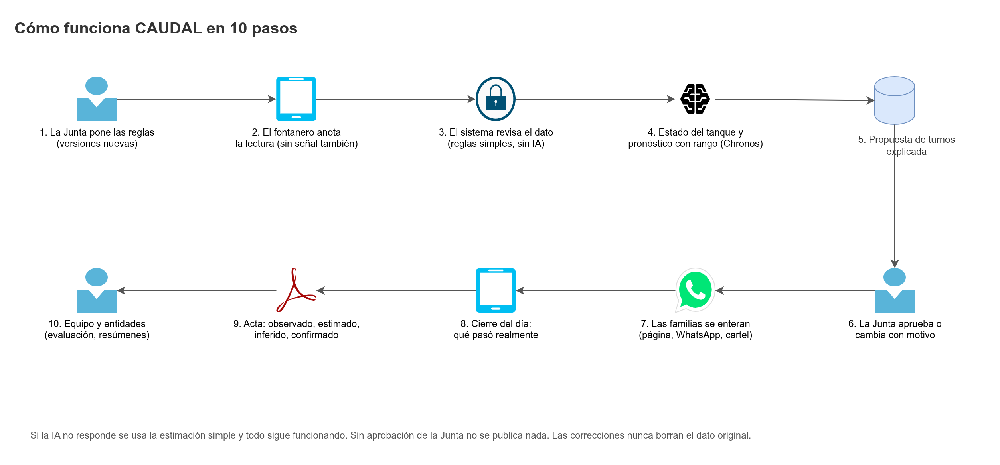

# Documentación de CAUDAL

**CAUDAL** es el cuaderno del acueducto veredal, pero digital: ayuda a las veredas de Guaitarilla (Nariño) a racionar el agua con menos trabajo manual, registros que no se pierden en papel, pronóstico del nivel del tanque con IA y decisiones explicadas que aprueba la Junta.

> Proyecto académico de la materia **Patrones de Software**. Backend en Java (exigencia del curso), frontend PWA, módulo de IA con Chronos y simulador de los datos de la región y del hardware.
>
> **Equipo:** Nicolas Diaz (`NicoalsD`) · Drako Salazar (`Drako2305`) · Nicolas Mora (`nicomora70`)

Esta carpeta es la **documentación canónica** de los 4 repositorios. Los demás repositorios enlazan aquí.

## Producto

| Documento | Contenido |
|---|---|
| [Caudal](Caudal.md) | Problema, objetivos, alcance, los 10 pasos en palabras simples, módulos y principios |
| [Actores y permisos](Actores-y-permisos.md) | Junta, fontanero, familias, equipo y entidades; roles y matriz de permisos |
| [Historias de usuario](Historias-de-usuario.md) | HU con prioridad MoSCoW y criterios Gherkin |
| [Requerimientos](Requerimientos.md) | Funcionales (RF) y no funcionales (RNF) con trazabilidad |
| [Reglas de negocio](Reglas-de-negocio.md) | Reglas versionadas, bandas, asignación de turnos, validación de lecturas, estados, actas |
| [Glosario](Glosario.md) | Términos del dominio y su nombre en el código |

## Técnico

| Documento | Contenido |
|---|---|
| [Stack tecnológico](Stack-tecnologico.md) | Tecnologías por capa con su justificación y alternativas descartadas |
| [Arquitectura](Arquitectura.md) | C4, arquitectura hexagonal, flujos, despliegue, CI/CD y decisiones |
| [Modelo de datos](Modelo-de-datos.md) | 7 esquemas y 57 tablas, relaciones, migraciones y semilla |
| [Diccionario de datos](Diccionario-de-datos.md) | Cada columna con tipo, restricciones y clasificación (generado) |
| [API REST](API.md) | Convenciones, errores, Swagger y todos los endpoints |
| [Patrones de diseño](Patrones-de-diseno.md) | Catálogo P01 a P23 por repositorio, con dueño y prueba |
| [Módulo de IA](Modulo-IA.md) | Pronóstico con Chronos, respaldo simple, circuit breaker y evaluación |
| [Contrato backend-IA](Contrato-IA.md) | Endpoints, esquemas, errores y pruebas de contrato |
| [Datos simulados](Datos-simulados.md) | Gemelo digital de la región, modos y cómo se marcan los datos |
| [Simulador y hardware](Simulador-y-hardware.md) | Propuesta de hardware real y su representación en el simulador |
| [Protocolo de dispositivos](Protocolo-de-dispositivos.md) | Firmas Ed25519, telemetría y comandos de válvula |

## Seguridad y configuración

| Documento | Contenido |
|---|---|
| [Seguridad](Seguridad.md) | Modelo de amenazas y controles de todo el sistema |
| [Seguridad de la base de datos](Seguridad-de-la-base-de-datos.md) | Roles, RLS, append-only, cadena de hashes, retención |
| [Configuración sin valores quemados](Configuracion-sin-valores-quemados.md) | Una sola fuente por valor: BD, `FieldLimits`, entorno, i18n |

## Gestión

| Documento | Contenido |
|---|---|
| [Roles y planeación](Roles-y-planeacion.md) | Roles del equipo, fases 0 a 12, dependencias, DoR y DoD |
| [Plan de commits](Plan-de-commits.md) | Commits previstos por repositorio, fase e integrante |
| [Riesgos](Riesgos.md) | Riesgos con probabilidad, impacto, mitigación y contingencia |
| [Flujo de trabajo](../.agents/workflow.md) | Cuentas, ramas, commits y pull requests |

## Diagramas

Todos se hacen con draw.io (MCP de draw.io y sus iconos). Cada diagrama tiene su fuente `.drawio` y su exportación `.png` en [`images/`](images/).

| Diagrama | Archivo |
|---|---|
| Flujo de CAUDAL en 10 pasos | [flujo-caudal](images/flujo-caudal.png) |
| Casos de uso | [casos-de-uso](images/casos-de-uso.png) |
| Contexto y contenedores (C4) | [c4-contexto](images/c4-contexto.png) · [c4-contenedores](images/c4-contenedores.png) |
| Arquitectura hexagonal | [capas-backend](images/capas-backend.png) |
| Modelo de datos (7 páginas) | [general](images/modelo-de-datos.png) · [iam](images/modelo-de-datos-iam.png) · [org](images/modelo-de-datos-org.png) · [ops lecturas](images/modelo-de-datos-ops-lecturas.png) · [ops turnos](images/modelo-de-datos-ops-turnos.png) · [reporting, audit, sim](images/modelo-de-datos-reporting-audit-sim.png) · [devices](images/modelo-de-datos-devices.png) |
| Secuencias | [login](images/secuencia-login.png) · [lectura](images/secuencia-lectura.png) · [pronóstico](images/secuencia-pronostico.png) · [propuesta](images/secuencia-propuesta.png) · [telemetría](images/secuencia-telemetria.png) |
| Estados | [propuesta](images/estados-propuesta.png) · [circuit breaker](images/estados-circuit-breaker.png) |
| Patrones | [catálogo](images/catalogo-patrones.png) · [backend](images/patrones-backend.png) |
| IA y simulación | [arquitectura de la IA](images/arquitectura-ia.png) · [datos simulados](images/flujo-datos-simulados.png) · [modelo físico](images/modelo-fisico-acueducto.png) · [hardware propuesto](images/hardware-propuesto.png) |
| Gestión | [fases](images/dependencias-fases.png) · [Git Flow](images/git-flow.png) · [CI/CD](images/ci-cd.png) · [despliegue](images/despliegue.png) |

Relacionados: [AGENTS.md](../AGENTS.md) · [README](../README.md)
