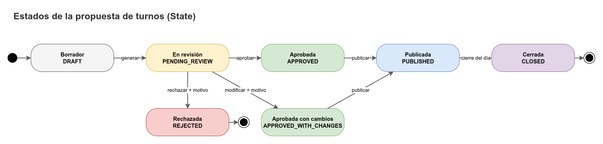

# Reglas de negocio

Este documento desarrolla las reglas de negocio de CAUDAL (sección 17 de los hechos canónicos) con ejemplos numéricos. Cada cifra indica el parámetro de la base de datos que la gobierna. Los valores de ejemplo viven en la semilla o en las filas de `org.rule_sets` y sus tablas hijas; el código no los quema.

Convenciones:

- Los valores marcados **semilla** vienen de los hechos canónicos y son los únicos de referencia.
- Los valores marcados **ejemplo, verificar** son supuestos para ilustrar. La Junta los define.
- **Por definir** indica un punto que no tiene decisión todavía. No se implementa sin confirmarlo.
- Todas las horas se almacenan en UTC (`timestamptz`) y se muestran en `America/Bogota`. En los ejemplos se usa hora local.
- Los números se muestran con coma decimal (`2,1`). En la base de datos se guardan con punto.

## 1. Versiones de reglas

Las reglas de la Junta son una fila en `org.rule_sets` más sus tablas hijas: bandas (`rule_level_bands`), prioridad por sector (`rule_sector_settings`), orden de válvulas (`rule_valve_orders`) y horarios (`rule_operating_windows`). Una versión pasa por cuatro estados.

| Estado | Significado | Quién lo cambia | Se puede editar |
|---|---|---|---|
| `DRAFT` | Borrador. Es la única versión editable. | `BOARD_ADMIN` y `BOARD_MEMBER` lo crean y lo editan. | Sí, con `PATCH /rule-sets/{id}` |
| `ACTIVE` | Vigente. Una sola por acueducto. | Pasa a `ACTIVE` con `POST /rule-sets/{id}/activate`. | No. Un trigger lo impide. |
| `SUPERSEDED` | Reemplazada por una versión posterior. Se conserva para explicar decisiones pasadas. | El sistema, al activar otra versión. | No |
| `DISCARDED` | Borrador descartado. | Por definir (no hay endpoint en la sección 13). | No |

Nota: `BOARD_MEMBER` crea y edita borradores (sección 9). Solo `BOARD_ADMIN` activa una versión.

### 1.1 Creación de un borrador (Prototype)

`POST /rule-sets` copia la versión `ACTIVE` mediante `RuleSet.copyForNewVersion()` (patrón P05). La copia incluye:

- Los escalares de la fila: `reserve_level`, `max_daily_service_hours`, `min_shift_hours`, `max_shift_hours`, `allocation_strategy`, `duplicate_window_minutes`, `max_level_change_per_hour`, `stale_reading_hours`, `max_backdate_days`, `forecast_horizon_days`, `forecast_context_days`, `trend_threshold_per_day`.
- Todas las filas hijas: bandas, sectores, orden de válvulas y ventanas de operación.

La copia recibe `version = versión máxima + 1`, `status = DRAFT`, `based_on_rule_set_id` apuntando a la versión original, y `created_by` con el usuario que la pidió.

Ejemplo: la versión 3 está `ACTIVE` con `reserve_level = 1,00`. La Junta pide subir la reserva a `1,20`. Se crea la versión 4 en `DRAFT` copiando todo. Solo cambia `reserve_level`. La versión 3 no se toca.

### 1.2 Activación

`POST /rule-sets/{id}/activate` (solo `BOARD_ADMIN`, permiso `RULESET_ACTIVATE`) hace lo siguiente en una sola transacción:

1. Valida la versión (sección 2). Si falla, responde `422 RULE_SET_INVALID` y no cambia nada.
2. Marca la versión anterior `ACTIVE` como `SUPERSEDED` y le pone `valid_to = valid_from` de la nueva.
3. Pone la nueva en `ACTIVE`, con `valid_from = ahora` (salvo que se indique otra fecha, por definir), `activated_by` y `activated_at`.
4. Escribe `RULESET_ACTIVATED` en `audit.audit_log`.

El motivo de la activación es obligatorio (`change_reason`, 10 a 500 caracteres, `FieldLimits.REASON`). Ver la sección 7.

### 1.3 Inmutabilidad

Una versión `ACTIVE` o `SUPERSEDED` no se modifica, ni ella ni sus filas hijas. El trigger de inmutabilidad de reglas activas rechaza cualquier `UPDATE` o `DELETE` sobre ellas. Si la Junta necesita cambiar algo, se crea un borrador nuevo (sección 1.1). Un intento de editar una versión activa responde `409 RULE_SET_IMMUTABLE`.

### 1.4 Vigencia

- Una lectura guarda `rule_set_id` con la versión vigente en el momento de validarla (`ops.readings.rule_set_id`). Si después cambian las reglas, la lectura conserva su versión.
- Una propuesta guarda `rule_set_id` con la versión usada para `service_date`.
- Un pronóstico guarda `rule_set_id` con la versión vigente al calcularlo.

Así cualquier decisión pasada se puede explicar con las reglas que estaban vigentes.

## 2. Validación de una versión de reglas

Antes de activar una versión se comprueba lo siguiente. Todos los límites de rango están en la base de datos o en `FieldLimits`.

| Comprobación | Dónde se aplica | Resultado si falla |
|---|---|---|
| Bandas sin solapes | `EXCLUDE` con `numrange` sobre `rule_level_bands` | Error de base de datos traducido a `RULE_SET_INVALID` (422) |
| Bandas cubren todo el rango del tanque | Validación de aplicación al activar | `RULE_SET_INVALID` (422) con los huecos en `details` |
| `max_level > min_level` en cada banda | `CHECK` en `rule_level_bands` | `RULE_SET_INVALID` |
| `max_shift_hours >= min_shift_hours` | `CHECK` en `rule_sets` | `RULE_SET_INVALID` |
| `max_daily_service_hours` entre 0 y 24 | `CHECK` con `HOURS_PER_DAY` | `RULE_SET_INVALID` |
| Cada sector incluido tiene su orden de válvulas (si tiene válvulas) | Validación de aplicación | `RULE_SET_INVALID` |

### 2.1 Cobertura y el extremo superior

Las bandas son intervalos `[min_level, max_level)`: `min_level` está incluido y `max_level` excluido. La banda superior incluye `gauge_max`: para la banda cuyo `max_level` es igual a `tanks.gauge_max`, la búsqueda usa `min_level <= nivel <= max_level`. Así una lectura de exactamente `5,00` cae en `HIGH`. Las demás bandas son semiabiertas.

Ejemplo de la semilla (regla 0 a 5):

| Banda | `min_level` (incluido) | `max_level` (excluido) | Horas al día | `priority_only` |
|---|---|---|---|---|
| `HIGH` | 3,50 | 5,00 (incluye 5,00) | 16 | No |
| `LOW` | 1,50 | 3,50 | 8 | No |
| `CRITICAL` | 0,00 | 1,50 | 3 | Sí |

Cobertura: `0,00` a `1,50` (CRITICAL), `1,50` a `3,50` (LOW), `3,50` a `5,00` (HIGH). No hay huecos ni solapes.

Ejemplos de versiones rechazadas:

- `LOW` con `max_level = 3,60` se solapa con `HIGH` (desde `3,50`). La base de datos la rechaza con `EXCLUDE`.
- `LOW` con `max_level = 3,00` deja libre `[3,00; 3,50)`. La validación de cobertura la rechaza y `details` indica `"gaps": [{"from": "3,00", "to": "3,50"}]`.

## 3. Cálculo de horas disponibles

Las horas disponibles de un día son el máximo de servicio que el tanque permite repartir. Se guardan en `ops.schedule_proposals.available_hours` con estatus `ESTIMATED`.

### 3.1 Banda

La banda sale del último nivel observado (`tank_level_snapshot`), no del pronóstico. Así la decisión se apoya en un dato que alguien midió. El pronóstico solo interviene en la guarda de reserva (sección 3.3).

Ejemplo: último nivel `2,10`. Está en `[1,50; 3,50)`, así que la banda es `LOW` con 8 horas (`rule_level_bands.daily_service_hours`).

### 3.2 Ventana de operación y tope diario

Horas máximas del día:

```
horas = min(
    banda.daily_service_hours,              -- rule_level_bands
    duracion(ventana de operación del día), -- rule_operating_windows
    max_daily_service_hours                 -- rule_sets
)
```

Ejemplo: ventana `05:00` a `21:00` (16 h, `rule_operating_windows` con `day_of_week` nulo, es decir, todos los días). `max_daily_service_hours = 16,00` (ejemplo, verificar). Entonces `min(8, 16, 16) = 8,00`. La banda es la que limita.

### 3.3 Guarda de reserva con el p10

La reserva es el nivel mínimo que la Junta quiere conservar (`rule_sets.reserve_level`, semilla `1,0`).

Se compara el cuantil bajo del pronóstico del día de servicio (`forecast_points.p10`) con la reserva:

- Si `p10 >= reserve_level`: no se recortan horas. Se explica con `RESERVE_GUARD`.
- Si `p10 < reserve_level`: se aplica la política `rule_sets.reserve_policy`:
  - `NONE`: no recorta horas.
  - `REDUCE_TO_CRITICAL_BAND` (por defecto): las horas del día se limitan a las de la banda `CRITICAL` de la misma versión.
  - `PRIORITY_ONLY`: solo se asignan turnos a los sectores prioritarios.

Ejemplo: `p10 = 1,80` y `reserve_level = 1,00`. `1,80 >= 1,00`, así que no hay recorte. Horas disponibles: `8,00`.

Ejemplo con recorte: `p10 = 0,90` está por debajo de la reserva. Con `REDUCE_TO_CRITICAL_BAND` y la banda `CRITICAL` de la semilla (3 h), las horas bajan de `8,00` a `min(8,00; 3,00) = 3,00`.

### 3.4 Explicación del nivel y del pronóstico

Los números de la guarda y de la banda se guardan como parámetros del código `TANK_BAND`, `FORECAST_RANGE` y `RESERVE_GUARD` (sección 6).

## 4. Horas sin servicio

Horas sin servicio de un sector: tiempo entre el fin de su último turno y la referencia de la propuesta.

**Referencia (propuesta, verificar):** el inicio de la ventana de operación del día de servicio. Así dos propuestas del mismo día calculan lo mismo.

**Último fin:**

1. El `actual_end` del último registro de `ops.shift_executions` con estatus `COMPLETED` o `PARTIAL` y que no esté reemplazado (`supersedes_id` no lo apunta). Este dato es `CONFIRMED`.
2. Si no hay ninguno, el `end_at` del último turno publicado (`ops.schedule_items` de una propuesta `PUBLISHED` o `CLOSED`). Este dato es `ESTIMATED`.
3. Si tampoco hay, por definir (propuesta: fecha de alta del sector).

`NOT_EXECUTED` no reinicia el contador. Un sector que no recibió agua no ganó nada.

Ejemplo, referencia `2026-10-09 05:00`:

| Sector | Último fin usado | Origen | Horas sin servicio |
|---|---|---|---|
| Escuela | 2026-10-08 19:00 (turno publicado de 17:00 a 19:00) | `ESTIMATED` | 10 |
| Sector Alto | 2026-10-08 13:00 (`COMPLETED`) | `CONFIRMED` | 16 |
| Sector Centro | 2026-10-07 21:00 (`PARTIAL`). Su turno `NOT_EXECUTED` del 8 de octubre no cuenta. | `CONFIRMED` | 32 |
| Sector Sur | 2026-10-08 07:00 (`COMPLETED`) | `CONFIRMED` | 22 |

Cálculo de Centro: de 21:00 a 24:00 son 3 h, el 8 de octubre son 24 h, y de 00:00 a 05:00 son 5 h. Total 32 h.

## 5. Asignación de turnos

### 5.1 Estrategia `PRIORITY_THEN_LONGEST_WAIT` (por defecto)

Valor de `rule_sets.allocation_strategy`. Orden:

1. Sectores prioritarios (`rule_sector_settings.is_priority = true`), en orden de `priority_rank` ascendente.
2. Resto de sectores incluidos (`is_included = true`), por horas sin servicio de mayor a menor. Desempate: código del sector, en orden alfabético (propuesta).

Si la banda tiene `priority_only = true`, solo se asignan los prioritarios.

Reglas de tamaño:

- Cada turno dura `min(max_shift_hours, presupuesto restante)`.
- Un turno solo se crea si su duración es `>= min_shift_hours`. No se fragmenta lo que sobra.
- El presupuesto nunca baja de cero. Como cada turno solo consume presupuesto, si un sector no cabe, los siguientes tampoco caben.
- Los turnos son consecutivos desde la hora de inicio de la ventana. No se solapan.
- Un sobrante menor que `min_shift_hours` queda sin usar y se registra en la propuesta.

Pseudocódigo:

```
entrada: ruleSet, tanque, nivel, pronostico, fechaServicio

 1  banda <- bandaQueContiene(ruleSet, nivel)           // sección 2.1 para el extremo superior
 2  horas <- min(banda.daily_service_hours,
               duracionVentana(ruleSet, fechaServicio),
               ruleSet.max_daily_service_hours)
 3  si pronostico != null y pronostico.p10 < ruleSet.reserve_level:
        horas <- aplicarRecorteReserva(horas, ruleSet.reserve_policy)
 4  presupuesto <- horas
 5  cursor <- inicioVentana(fechaServicio)
 6  incluidos <- sectores con is_included = true
 7  si banda.priority_only: candidatos <- incluidos con is_priority = true
    si no:
        prioritarios <- incluidos con is_priority = true, orden por priority_rank
        resto <- incluidos sin is_priority, orden por horasSinServicio desc
        candidatos <- prioritarios + resto
 8  para cada s en candidatos:
        si presupuesto < min_shift_hours:
            registrar(s, NO_BUDGET); continuar
        duracion <- min(max_shift_hours, presupuesto)
        crear turno(s, cursor, cursor + duracion, origen = PROPOSED)
        explicar(s)                                     // sección 6
        cursor <- cursor + duracion
        presupuesto <- presupuesto - duracion
 9  devolver turnos, presupuesto sobrante, sectores sin turno con motivo
```

Nota: en el paso 8 la prioridad del sector y su orden de llegada son los mismos en las dos fases. Para los prioritarios, la duración es `min(max_shift_hours, presupuesto)`, es decir, no se les da menos que a los demás.

### 5.2 Ejemplo completo

Datos del ejemplo (todos son ejemplo, verificar, salvo la semilla indicada):

| Dato | Valor | Gobernado por |
|---|---|---|
| Regla | Versión 3, `ACTIVE` | `org.rule_sets` |
| Rango del tanque | `0,00` a `5,00` | `org.tanks.gauge_min`, `gauge_max` (semilla) |
| Último nivel | `2,10` (2026-10-08 18:00, `OBSERVED`) | `ops.readings`, vista de lecturas efectivas |
| Hora de cálculo | 2026-10-09 04:30 | Reloj del servidor |
| Pronóstico del día (`p10`, `p50`, `p90`) | `1,80`, `2,10`, `2,40` | `ops.forecast_points` |
| `reserve_level` | `1,00` (semilla) | `org.rule_sets` |
| Banda `LOW` | `[1,50; 3,50)`, 8 h, `priority_only = false` | `org.rule_level_bands` |
| Ventana de operación | 05:00 a 21:00 | `org.rule_operating_windows` |
| `max_daily_service_hours` | `16,00` | `org.rule_sets` |
| `min_shift_hours` | `1,00` | `org.rule_sets` |
| `max_shift_hours` | `3,00` | `org.rule_sets` |
| `stale_reading_hours` | `12` | `org.rule_sets` |
| `allocation_strategy` | `PRIORITY_THEN_LONGEST_WAIT` | `org.rule_sets` |

Sectores incluidos:

| Sector | `is_priority` | `priority_rank` | Horas sin servicio |
|---|---|---|---|
| Escuela | Sí | 1 | 10 (`ESTIMATED`) |
| Sector Centro | No | | 32 (`CONFIRMED`) |
| Sector Sur | No | | 22 (`CONFIRMED`) |
| Sector Alto | No | | 16 (`CONFIRMED`) |

Paso a paso:

1. Banda: `2,10` cae en `LOW`. Horas de la banda: `8,00`.
2. Horas: `min(8,00; 16,00; 16,00) = 8,00`. Horas disponibles: `8,00` (`ESTIMATED`).
3. Reserva: `p10 = 1,80 >= 1,00`. No hay recorte. Explicación `RESERVE_GUARD`.
4. Presupuesto `8,00`, cursor `05:00`.
5. Prioritarios: Escuela. Duración `min(3,00; 8,00) = 3,00`. Turno `05:00` a `08:00`. Presupuesto `5,00`, cursor `08:00`.
6. Resto por horas sin servicio: Centro (32), Sur (22), Alto (16).
7. Centro: `min(3,00; 5,00) = 3,00`. Turno `08:00` a `11:00`. Presupuesto `2,00`, cursor `11:00`.
8. Sur: `min(3,00; 2,00) = 2,00`, que es `>= 1,00`. Turno `11:00` a `13:00`. Presupuesto `0,00`, cursor `13:00`.
9. Alto: presupuesto `0,00 < 1,00`. Sin turno hoy. Motivo `NO_BUDGET`.

Comprobación: `3 + 3 + 2 = 8` horas, igual al presupuesto. Turnos `05:00-08:00`, `08:00-11:00`, `11:00-13:00`: consecutivos, sin solapes, todos dentro de `05:00-21:00`.

Resultado:

| Orden | Sector | Inicio | Fin | Duración | Origen | Explicaciones (en orden) |
|---|---|---|---|---|---|---|
| 1 | Escuela | 05:00 | 08:00 | 3 h | `PROPOSED` | `PRIORITY_SECTOR`, `HOURS_WITHOUT_SERVICE`, `TANK_BAND`, `RESERVE_GUARD` |
| 2 | Sector Centro | 08:00 | 11:00 | 3 h | `PROPOSED` | `HOURS_WITHOUT_SERVICE`, `TANK_BAND` |
| 3 | Sector Sur | 11:00 | 13:00 | 2 h | `PROPOSED` | `HOURS_WITHOUT_SERVICE` |

Sin turno: Sector Alto. Su explicación no se guarda en `schedule_item_reasons` porque no tiene turno. Ver la sección 6.3.

Textos (en español, ver sección 6):

- Escuela: "Escuela es prioritario y recibe turno antes que los demás." / "Escuela lleva 10 horas sin servicio (dato estimado, según el último turno publicado)." / "Nivel del tanque 2,10 (banda LOW): hay 8 horas de servicio hoy." / "El nivel posible más bajo (1,80) está por encima de la reserva (1,00); no se recortan horas."
- Centro: "Sector Centro lleva 32 horas sin servicio." / "Nivel del tanque 2,10 (banda LOW): hay 8 horas de servicio hoy."
- Sur: "Sector Sur lleva 22 horas sin servicio."

Si hoy el tanque estuviera en `CRITICAL` (menos de `1,50`), la banda sería `priority_only`. Entonces solo Escuela recibiría turno, con `min(3; 3) = 3` horas, y los demás no aparecerían.

### 5.3 Estrategia `EQUAL_SPLIT`

Valor alternativo de `rule_sets.allocation_strategy`. Reparte el presupuesto en partes iguales entre los sectores incluidos (propuesta de diseño, verificar con el equipo).

```
cuota <- min(max_shift_hours, presupuesto / N)     // N = sectores incluidos
si cuota < min_shift_hours: ningún sector recibe turno; motivo CUOTA_INSUFICIENTE
si no: asignar cuota a cada sector en el orden de la estrategia (prioritarios primero, luego horas sin servicio)
```

Ejemplo con el mismo día: `8,00 / 4 = 2,00` por sector, que es mayor que `min_shift_hours = 1,00` y menor que `max_shift_hours = 3,00`.

| Orden | Sector | Inicio | Fin |
|---|---|---|---|
| 1 | Escuela | 05:00 | 07:00 |
| 2 | Sector Centro | 07:00 | 09:00 |
| 3 | Sector Sur | 09:00 | 11:00 |
| 4 | Sector Alto | 11:00 | 13:00 |

Con `EQUAL_SPLIT` todos reciben turno, pero cada uno recibe menos horas. El código `PRIORITY_SECTOR` sigue explicando el orden.

## 6. Explicaciones estructuradas

Cada turno guarda una o más filas en `ops.schedule_item_reasons` con `reason_code`, `params` (JSON) y `sort_order`. El texto se arma en el backend con plantillas en español (patrón P22, `{sector}`, `{horas}`, coma decimal). El frontend no construye texto a partir de los códigos.

### 6.1 Códigos y parámetros

| `reason_code` | Cuándo se usa | `params` | Plantilla en español |
|---|---|---|---|
| `PRIORITY_SECTOR` | El sector es prioritario | `sector`, `priority_rank` | `{sector} es prioritario y recibe turno antes que los demás.` |
| `HOURS_WITHOUT_SERVICE` | Se explica el orden por espera | `sector`, `horas`, `origen` (`CONFIRMED` o `ESTIMATED`) | `{sector} lleva {horas} {unidad_horas} sin servicio.` |
| `TANK_BAND` | Se explica la banda y las horas del día | `nivel`, `banda`, `horas` | `Nivel del tanque {nivel} (banda {banda}): hay {horas} {unidad_horas} de servicio hoy.` |
| `FORECAST_RANGE` | Se explica el pronóstico (si existe) | `p10`, `p50`, `p90`, `dia` | `Para {dia} se espera un nivel de {p50} (entre {p10} y {p90}).` |
| `RESERVE_GUARD` | Se explica que la reserva fue revisada | `p10`, `reserve_level`, `recortado` | Sin recorte: `El nivel posible más bajo ({p10}) está por encima de la reserva ({reserve_level}); no se recortan horas.` Con recorte: texto por definir. |
| `BOARD_CHANGE` | La Junta cambió el turno | `motivo` (del `proposal_decisions`) | `La Junta cambió este turno: {motivo}` |

Formato:

- `{horas}` y `{nivel}` se muestran con coma decimal. Si el número es entero no se muestran decimales: `8` y `10`. Si no es entero: `2,5`. Los niveles siempre con dos decimales: `2,10`.
- `{unidad_horas}`: `hora` si el valor es `1`, `horas` en otro caso. Así `1 hora` y `2 horas`.
- Los valores `{dia}` se muestran como "mañana", "hoy" o la fecha, según la diferencia con la fecha de emisión.

### 6.2 Reglas de redacción

- Una explicación por hecho. No se mezclan dos hechos en una sola plantilla.
- Las explicaciones se muestran en el orden de `sort_order`. Primero la prioridad, después las horas sin servicio, después la banda y el pronóstico.
- El texto no incluye nombres de personas ni teléfonos (la página pública hereda este texto).

### 6.3 Sectores sin turno

Un sector sin turno no tiene fila en `schedule_items`, así que no puede tener fila en `schedule_item_reasons`. Su motivo (`NO_BUDGET`, `CUOTA_INSUFICIENTE` o `NO_INCLUIDO`) se guarda en `ops.schedule_proposals.unserved_sectors` (jsonb) y se devuelve en la respuesta de `GET /schedule-proposals/{id}`.

Plantilla propuesta: `{sector} no tiene turno hoy: el agua disponible se usó en los sectores anteriores de la lista.`

## 7. Versiones de la columna `change_reason`

`org.rule_sets.change_reason` tiene `FieldLimits.REASON` (10 a 500 caracteres). El motivo se exige al activar; en el borrador puede estar vacío.

- `POST /rule-sets` crea el borrador; el motivo puede venir vacío.
- `POST /rule-sets/{id}/activate` exige `change_reason` y lo audita en `audit.audit_log.after_state`.
- Los hechos exigen el motivo al activar; el borrador puede no tenerlo.

## 8. Validación de lecturas

La cadena de validación (patrón P12, `ReadingValidationHandler`) se ejecuta en este orden: rango, fecha, duplicado, salto brusco y antigüedad. Se detiene en el primer error. Las advertencias se acumulan.

Severidades permitidas por el esquema: `INFO`, `WARNING`. Estados guardados de la lectura: `ACCEPTED` y `FLAGGED`. Una lectura inválida no se guarda: la API responde `422`.

### 8.1 Tabla de validadores

| Orden | Código | Condición exacta | Tipo | Efecto | Estado resultante |
|---|---|---|---|---|---|
| 1 | `GAUGE_OUT_OF_RANGE` (API) | `value < tanks.gauge_min` o `value > tanks.gauge_max`, o tiene más de 2 decimales | Rechazo | Respuesta 422. No se guarda la lectura. | Ninguno (no persiste). |
| 2a | `MISSING_TIMESTAMP` (API) | `observed_at` no existe o no es una fecha ISO-8601 con zona | Rechazo | Respuesta 422. No se guarda. | Ninguno |
| 2b | `FUTURE_TIMESTAMP` | `observed_at > ahora + 5 minutos` | Rechazo | Respuesta 422. No se guarda. | Ninguno |
| 3 | `DUPLICATE` | Existe otra lectura del mismo tanque con el mismo `gauge_value` y `\|observed_at - observed_at_otra\| <= duplicate_window_minutes` | Marca | Se guarda y se marca. | `FLAGGED` |
| 4 | `SUDDEN_JUMP` | `\|valor - valor_anterior\| / horas_entre > max_level_change_per_hour`, donde `valor_anterior` es la última lectura efectiva anterior a `observed_at` y `horas_entre > 0` | Marca | Se guarda y se marca. El dato se acepta marcado. | `FLAGGED` |
| 5 | `TOO_OLD` | `ahora - observed_at > max_backdate_days * 24 horas` (excepto importación en acueducto demo) | Rechazo | Respuesta 422. No se guarda. | Ninguno |

Notas:

1. La API responde 422 `GAUGE_OUT_OF_RANGE` con `details` (`gauge_min`, `gauge_max`, `value`), y la app pide corregir antes de reenviar. El trigger de rango de `ops.readings.gauge_value` es la defensa final en la BD.
2. Las lecturas rechazadas por los errores 1, 2 y 5 no se guardan y no generan issue. Las lecturas guardadas quedan solo `ACCEPTED` o `FLAGGED`.
3. `MISSING_TIMESTAMP` no genera fila en `reading_issues` porque `observed_at` es `NOT NULL`. Es un rechazo de la API.
4. `STALE` no es un validador de lectura. Es un aviso del estado del tanque (sección 10) y una anomalía `STALE_DATA`.

### 8.2 Reglas de identidad

- Si llega un `id` (UUID del cliente) que ya existe con el mismo contenido, es un reintento idempotente. Se responde 200 con la lectura original y `idempotent_replay: true`. No es un error.
- Si llega un `id` que existe con contenido distinto, se responde 409 `DUPLICATE_READING`.
- Un valor repetido con otro `id` dentro de la ventana no es error: queda `FLAGGED` por `DUPLICATE`.

### 8.3 Ejemplos

Con `gauge_min = 0,00`, `gauge_max = 5,00`, `duplicate_window_minutes = 30` (ejemplo, verificar), `max_level_change_per_hour = 0,30` (ejemplo, verificar) y `max_backdate_days = 2` (ejemplo, verificar):

| Caso | Entrada | Resultado |
|---|---|---|
| Dato 8 en regla de 0 a 5 | `gauge_value = 8,00` | 422 `GAUGE_OUT_OF_RANGE`, `details: {"gauge_min": "0,00", "gauge_max": "5,00", "value": "8,00"}`. No se guarda. |
| Fecha en el futuro | `observed_at` = ahora + 10 min | 422 `FUTURE_TIMESTAMP` |
| Lectura de hace 3 días | `observed_at` = ahora - 72 h | 422 `TOO_OLD` |
| Repetido | Lectura `2,10` a las 18:00 y otra `2,10` a las 18:20 | Se guarda `FLAGGED`, issue `DUPLICATE` (`window: 30`, `matched_reading_id`) |
| Salto | `2,10` a las 18:00 y `1,20` a las 19:00: caída de `0,90` en 1 h | Se guarda `FLAGGED`, issue `SUDDEN_JUMP` (`rate: 0,90`, `max: 0,30`) |
| Normal | `2,10` a las 18:00 y `2,05` a las 18:30 | `ACCEPTED`, sin issues |

## 9. Correcciones

- Una corrección nunca borra la lectura original. Se guarda una fila nueva en `ops.reading_corrections`.
- El valor efectivo de una lectura es el de su última corrección (vista `effective_readings`).
- `corrected_gauge_value` debe estar en el rango del tanque, igual que una lectura (`422 GAUGE_OUT_OF_RANGE` si no lo está).
- `reason` es obligatorio, de 10 a 500 caracteres. Si falta: `422 REASON_REQUIRED`.
- Quién puede corregir: `BOARD_ADMIN` y `BOARD_MEMBER` cualquier lectura; `OPERATOR` solo las suyas. El límite de tiempo para corregir las propias es por definir.
- Las issues de la lectura original no se recalculan al corregir (verificar). El estado `FLAGGED` sigue visible en el historial.

## 10. Estado del tanque

### 10.1 Último nivel y antigüedad

- Nivel: valor efectivo de la última lectura válida.
- Hace cuántas horas: `ahora - observed_at` de esa lectura. En el ejemplo, `2026-10-09 04:30 - 2026-10-08 18:00 = 10,5 horas`.

### 10.2 Tendencia

Se calcula la pendiente por mínimos cuadrados de las últimas lecturas efectivas dentro de la ventana de tendencia. La ventana es por definir; en el ejemplo se usan las lecturas de las 18:00 de los últimos tres días.

Eje X en días, con cero en la última lectura: `-2`, `-1`, `0`. Valores de la semilla de ejemplo: `2,60`, `2,35`, `2,10`.

```
x̄ = (-2 - 1 + 0) / 3 = -1
ȳ = (2,60 + 2,35 + 2,10) / 3 = 2,35
pendiente = Σ (x - x̄)(y - ȳ) / Σ (x - x̄)²
          = [(-1)(0,25) + (0)(0) + (1)(-0,25)] / [1 + 0 + 1]
          = -0,50 / 2
          = -0,25 unidades por día
```

Clasificación con `trend_threshold_per_day = 0,10` (ejemplo, verificar):

| Condición | Resultado |
|---|---|
| `pendiente < -trend_threshold_per_day` | Viene bajando |
| `-trend_threshold_per_day <= pendiente <= trend_threshold_per_day` | Estable |
| `pendiente > trend_threshold_per_day` | Sube |

Ejemplo: `-0,25 < -0,10`. El estado dice "viene bajando".

### 10.3 Dato viejo

`ahora - observed_at_ultima > stale_reading_hours` marca el estado como viejo (`STALE`) y crea la anomalía `STALE_DATA`. Ejemplo: `stale_reading_hours = 12` (ejemplo, verificar). Con 10,5 horas, no está viejo. Si pasan 13 horas sin lectura, sí.

### 10.4 Pronóstico en el estado

El estado muestra el pronóstico de la IA (o de la estimación simple si la IA no respondió) para el horizonte `forecast_horizon_days` (1 a 3, semilla). Si la IA no respondió, el estado indica `is_fallback = true` y el motivo.

## 11. Anomalías

Las anomalías son sospechas inferidas por reglas (`ops.anomalies`). Su estatus epistémico es `INFERRED` hasta que alguien las confirme en campo.

| `kind` | Condición | Parámetro | Estado inicial |
|---|---|---|---|
| `POSSIBLE_LEAK` | El nivel baja entre dos lecturas válidas consecutivas y en ese intervalo no hubo válvula abierta (ningún turno ejecutado ni comando `ACKED` de apertura). La caída supera la tolerancia. | `leak_tolerance` (por definir; ejemplo `0,05`) | `OPEN` |
| `ABNORMAL_DROP` | Durante un turno, el nivel baja más rápido que `max_level_change_per_hour` por hora | `max_level_change_per_hour` (ejemplo `0,30`) | `OPEN` |
| `SENSOR_FAULT` | Un sensor reporta el mismo valor en `N` lecturas seguidas (valor pegado) | `N` (por definir; ejemplo 6) | `OPEN` |
| `STALE_DATA` | `ahora - última lectura válida > stale_reading_hours` | `stale_reading_hours` (ejemplo `12`) | `OPEN` |
| `SUSPECTED_DUPLICATE` | Varias lecturas `FLAGGED` por `DUPLICATE` del mismo tanque en el mismo día | `duplicate_window_minutes` | `OPEN` |

Ejemplo de fuga: el 9 de octubre a las 02:00, el nivel baja de `2,10` a `1,95` (caída de `0,15`), sin turnos ni comandos de apertura entre las 18:00 y las 06:00. Como `0,15 > 0,05`, se crea `POSSIBLE_LEAK` con `evidence` que contiene las dos lecturas.

Ciclo de vida: `OPEN` pasa a `CONFIRMED` (con `resolved_by` y nota) o a `DISMISSED`. Una anomalía confirmada puede vincularse a un incidente (`related_incident_id`).

Limitación del modelo: el simulador asume que no sale agua con la válvula cerrada (hechos, sección 15). Si esa suposición cambia en campo, la regla de fuga cambia con ella (verificar).

## 12. Máquina de estados de la propuesta



Estados (`ops.schedule_proposals.status`): `DRAFT`, `PENDING_REVIEW`, `APPROVED`, `APPROVED_WITH_CHANGES`, `REJECTED`, `PUBLISHED`, `CLOSED`. `DRAFT` es interno: la propuesta nace en `PENDING_REVIEW`.

| Desde | Hacia | Acción (endpoint) | Quién (matriz sección 9) | Motivo | Condición |
|---|---|---|---|---|---|
| (nada) | `PENDING_REVIEW` | `POST /schedule-proposals` (el cálculo es interno y `DRAFT` solo existe mientras se construye) | `BOARD_ADMIN`, `BOARD_MEMBER` | No | Horas disponibles calculadas. Los sectores sin turno quedan en `unserved_sectors`. |
| `PENDING_REVIEW` | `APPROVED` | `POST /schedule-proposals/{id}/approve` | `BOARD_ADMIN`, `BOARD_MEMBER` | No | `lock_version` coincide |
| `PENDING_REVIEW` | `APPROVED_WITH_CHANGES` | `POST /schedule-proposals/{id}/modify` | `BOARD_ADMIN`, `BOARD_MEMBER` | Sí, 10 a 500 caracteres | Se guarda `proposal_snapshots` antes del cambio; los turnos cambiados llevan `origin = MODIFIED` o `ADDED` |
| `PENDING_REVIEW` | `REJECTED` | `POST /schedule-proposals/{id}/reject` | `BOARD_ADMIN`, `BOARD_MEMBER` | Sí, 10 a 500 caracteres | Estado final. Para el mismo día se genera una propuesta nueva. |
| `APPROVED` o `APPROVED_WITH_CHANGES` | `PUBLISHED` | `POST /schedule-proposals/{id}/publish` | `BOARD_ADMIN`, `BOARD_MEMBER` | No | Crea una fila en `ops.publications` (única por propuesta) |
| `PUBLISHED` | `CLOSED` | `POST /days/{date}/closure` | `BOARD_ADMIN`, `OPERATOR` | Notas opcionales | El día de servicio se cierra con `ops.day_closures` |

Transiciones prohibidas (todas responden `409 INVALID_STATE_TRANSITION`):

- Publicar desde `PENDING_REVIEW`, `REJECTED` o `DRAFT`. Sin aprobación no se publica nada.
- Aprobar o modificar una propuesta que ya no está en `PENDING_REVIEW`.
- Cualquier cambio desde `CLOSED` o `REJECTED`.
- Un `OPERATOR` que intente aprobar, modificar, rechazar o publicar recibe `403 FORBIDDEN`, no `409`.

Concurrencia: cada transición compara `lock_version`. Si no coincide, responde `409 CONFLICT`.

Nota: los hechos no definen si se puede modificar una propuesta ya publicada. Propuesta: no se modifica. Si cambia el plan del día, se crea una propuesta nueva (verificar).

## 13. Publicación

Al publicar, el sistema escribe una fila en `ops.publications`, que es append-only.

| Se publica | No se publica |
|---|---|
| Sector, hora de inicio y hora de fin de cada turno aprobado | Nombres de la Junta (`decided_by`) ni de quien publicó (`published_by`) |
| Fecha de servicio | Nivel del tanque, pronósticos, horas disponibles |
| Mensaje de WhatsApp (`whatsapp_text`, sin datos personales) | Anomalías, motivos internos y `schedule_item_reasons` (verificar) |
| Cartel PDF (su hash SHA-256 queda en `poster_sha256`) | Datos de reportes de daño de otras personas |
| Aviso "Datos simulados" si el acueducto es demo | Teléfonos o nombres de familias (no se guardan) |

Reglas:

- La página pública usa `PublicScheduleProxy`, que quita los datos personales antes de responder (patrón P11).
- Una publicación no se reemplaza. Si el horario cambia, se genera otra propuesta para el mismo día.
- Si el acueducto tiene `public_page_enabled = false`, la página pública responde `404` y el WhatsApp y el cartel no se generan (verificar).

## 14. Cierre del día

`POST /days/{date}/closure` registra el cierre de un día de servicio. Reglas:

- Solo se cierra un día que tenga una propuesta `PUBLISHED`.
- Un día tiene un solo cierre (`UNIQUE` sobre `aqueduct_id` y `service_date`).
- Antes de cerrar, cada turno debería tener un registro de ejecución. Por definir si el cierre se bloquea o solo avisa.
- Para cada turno, `POST /schedule-items/{id}/execution` registra `COMPLETED`, `PARTIAL` o `NOT_EXECUTED`.
  - `PARTIAL` y `COMPLETED` pueden llevar `actual_start` y `actual_end`. Si faltan, se usan los del turno (propuesta). `actual_end > actual_start` (CHECK).
  - `NOT_EXECUTED` no lleva horas. Por definir si `note` es obligatorio en `PARTIAL` y `NOT_EXECUTED`.
- Una ejecución no se edita. Para corregirla se crea otra fila con `supersedes_id` apuntando a la anterior.

Las ejecuciones son el origen del dato `CONFIRMED` de la sección 4.

## 15. Incidentes

Estados (`ops.incidents.status`): `REPORTED`, `VERIFYING`, `CONFIRMED`, `RESOLVED`, `DISMISSED`.

| Desde | Hacia | Quién (propuesta, verificar) | Nota obligatoria |
|---|---|---|---|
| (nada) | `REPORTED` | Público (`POST /public/{slug}/damage-reports`), fontanero o anomalía | No |
| `REPORTED` | `VERIFYING` | `OPERATOR`, `BOARD_ADMIN`, `BOARD_MEMBER` | No |
| `VERIFYING` | `CONFIRMED` | `OPERATOR` (en campo), `BOARD_ADMIN`, `BOARD_MEMBER` | Recomendada |
| `CONFIRMED` | `RESOLVED` | `OPERATOR`, `BOARD_ADMIN`, `BOARD_MEMBER` | Recomendada |
| `REPORTED` o `VERIFYING` | `DISMISSED` | `BOARD_ADMIN`, `BOARD_MEMBER` | Sí, 10 a 500 caracteres |

Cada cambio escribe una fila en `ops.incident_status_history` (append-only). El reportante consulta el estado con su código de seguimiento de 8 caracteres (`GET /public/damage-reports/{trackingCode}`). En la base solo se guarda el hash del código.

Categorías del catálogo `DAMAGE_CATEGORY`: fuga, tubo roto, sin agua, agua sucia, falla de válvula, otro.

## 16. Actas y resúmenes

### 16.1 Estatus epistémico

Cada registro cae en una sola sección del acta. La clasificación la hace `MinutesSectionVisitor` (patrón P21).

| Sección | Registros | Razón |
|---|---|---|
| **Observado** | `ops.readings` válidas (efectivas), reportes de daño en estado `REPORTED`, correcciones con su motivo | Lo que alguien vio o midió |
| **Estimado** | `ops.forecast_runs` y `ops.forecast_points`, horas disponibles de propuestas, evaluaciones (`forecast_evaluations`) | Lo que se calculó |
| **Inferido** | `ops.anomalies` en `OPEN` o `DISMISSED`, lecturas `FLAGGED` por duplicado o salto | Lo que se sospecha |
| **Confirmado** | `ops.shift_executions` (no reemplazadas), `ops.incidents` en `CONFIRMED` o `RESOLVED`, anomalías `CONFIRMED` con incidente vinculado confirmado en campo | Lo que se verificó en campo |

Regla: un registro que tiene dos interpretaciones se muestra en la sección más conservadora. Una anomalía `CONFIRMED` sin incidente confirmado en campo queda como inferida (verificar).

### 16.2 Estados del acta

- `DRAFT`: se puede regenerar. `generated_by` y `generated_at` se actualizan.
- `FINAL`: inmutable. Al cerrarla se guardan `finalized_by`, `finalized_at`, `pdf_sha256` y `audit_head_hash` (ancla de la cadena de auditoría del día).
- Solo `BOARD_ADMIN` y `BOARD_MEMBER` generan actas (`POST /minutes`).

### 16.3 Autorización de resúmenes

Un `SUPPORT_ENTITY` ve un resumen solo si todas estas condiciones son ciertas en el momento de la consulta:

1. `summary_shares.grantee_user_id` es su usuario.
2. `revoked_at IS NULL`.
3. `now() < expires_at` (vencimiento obligatorio).
4. El periodo pedido cae dentro de `period_from` y `period_to`.
5. Su membresía de `SUPPORT_ENTITY` está vigente (`memberships.valid_from <= now() < valid_to`, o `valid_to` nulo).
6. Si el alcance es `MINUTES`, el acta está en `FINAL`.

Cada consulta exitosa escribe una fila en `audit.data_access_log` con `summary_share_id`.

## 17. Parámetros que gobiernan cada número

| Número del documento | Parámetro | Dónde vive | Valor |
|---|---|---|---|
| Rango de la regla | `tanks.gauge_min`, `gauge_max`, `gauge_step` | `org.tanks` | Semilla: 0 a 5 |
| Bandas y horas (16, 8, 3) | `rule_level_bands.min_level`, `max_level`, `daily_service_hours`, `priority_only` | `org.rule_level_bands` | Semilla |
| Reserva 1,0 | `rule_sets.reserve_level` | `org.rule_sets` | Semilla: 1,00 |
| Horas máximas por día | `rule_sets.max_daily_service_hours` | `org.rule_sets` | Ejemplo: 16,00 |
| Duración de turnos | `rule_sets.min_shift_hours`, `max_shift_hours` | `org.rule_sets` | Ejemplo: 1,00 y 3,00 |
| Horario de operación | `rule_operating_windows` | `org.rule_operating_windows` | Ejemplo: 05:00 a 21:00 |
| Prioridad | `rule_sector_settings.is_priority`, `priority_rank` | `org.rule_sector_settings` | Ejemplo: Escuela, rango 1 |
| Estrategia | `rule_sets.allocation_strategy` | `org.rule_sets` | `PRIORITY_THEN_LONGEST_WAIT` |
| Ventana de duplicados | `rule_sets.duplicate_window_minutes` | `org.rule_sets` | Ejemplo: 30 |
| Salto brusco | `rule_sets.max_level_change_per_hour` | `org.rule_sets` | Ejemplo: 0,30 |
| Dato viejo | `rule_sets.stale_reading_hours` | `org.rule_sets` | Ejemplo: 12 |
| Antigüedad máxima | `rule_sets.max_backdate_days` | `org.rule_sets` | Ejemplo: 2 |
| Horizonte del pronóstico (1 a 3) | `rule_sets.forecast_horizon_days` | `org.rule_sets` | Semilla: 1 a 3 |
| Historia enviada a la IA | `rule_sets.forecast_context_days` | `org.rule_sets` | Ejemplo, verificar |
| Umbral de tendencia | `rule_sets.trend_threshold_per_day` | `org.rule_sets` | Ejemplo: 0,10 |
| Tolerancia de fuga | Por definir | Por definir | Ejemplo: 0,05 |
| Tolerancia de 5 minutos de futuro | Hechos, sección 11 | `FieldLimits` (constante) | 5 minutos |
| Límites de texto (motivos 10 a 500) | `FieldLimits.REASON` | Clase Java | 10 a 500 |

Lo que no está en esta tabla (ventana de tendencia, regla de recorte por reserva, tolerancia de fuga, número de lecturas para sensor pegado, tope de turnos por fragmento) se define en la Junta o en el equipo antes de implementarlo.

Relacionados: [API.md](API.md), [Contrato-IA.md](Contrato-IA.md), [Protocolo-de-dispositivos.md](Protocolo-de-dispositivos.md), [Diccionario-de-datos.md](Diccionario-de-datos.md)
