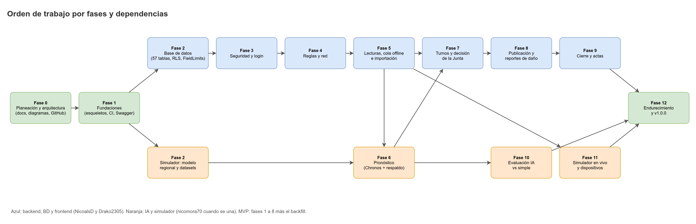
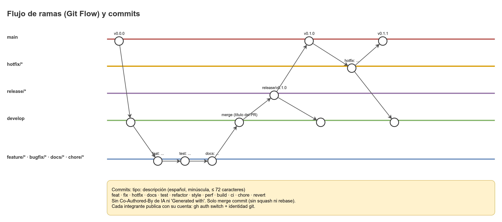

# Roles y planeación

Este documento define quién hace qué, cómo se trabaja (ramas, PR y commits), en qué orden se construye CAUDAL y cuándo una tarea está lista o terminada. Es la referencia para planear el trabajo de los cuatro repositorios: `caudal-backend`, `caudal-frontend`, `caudal-ia` y `caudal-simulador`.



## 1. Equipo y roles

| Integrante | Cuenta de GitHub | Rol principal | Responsabilidad transversal | Repos principales |
|---|---|---|---|---|
| Nicolas Diaz | `NicoalsD` | Frontend, UX y publicación (página pública, WhatsApp, cartel). | Documentación global y DevOps: dueño de los repos, reglas de GitHub, CI, releases. | `caudal-frontend`, `caudal-backend` (docs), todos (configuración). |
| Drako Salazar | `Drako2305` | Backend Java, base de datos y seguridad. | Líder de seguridad y de patrones de diseño. | `caudal-backend`. Cliente de IA en el backend. |
| Nicolas Mora | `nicomora70` | IA, datos simulados y simulador y hardware. Se une más adelante. | Detalle operativo de `caudal-ia` y `caudal-simulador` (`.agents/*`) y su código. | `caudal-ia`, `caudal-simulador`. |

### 1.1 Situación de nicomora70

Nicolas Mora se une al proyecto más adelante. La fecha de incorporación **por definir**. Mientras tanto, las piezas de IA y simulador se planean y se diseñan con el contrato y la documentación, pero su trabajo permanece asignado a nicomora70. Hasta que se una, el backend funciona con la estimación simple y con el circuito de la IA en abierto.

El reparto de trabajo queda **desigual** en las primeras fases: Nicolas Diaz y Drako cubren la mayor parte del trabajo. Se acepta esta desigualdad inicial. Se revisa cuando nicomora70 se incorpore.

### 1.2 Cuentas y configuración local

Cuentas permitidas: **solo las tres de la tabla**. Antes de trabajar en cualquier repositorio:

```
gh auth switch --hostname github.com --user <cuenta>
git config user.name "<nombre del integrante>"
git config user.email "<correo del integrante>"
gh api user --jq .login        # debe devolver la cuenta del integrante
```

| Integrante | `user.name` | `user.email` |
|---|---|---|
| Nicolas Diaz | Nicolas Diaz | correo verificado en su cuenta de GitHub |
| Drako Salazar | Drako Salazar | `203891767+Drako2305@users.noreply.github.com` |
| Nicolas Mora | Nicolas Mora | `167647383+nicomora70@users.noreply.github.com` |

Reglas:

- El trabajo de un integrante **nunca** se publica con la cuenta de otro.
- Las aprobaciones de PR las dan personas. Un agente o herramienta no aprueba con la cuenta de un integrante.
- Activar el hook de commits en cada clon: `git config core.hooksPath .githooks`.

## 2. Responsabilidades por rol y fase

| Rol | Fases 0 a 1 | Fases 2 a 5 | Fases 6 a 8 | Fases 9 a 12 |
|---|---|---|---|---|
| **NicoalsD** | Documentación, diagramas, reglas de GitHub, CI, esqueleto del frontend y de la configuración. | Frontend: login, reglas, lecturas offline, cola, importación en la UI. Revisión de PR del backend. | Frontend: estado del tanque y visualización del pronóstico, editor de propuesta, página pública, WhatsApp, cartel. | Frontend: cierre del día, actas, evaluación. Releases y DevOps. |
| **Drako2305** | Esqueleto del backend, linters, Docker Compose, logging, errores, Swagger. | Base de datos (57 tablas, RLS, triggers, `FieldLimits`), seguridad y login, reglas y red, validación de lecturas, importación. | Cliente de IA y respaldo, `CircuitBreakerState`, motor de propuesta, `CommandBus`, endpoints de publicación del lado del backend. | Actas (`MinutesBuilder`, `MinutesSectionVisitor`), evaluación, dispositivos (firma Ed25519), endurecimiento y seguridad. |
| **nicomora70** | Esqueleto de `caudal-ia` y `caudal-simulador`, cuando se una. | Simulador: escenarios, generación de datos, modo `backfill`. | `caudal-ia` completo: contrato, preprocesado, Chronos, pruebas. Simulador: modo `live`. | Simulador en vivo y dispositivos. Backtest. Pruebas de integración del guion `demo`. |

Las tareas de IA y simulador siguen asignadas a nicomora70. Su disponibilidad es por definir.

## 3. Metodología

### 3.1 Git Flow



| Rama | Origen | Destino | Uso |
|---|---|---|---|
| `main` | No aplica (rama base) | No aplica | Versiones con etiqueta (`v1.0.0`, etc.). Nunca se trabaja directo. |
| `develop` | `main` | No aplica (rama de integración) | Integración. Es la rama por defecto. Todo PR apunta aquí. |
| `feature/<tema>` | `develop` | `develop` (PR) | Funcionalidad nueva. |
| `bugfix/<tema>` | `develop` | `develop` (PR) | Corrección de un error encontrado en `develop`. |
| `hotfix/<tema>` | `main` | `main` y `develop` | Corrección urgente en producción. Se fusiona en ambas. |
| `release/<versión>` | `develop` | `main` (y luego `develop`) | Preparación de una versión. Solo ajustes menores. Se etiqueta al fusionar en `main`. |
| `docs/<tema>` | `develop` | `develop` (PR) | Documentación. |
| `chore/<tema>` | `develop` | `develop` (PR) | Configuración, dependencias, herramientas. |

- Nombres de ramas en kebab-case: `feature/registro-lecturas-offline`, no `feature/RegistroLecturas`.
- Un tema por rama. Una rama vive lo que dura su tarea.

### 3.2 Pull requests

- Todo cambio entra a `develop` por PR. El ruleset de GitHub exige PR y el check `commit-lint`.
- **Título del PR:** `tipo: descripción`, igual que un commit. Se convierte en el asunto del merge commit.
- **Solo merge commit.** No se usa squash ni rebase, para conservar los commits.
- **Sin force-push y sin borrado** de ramas protegidas (ruleset).
- Aprobación: una persona distinta al autor. Para cambios de seguridad o de datos personales, la aprobación la da Drako.
- El cuerpo del PR describe el cambio, las pruebas que se corrieron y el módulo (M1 a M13) y la fase.

### 3.3 Commits

Formato: `tipo: descripción`, en español, minúscula inicial, en presente ("agrega", "corrige", "documenta"), máximo 72 caracteres, sin punto final.

| Tipo | Uso |
|---|---|
| `feat` | Funcionalidad. |
| `fix` | Corrección de error. |
| `hotfix` | Corrección urgente en `main`. |
| `docs` | Documentación. |
| `test` | Pruebas. |
| `refactor` | Refactor sin cambio de comportamiento. |
| `style` | Formato sin cambio de lógica. |
| `perf` | Mejora de rendimiento. |
| `build` | Dependencias o build. |
| `ci` | Integración continua. |
| `chore` | Mantenimiento. |
| `revert` | Reversión. |

Reglas:

- Un commit es una unidad lógica: un documento, un diagrama, una migración, una clase o patrón, un endpoint, una regla de validación, un control de seguridad, las pruebas de una unidad, una corrección con su prueba, un refactor o un cambio de configuración.
- Prohibido: commits vacíos, dividir un cambio de forma artificial, mensajes genéricos ("update", "cambios", "wip") y reescribir fechas.
- **Prohibido atribuir a IA.** Ningún `Co-Authored-By` de Claude o de otra IA, ni "Generated with Claude Code" en commits, PR o releases. Lo cumplen el hook `.githooks/commit-msg` y el workflow `commit-lint`.
- El cuerpo del commit es opcional y también va en español.

### 3.4 Tablero

El tablero de GitHub Projects es **opcional** (propuesta). Si se usa, tiene cuatro columnas:

| Columna | Significado |
|---|---|
| Por hacer | Historia con criterios de aceptación y dependencias listas. |
| En curso | Tiene responsable y rama. |
| En revisión | Tiene PR abierto. |
| Hecho | PR fusionado en `develop` y criterios de aceptación cumplidos. |

Cada tarjeta lleva la fase (0 a 12), el módulo (M1 a M13) y el repositorio.

## 4. Orden de construcción

Las fases van en orden de dependencia. Las columnas indican qué se puede empezar en paralelo.

| Fase | Qué se construye | Depende de | Repos | Responsable |
|---|---|---|---|---|
| **0** | Planeación y arquitectura: documentación, diagramas, configuración de GitHub (rulesets, etiquetas, plantillas de PR). | Nada. | `caudal-backend` (docs), configuración en los cuatro. | NicoalsD, con el equipo. |
| **1** | Fundaciones: esqueletos, linters, CI, Docker Compose, configuración, logging, manejo de errores, health, Swagger. | 0 | Los cuatro. | Drako (backend), NicoalsD (frontend). IA y simulador: nicomora70 (incorporación por definir). |
| **2** | Base de datos: 57 tablas, roles, RLS, triggers, `FieldLimits`, semilla. | 1 | `caudal-backend` | Drako, con NicoalsD en la revisión. |
| **3** | Seguridad y login: M1, JWT, refresh, MFA, rate limits, eventos de seguridad. | 2 | `caudal-backend`, `caudal-frontend` | Drako (backend), NicoalsD (pantalla de login). |
| **4** | Reglas y red: M2 reglas versionadas, tanques, sectores, válvulas, catálogos. | 3 | `caudal-backend`, `caudal-frontend` | Drako, NicoalsD (editor de reglas). |
| **5** | Lecturas, cola offline e importación: M3, validación en cadena, cola offline, lotes, importación en acueducto demo. | 4 | `caudal-backend`, `caudal-frontend`. La importación prueba con `caudal-simulador`. | Drako, NicoalsD. Dependencia por definir: el modo `backfill` pertenece al simulador de nicomora70 (ver sección 5). |
| **6** | Pronóstico: M4, cliente de IA, respaldo, circuit breaker, pronóstico en sombra. | 5, y el contrato de la IA acordado desde la fase 1 | `caudal-ia`, `caudal-backend`, `caudal-frontend` | nicomora70 (IA), Drako (cliente), NicoalsD (visualización). |
| **7** | Turnos y decisión de la Junta: M5 y M6, propuesta explicada, aprobar, modificar y rechazar con motivo, `CommandBus`. | 4 y 6. Puede empezar con la estimación simple. | `caudal-backend`, `caudal-frontend` | Drako (motor), NicoalsD (editor de propuesta). |
| **8** | Publicación y reportes de daño: M7, página pública, mensaje de WhatsApp, cartel y reportes. | 7 | `caudal-backend`, `caudal-frontend` | Drako (endpoints públicos y reportes de daño en el backend), NicoalsD (`PublicScheduleProxy`, página, WhatsApp y cartel con `DocumentFactory`). |
| **9** | Cierre y actas: M8 cierre del día, M9 actas y resúmenes para entidades. | 7 y 5 | `caudal-backend`, `caudal-frontend` | Drako (actas), NicoalsD (cierre). |
| **10** | Evaluación IA vs estimación simple: M10 con MAE, WQL, cobertura y skill. | 6 y 9 | `caudal-backend`, `caudal-frontend`, `caudal-ia` (backtest) | Drako (cálculo), NicoalsD (vista), nicomora70 (backtest). |
| **11** | Simulador en vivo y dispositivos: modo `live`, tablero, firma Ed25519, telemetría, comandos de válvula. | 1, 3 y 5. El simulador en vivo depende de la API estable de las fases 5 y 7. | `caudal-simulador`, `caudal-backend` | nicomora70 (simulador), Drako (dispositivos en el backend). |
| **12** | Endurecimiento, despliegue y `v1.0.0`: pruebas de seguridad, despliegue en Render, Vercel y Hugging Face Spaces, etiqueta `v1.0.0`. | 1 a 11 | Los cuatro. | NicoalsD (DevOps y release), Drako (seguridad). |

### 4.1 Trabajo en paralelo

- **Desde la fase 1:** `caudal-ia` y `caudal-simulador` pueden avanzar en paralelo con el backend. Para la IA, el contrato de la sección 4 de `Modulo-IA.md` permite trabajar con un servicio simulado.
- **Desde la fase 2:** el frontend avanza con los contratos de OpenAPI y con MSW, sin esperar al backend terminado.
- **Fase 6 y fase 7:** la fase 7 puede empezar con la estimación simple mientras la IA se termina.
- **Fase 8 y fase 9:** pueden avanzar en paralelo una vez cerrada la fase 7, porque comparten la base de la propuesta publicada.
- **Ruta crítica:** 0, 1, 2, 3, 4, 5, 7, 8. La fase 6 puede ir por debajo si la IA llega después, porque el respaldo funciona sin ella.

## 5. Corte del MVP

**MVP = fases 1 a 8 más el modo `backfill`.**

| Incluido | Fuera del MVP |
|---|---|
| Login, usuarios y roles (M1). | Cierre del día y actas (M8, M9). |
| Reglas versionadas (M2). | Evaluación IA vs simple (M10). Los pronósticos en sombra se guardan desde la fase 6, pero no se evalúan en el MVP. |
| Lecturas offline con validación y correcciones (M3). | Simulador en vivo (modo `live`). |
| Estado del tanque y pronóstico con respaldo (M4). | Dispositivos, telemetría firmada y actuación de válvulas (M11). |
| Propuesta de turnos explicada y decisión de la Junta (M5, M6). | Endurecimiento y `v1.0.0` (fase 12). El MVP se entrega antes de la etiqueta final. |
| Publicación y reportes de daño (M7). | Consultas de auditoría `GET /audit-log` y `GET /security-events`: por definir. Los mecanismos de BD (registro append-only y cadena de hashes, M12) sí entran en la fase 2. |
| Datos simulados e importación de historial (M13), solo `backfill`. | |

Notas del corte:

- El modo `backfill` necesita el simulador. Dependencia por definir: si el simulador de nicomora70 no está listo para la fase 5, el equipo decide cómo se cubre el `backfill`.
- Sin fase 10, la pregunta "¿la IA ayuda?" queda abierta en el MVP. La Junta sigue viendo el respaldo y el rango de la IA con esa advertencia.

## 6. Definition of Ready

Una tarea se puede empezar cuando cumple **todo** lo siguiente:

- [ ] Tiene una historia con actor, objetivo y criterios de aceptación verificables.
- [ ] Tiene módulo (M1 a M13), fase y repositorio.
- [ ] Sus dependencias están hechas o se marcan explícitamente como bloqueadas.
- [ ] Las reglas de negocio que usa tienen su valor en la BD (reglas, catálogos, tanques) o en `FieldLimits`. Ningún valor queda por definir sin responsable.
- [ ] El contrato de la API (endpoint, DTO, códigos de error y mensaje en español) está escrito en `docs/` o en el OpenAPI.
- [ ] Si tiene UI: estados (cargando, vacío, error, sin conexión) y textos en `src/i18n/es.ts` o `messages_es.properties`.
- [ ] Las pruebas planeadas están listadas: unitarias, de integración y, si aplica, de navegador.
- [ ] Tiene responsable y rama con el tipo correcto (`feature/`, `bugfix/`, `docs/`, `chore/`).
- [ ] Si toca datos personales, contraseñas, tokens o dispositivos: Drako está informado para la revisión de seguridad.

## 7. Definition of Done

Una tarea está terminada cuando cumple **todo** lo siguiente:

- [ ] **CI en verde:** `commit-lint`, lint, formato, pruebas, cobertura, análisis estático (SpotBugs y FindSecBugs en backend, CodeQL) y gitleaks.
- [ ] **Pruebas:** unitarias para la lógica de dominio; de integración para la base de datos (Testcontainers) y la API; de navegador para flujos completos de UI, y axe para accesibilidad.
- [ ] **Documentación y diagramas actualizados:** `docs/`, `.agents/` si aplica, y el `.drawio` con su `.png` cuando cambia un diagrama.
- [ ] **Sin valores quemados:** los parámetros de negocio están en la BD, los límites en `FieldLimits`, el entorno en variables y los textos en i18n. Pasan Checkstyle (`MagicNumber`), ESLint (`no-magic-numbers`) y Ruff (`PLR2004`).
- [ ] **Sin secretos:** ningún token, clave, contraseña o credencial en git. `.env.example` tiene marcadores. Gitleaks pasa.
- [ ] **Commits válidos:** formato `tipo: descripción` en español, una unidad lógica por commit, sin atribución a IA, sin mensajes genéricos.
- [ ] **PR:** título válido, cuerpo con las pruebas corridas, revisado y aprobado por una persona distinta al autor, con merge commit.
- [ ] **Verificación local:** el cambio se probó en Docker Compose (backend y base de datos) o en el entorno local del repo.
- [ ] **Datos simulados:** la UI, la página pública, el mensaje de WhatsApp, el cartel y las actas de un acueducto demo muestran "Datos simulados".
- [ ] **Logs sin datos personales:** no se registran teléfonos, nombres completos, contraseñas ni tokens.
- [ ] **Cuenta correcta:** el trabajo se publicó con la cuenta del integrante que lo hizo.

## 8. Metas de commits por repo

El profesor de la materia exige que `caudal-backend`, el repositorio con más responsabilidad, tenga cerca de 150 commits o más.

| Repositorio | Meta | Estimado de la planeación | Responsable principal |
|---|---|---|---|
| `caudal-backend` | **150 o más** | Cerca de 255 | Drako2305, con NicoalsD |
| `caudal-frontend` | Cerca de 115 | 115 | NicoalsD, con Drako2305 |
| `caudal-simulador` | Cerca de 95 | 95 | nicomora70 (cuando se una) |
| `caudal-ia` | Cerca de 75 | 75 | nicomora70 (cuando se una) |

Las metas son una guía de planeación, no una cuota. Un commit se hace cuando hay una unidad lógica terminada. Dividir un cambio para llegar a la cifra está prohibido.

Relacionados: [Stack-tecnologico.md](Stack-tecnologico.md), [Modulo-IA.md](Modulo-IA.md), [Datos-simulados.md](Datos-simulados.md), [Simulador-y-hardware.md](Simulador-y-hardware.md)
