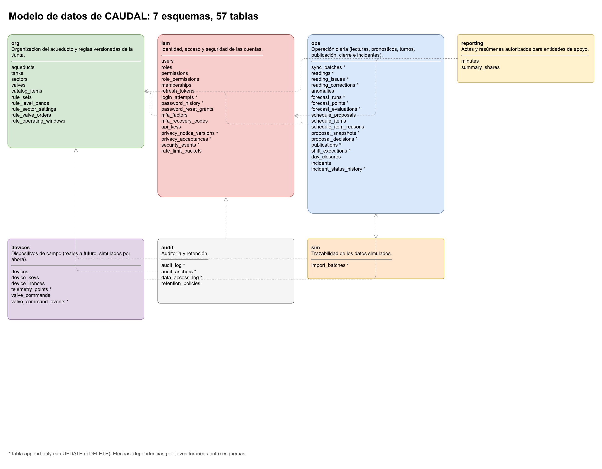

# Seguridad de la base de datos

Este documento describe cómo se protege la base de datos PostgreSQL 18 de CAUDAL: quién puede hacer qué, cómo se aísla cada acueducto, qué tablas no se pueden modificar, cómo se encadena la auditoría y cómo se prueba todo lo anterior.

La especificación de columnas es la fuente `schema.yaml` del equipo de documentación (fuera del repositorio). Su versión publicada, columna por columna, está en el [diccionario de datos](Diccionario-de-datos.md). Las cifras de seguridad de la base de datos se resumen aquí. El modelo general de amenazas y los controles de la aplicación están en [`Seguridad.md`](Seguridad.md).



## 1. Números clave

| Concepto | Valor |
|---|---|
| Esquemas | 7: `iam`, `org`, `ops`, `reporting`, `devices`, `audit`, `sim` |
| Tablas | 57 (iam 16, org 10, ops 18, reporting 2, devices 6, audit 4, sim 1) |
| Columnas | 467 (I 372, P 71, C 16, S 8) |
| Tablas con RLS (`FORCE`) | 37 |
| Tablas append-only | 23 |
| Columnas secretas (S) | 8 |
| Extensiones | `pgcrypto`, `btree_gist` |

## 2. Roles

| Rol | Para qué | Puede | No puede |
|---|---|---|---|
| `caudal_migrator` | Dueño de todos los objetos. Único con DDL. Lo usa Flyway en el despliegue | Crear, alterar y borrar tablas, índices, triggers, funciones y políticas. Ejecutar las migraciones | Lo usa la aplicación en tiempo de ejecución. Sus credenciales no están en el contenedor de la API |
| `caudal_app` | Lo usa la API en tiempo de ejecución | DML mínimo, según la tabla de privilegios de la sección 3. Ejecutar las funciones `SECURITY DEFINER` de purga | DDL. `DELETE` directo. Modificar tablas append-only. Leer columnas `S` que no necesita. Saltarse RLS |
| `caudal_readonly` | Reportes y consultas de solo lectura | `SELECT` sobre las vistas de reportes (lista por definir) | Leer tablas base. Leer `password_hash` o cualquier columna `S` o `C` |

Atributos (propuesta): los roles de privilegios son `NOLOGIN`, y cada servicio entra con un usuario que es miembro del rol correspondiente. `caudal_app` y `caudal_readonly` no tienen `BYPASSRLS`, no son `SUPERUSER` y no son dueños de ningún objeto. No tienen `CREATE` sobre el esquema `public`. Se revoca `CREATE ON SCHEMA public FROM PUBLIC`.

### 2.1 Tiempos límite por rol

Los hechos fijan los tiempos para el rol de la aplicación. Para `caudal_readonly` el `statement_timeout` es 15 s, y `caudal_migrator` no tiene límite de sentencia (solo se usa en migraciones). Los demás tiempos de esos roles quedan por definir.

| Rol | `statement_timeout` | `lock_timeout` | `idle_in_transaction_session_timeout` |
|---|---|---|---|
| `caudal_app` | 5 s | 3 s | 10 s |
| `caudal_readonly` | 15 s | por definir (propuesta: 3 s) | por definir (propuesta: 10 s) |
| `caudal_migrator` | sin límite (solo migraciones) | por definir | por definir |

```sql
ALTER ROLE caudal_app SET statement_timeout = '5s';
ALTER ROLE caudal_app SET lock_timeout = '3s';
ALTER ROLE caudal_app SET idle_in_transaction_session_timeout = '10s';
ALTER ROLE caudal_readonly SET statement_timeout = '15s';
```

### 2.2 Conexión segura

- Toda conexión usa `sslmode=verify-full`. Se valida el certificado del servidor y su nombre de host.
- La ruta del certificado de la autoridad (`sslrootcert`) se define en configuración (ver [`Configuracion-sin-valores-quemados.md`](Configuracion-sin-valores-quemados.md)).
- En local (Docker Compose) también se usa `verify-full`, con una autoridad local. Cómo se genera esa autoridad: por definir.
- Cada servicio tiene su propio usuario. Las contraseñas de los roles se rotan (ver [`Seguridad.md`](Seguridad.md), sección de secretos).

## 3. Privilegios por tabla

Códigos: `S` = `SELECT`, `I` = `INSERT`, `U` = `UPDATE` (entre paréntesis, las columnas permitidas), `D` = `DELETE` solo por función o trigger que lo condiciona. `No` = sin privilegio. "AO" = append-only (ver sección 6).

Regla general para `caudal_app`: `S` e `I` por defecto. `U` solo en columnas de estado. `D` no existe, salvo las excepciones marcadas. Las tablas AO solo tienen `S` e `I`.

### 3.1 `iam`

| Tabla | Clase | `caudal_app` | `caudal_readonly` |
|---|---|---|---|
| `users` | Normal, con `S` | S, I, U(`full_name`, `status`, `must_change_password`, `password_hash`, `password_changed_at`, `failed_login_count`, `locked_until`, `lockout_level`, `token_version`, `last_login_at`, `last_login_ip_hmac`, `updated_at`, `disabled_at`) | No |
| `roles` | Catálogo | S | No |
| `permissions` | Catálogo | S | No |
| `role_permissions` | Catálogo | S (escritura solo por migración; verificar si la Junta edita la matriz desde la app) | No |
| `memberships` | RLS | S, I, U(`valid_to`) | No |
| `refresh_tokens` | Normal | S, I, U(`last_used_at`, `revoked_at`, `revoked_reason`, `replaced_by_id`) | No |
| `login_attempts` | AO | S, I | No |
| `password_history` | AO | S, I | No |
| `password_reset_grants` | Normal | S, I, U(`used_at`, `revoked_at`) | No |
| `mfa_factors` | Normal | S, I, U(`confirmed_at`, `last_used_step`) | No |
| `mfa_recovery_codes` | Normal | S, I, U(`used_at`) | No |
| `api_keys` | Normal | S, I, U(`last_used_at`, `revoked_at`) | No |
| `privacy_notice_versions` | AO | S, I | No |
| `privacy_acceptances` | AO | S, I | No |
| `security_events` | AO | S, I | No |
| `rate_limit_buckets` | Normal | S, I, U(`state`, `expires_at`). `D` solo por función de limpieza | No |

`DELETE /api/v1/memberships/{id}` (de la sección 13 de los hechos) no borra la fila: se implementa como `UPDATE` de `valid_to` a la fecha actual. La membresía deja de ser vigente y su historial queda. Igual que `summary_shares`, sin `DELETE`.

### 3.2 `org`

| Tabla | Clase | `caudal_app` | `caudal_readonly` |
|---|---|---|---|
| `aqueducts` | Normal | S, U(`name`, `public_page_enabled`, `timezone`, `updated_at`). `is_demo` y `slug` solo por migración | No |
| `tanks` | RLS | S, I, U(`name`, `capacity_liters`, `is_active`, `updated_at`). `gauge_min` y `gauge_max` no se modifican en caliente (propuesta) | No |
| `sectors` | RLS | S, I, U(`name`, `households_count`, `parent_sector_id`, `is_active`, `updated_at`) | No |
| `valves` | RLS | S, I, U(`name`, `location_hint`, `is_motorized`, `fail_safe_position`, `is_active`) | No |
| `catalog_items` | Catálogo, sin RLS | S | No |
| `rule_sets` | RLS, inmutable al activar | S, I, U(`status`, `valid_to`, `activated_by`, `activated_at`) y, en borrador, las columnas de contenido (trigger, sección 5.2) | No |
| `rule_level_bands` | RLS | S, I, U (solo en borrador), D (solo en borrador, trigger) | No |
| `rule_sector_settings` | RLS | S, I, U y D (solo en borrador, trigger) | No |
| `rule_valve_orders` | RLS | S, I, U y D (solo en borrador, trigger) | No |
| `rule_operating_windows` | RLS | S, I, U y D (solo en borrador, trigger) | No |

Las cuatro tablas hijas de reglas tienen `D` porque `PATCH /rule-sets/{id}` reemplaza listas completas mientras la versión es borrador. Es la única excepción a "sin DELETE" fuera de las purgas. El trigger impide el `DELETE` cuando la versión padre no está en `DRAFT`. Esta excepción debe confirmarse con Drako Salazar.

### 3.3 `ops`

| Tabla | Clase | `caudal_app` | `caudal_readonly` |
|---|---|---|---|
| `sync_batches` | AO, RLS | S, I | No |
| `readings` | AO, RLS | S, I | No |
| `reading_issues` | AO, RLS | S, I | No |
| `reading_corrections` | AO, RLS | S, I | No |
| `anomalies` | RLS | S, I, U(`status`, `resolved_by`, `resolved_at`, `resolution_note`, `related_incident_id`) | No |
| `forecast_runs` | AO, RLS | S, I | No |
| `forecast_points` | AO, RLS | S, I | No |
| `forecast_evaluations` | AO, RLS | S, I | No |
| `schedule_proposals` | RLS | S, I, U(`status`, `lock_version`) | No |
| `schedule_items` | RLS | S, I, D (solo si la propuesta está en `DRAFT` o `PENDING_REVIEW`, trigger) | No |
| `schedule_item_reasons` | RLS | S, I, D (misma condición que los turnos) | No |
| `proposal_snapshots` | AO, RLS | S, I | No |
| `proposal_decisions` | AO, RLS | S, I | No |
| `publications` | AO, RLS | S, I | No |
| `shift_executions` | AO, RLS | S, I | No |
| `day_closures` | RLS | S, I | No |
| `incidents` | RLS | S, I, U(`status`) | No |
| `incident_status_history` | AO, RLS | S, I | No |

`ops.sync_batches` es AO, pero sus contadores (`items_received`, `items_accepted`, `items_rejected`) solo se conocen después de procesar el lote. Para no necesitar `UPDATE`, la aplicación procesa el lote primero y **inserta la fila una sola vez**, con los tres contadores ya calculados, dentro de la misma transacción. Si el procesamiento falla, la transacción entera se revierte y no queda lote. Esta decisión debe confirmarse con Drako Salazar.

Los turnos se reemplazan en la decisión de la Junta mientras la propuesta no está publicada. La copia original queda en `proposal_snapshots`, que es AO. Por eso `schedule_items` tiene `D` condicionado. Cuando la propuesta pasa a `PUBLISHED`, los turnos quedan fijos.

### 3.4 `reporting`

| Tabla | Clase | `caudal_app` | `caudal_readonly` |
|---|---|---|---|
| `minutes` | RLS, `FINAL` inmutable (trigger) | S, I, U(`status`, `content`, `pdf_sha256`, `audit_head_hash`, `finalized_by`, `finalized_at`) solo en `DRAFT` | Vista de resúmenes autorizados (por definir) |
| `summary_shares` | RLS | S, I, U(`revoked_at`, `revoked_by`) | No |

`DELETE /summary-shares/{id}` se implementa como `UPDATE` de `revoked_at` y `revoked_by`. Nunca se borra la autorización.

### 3.5 `devices`

| Tabla | Clase | `caudal_app` | `caudal_readonly` |
|---|---|---|---|
| `devices` | RLS | S, I, U(`name`, `status`, `firmware_version`, `last_seen_at`) | No |
| `device_keys` | RLS | S, I, U(`revoked_at`) | No |
| `device_nonces` | Normal, purga por retención | S, I. `D` solo por función de purga | No |
| `telemetry_points` | AO, RLS | S, I | No |
| `valve_commands` | RLS | S, I, U(`status`) | No |
| `valve_command_events` | AO, RLS | S, I | No |

`telemetry_points.reading_id` se llena al insertar. Para no necesitar `UPDATE` sobre una tabla AO, la aplicación inserta primero la lectura y después el punto de telemetría, en la misma transacción. Esta decisión debe confirmarse con Drako Salazar.

### 3.6 `audit`

| Tabla | Clase | `caudal_app` | `caudal_readonly` |
|---|---|---|---|
| `audit_log` | AO, RLS, cadena de hashes | S, I | No |
| `audit_anchors` | AO, sin RLS (ver sección 4.4) | S. `I` solo por función `audit.write_daily_anchor()` | No |
| `data_access_log` | AO, RLS | S, I. `D` solo por función de purga | No |
| `retention_policies` | Configuración | S, U(`retention_days`, `updated_by`, `updated_at`) | No |

### 3.7 `sim`

| Tabla | Clase | `caudal_app` | `caudal_readonly` |
|---|---|---|---|
| `import_batches` | AO, RLS. Solo acueductos con `is_demo = true` (trigger) | S, I | No |

## 4. Privilegios por columna

Las columnas `S` (secretas) y las de hashes de credenciales tienen permisos propios. Las ocho columnas `S` del esquema son:

| Columna | Tabla | Quién la lee | Quién la escribe | Notas |
|---|---|---|---|---|
| `password_hash` | `iam.users` | `caudal_app` (login y cambio de contraseña) | `caudal_app` | Nunca en `caudal_readonly`. Nunca en respuestas ni logs |
| `password_hash` | `iam.password_history` | `caudal_app` (historial) | `caudal_app` | AO |
| `token_hash` | `iam.refresh_tokens` | `caudal_app` | `caudal_app` | SHA-256 del token. El token nunca se guarda |
| `code_hash` | `iam.password_reset_grants` | `caudal_app` | `caudal_app` | Código de un solo uso, mostrado una sola vez |
| `code_hash` | `iam.mfa_recovery_codes` | `caudal_app` | `caudal_app` (solo `used_at` después) | Códigos de respaldo hasheados |
| `secret_ciphertext` | `iam.mfa_factors` | `caudal_app`, solo en la verificación TOTP | `caudal_app`, solo al inscribir | Cifrado con AES-256-GCM. La clave no está en la BD (`key_id` indica cuál usar) |
| `key_hash` | `iam.api_keys` | `caudal_app` | `caudal_app` | SHA-256 de la llave. El prefijo visible está en `key_prefix` |
| `tracking_code_hash` | `ops.incidents` | `caudal_app` | `caudal_app` | SHA-256 del código de seguimiento de 8 caracteres |

Las columnas `C` (confidenciales) no se leen desde `caudal_readonly`. Las más sensibles son `full_name`, `decided_by`, `published_by`, `minutes.content`, `audit_log.before_state` y `after_state`, y las IP en HMAC. Su acceso se registra en `audit.data_access_log` cuando se exponen.

Implementación en SQL:

```sql
REVOKE ALL ON iam.users FROM caudal_app;
GRANT SELECT (id, username, full_name, status, must_change_password, password_changed_at,
              failed_login_count, locked_until, lockout_level, token_version,
              last_login_at, created_at, updated_at, disabled_at, password_hash)
  ON iam.users TO caudal_app;
GRANT UPDATE (full_name, status, must_change_password, password_hash, password_changed_at,
              failed_login_count, locked_until, lockout_level, token_version,
              last_login_at, last_login_ip_hmac, updated_at, disabled_at)
  ON iam.users TO caudal_app;
```

La prueba de privilegios (sección 9) confirma que `caudal_readonly` no puede leer `iam.users` ni ninguna columna `S`.

## 5. Aislamiento por acueducto (RLS)

### 5.1 Cómo se fija `app.aqueduct_id`

1. El filtro de autenticación valida el JWT y lee el claim `aqueduct_id`.
2. Al abrir cada transacción, la capa de persistencia ejecuta:

```sql
SELECT set_config('app.aqueduct_id', :aqueductId, true);
```

3. El tercer parámetro `true` equivale a `SET LOCAL`. El valor dura solo hasta el `COMMIT` o el `ROLLBACK`. Así no se filtra entre peticiones que comparten una conexión del pool.
4. La aplicación nunca toma el valor de la petición, de un parámetro de consulta ni de una cabecera. Solo del JWT validado.
5. Si la transacción no fija el valor, `current_setting('app.aqueduct_id', true)` devuelve `NULL`, la comparación da `NULL` y no se devuelve ninguna fila. Es un fallo cerrado.

### 5.2 Políticas

Plantilla estándar para cada tabla con RLS:

```sql
ALTER TABLE ops.readings ENABLE ROW LEVEL SECURITY;
ALTER TABLE ops.readings FORCE ROW LEVEL SECURITY;

CREATE POLICY readings_tenant ON ops.readings
  USING      (aqueduct_id = current_setting('app.aqueduct_id', true)::uuid)
  WITH CHECK (aqueduct_id = current_setting('app.aqueduct_id', true)::uuid);
```

- `USING` filtra lo que se lee o modifica. `WITH CHECK` impide insertar o mover filas a otro acueducto.
- `FORCE ROW LEVEL SECURITY` aplica las políticas también al dueño de la tabla (`caudal_migrator`). Sin `FORCE`, el dueño las saltaría.
- Las tablas hijas sin `aqueduct_id` (por ejemplo `rule_sector_settings`, que tiene `rule_set_id` y `sector_id`) usan una política que consulta la tabla padre con `EXISTS`. Es más lenta; se revisa con `EXPLAIN` en la prueba de rendimiento.

Tablas con RLS según el esquema (37):

| Esquema | Tablas con RLS |
|---|---|
| `iam` (1) | `memberships` |
| `org` (8) | `tanks`, `sectors`, `valves`, `rule_sets`, `rule_level_bands`, `rule_sector_settings`, `rule_valve_orders`, `rule_operating_windows` |
| `ops` (18) | `sync_batches`, `readings`, `reading_issues`, `reading_corrections`, `anomalies`, `forecast_runs`, `forecast_points`, `forecast_evaluations`, `schedule_proposals`, `schedule_items`, `schedule_item_reasons`, `proposal_snapshots`, `proposal_decisions`, `publications`, `shift_executions`, `day_closures`, `incidents`, `incident_status_history` |
| `reporting` (2) | `minutes`, `summary_shares` |
| `devices` (5) | `devices`, `device_keys`, `telemetry_points`, `valve_commands`, `valve_command_events` |
| `audit` (2) | `audit_log`, `data_access_log` |
| `sim` (1) | `import_batches` |

Tablas sin RLS que tienen `aqueduct_id` (hay que decidirlas):

| Tabla | Por qué no tiene RLS | Riesgo | Propuesta |
|---|---|---|---|
| `iam.security_events` | `aqueduct_id` es nulo en eventos globales (por ejemplo, login fallido sin acueducto) | Un acueducto podría leer eventos de otro si la consulta olvida el filtro | Añadir política `aqueduct_id IS NULL OR aqueduct_id = ...` solo para lectura de la función de auditoría. Por definir |
| `org.catalog_items` | `aqueduct_id` nulo = catálogo global | Ninguno para lectura de catálogos globales. Los catálogos por acueducto necesitan RLS | Política de lectura: `aqueduct_id IS NULL OR aqueduct_id = ...` |
| `audit.audit_anchors` | Solo escribe una función y la lectura va por la API de auditoría | Lectura directa de anclas de otro acueducto | Activar RLS (propuesta) |

Los eventos globales (sin acueducto) van a `iam.security_events`, que no tiene cadena de hashes. `audit.audit_log` solo recibe eventos de un acueducto. Así la cadena no necesita un caso especial para `NULL` (ver sección 7).

### 5.3 Membresías antes de elegir acueducto

En el login, el sistema debe leer las membresías del usuario antes de conocer `app.aqueduct_id`. Con la política estándar no devolvería nada. Propuesta: la política de `iam.memberships` admite también la fila del propio usuario:

```sql
CREATE POLICY memberships_tenant_or_self ON iam.memberships
  USING (aqueduct_id = current_setting('app.aqueduct_id', true)::uuid
         OR user_id = current_setting('app.user_id', true)::uuid);
```

`app.user_id` se fija igual que `app.aqueduct_id`, en la transacción de login. Esta política debe revisarse con la matriz de privilegios de la sección 3 de este documento. Un usuario con varios acueductos: el JWT lleva un solo `aqueduct_id` y `POST /api/v1/auth/switch-aqueduct` lo cambia.

## 6. Tablas append-only

Las 23 tablas con `append_only: true` del esquema son:

| Esquema | Tablas AO |
|---|---|
| `iam` (5) | `login_attempts`, `password_history`, `privacy_notice_versions`, `privacy_acceptances`, `security_events` |
| `ops` (12) | `sync_batches`, `readings`, `reading_issues`, `reading_corrections`, `forecast_runs`, `forecast_points`, `forecast_evaluations`, `proposal_snapshots`, `proposal_decisions`, `publications`, `shift_executions`, `incident_status_history` |
| `devices` (2) | `telemetry_points`, `valve_command_events` |
| `audit` (3) | `audit_log`, `audit_anchors`, `data_access_log` |
| `sim` (1) | `import_batches` |

Protección en dos capas:

1. **Privilegios.** `caudal_app` tiene solo `SELECT` e `INSERT`. Sin `UPDATE` ni `DELETE`. `TRUNCATE` revocado.
2. **Trigger.** Bloquea cualquier `UPDATE` o `DELETE` que llegue por cualquier vía, incluidas las del dueño. La excepción es la purga autorizada de la sección 6.1.

```sql
CREATE OR REPLACE FUNCTION audit.forbid_mutation()
RETURNS trigger
LANGUAGE plpgsql
SET search_path = pg_catalog, audit
AS $$
BEGIN
  IF TG_OP = 'DELETE' AND current_user = 'caudal_migrator' THEN
    RETURN OLD;  -- purga autorizada: solo se ejecuta dentro de una función SECURITY DEFINER
  END IF;
  RAISE EXCEPTION 'append_only_violation'
    USING ERRCODE = 'insufficient_privilege',
          HINT = format('%I.%I es append-only', TG_TABLE_SCHEMA, TG_TABLE_NAME);
END;
$$;

CREATE TRIGGER readings_append_only
  BEFORE UPDATE OR DELETE ON ops.readings
  FOR EACH ROW EXECUTE FUNCTION audit.forbid_mutation();

REVOKE TRUNCATE ON ops.readings FROM caudal_app;
```

Cada tabla AO tiene su propio trigger. Se generan con una migración que recorre la lista de la sección 6, y la prueba de privilegios verifica que existen.

### 6.1 Purga de tablas AO con retención

Cuatro tablas AO tienen plazo de retención (`login_attempts`, `security_events`, `data_access_log` y `telemetry_points`). Dos tablas que no son AO también se purgan (`device_nonces` y `refresh_tokens`). Como `caudal_app` no puede borrar, la purga pasa por funciones `SECURITY DEFINER`, que son el único camino de borrado además de la migración:

- La función es propiedad de `caudal_migrator` y se define con `SECURITY DEFINER` y `SET search_path`.
- El trigger de inmutabilidad deja pasar el `DELETE` solo si `current_user` es `caudal_migrator`. `caudal_app` nunca tiene esa identidad, aunque llame a la función. Dentro de la función, `current_user` sí es el dueño.
- La función lee el plazo de `audit.retention_policies`, escribe primero en `audit.audit_log` un registro `PURGE` con la clase de dato, la fecha de corte y el número de filas, y después borra.

```sql
CREATE OR REPLACE FUNCTION audit.purge_login_attempts()
RETURNS integer
LANGUAGE plpgsql
SECURITY DEFINER
SET search_path = pg_catalog, iam, audit
AS $$
DECLARE
  v_days integer;
  v_deleted integer;
BEGIN
  SELECT retention_days INTO STRICT v_days
    FROM audit.retention_policies WHERE data_class = 'LOGIN_ATTEMPTS';

  DELETE FROM iam.login_attempts
   WHERE created_at < now() - make_interval(days => v_days);
  GET DIAGNOSTICS v_deleted = ROW_COUNT;
  RETURN v_deleted;
END;
$$;

REVOKE ALL ON FUNCTION audit.purge_login_attempts() FROM PUBLIC;
GRANT EXECUTE ON FUNCTION audit.purge_login_attempts() TO caudal_app;
```

La versión final de `audit.forbid_mutation()` (la de la sección 6) deja pasar el `DELETE` solo cuando `current_user` es `caudal_migrator`. Dos advertencias:

- El nombre `caudal_migrator` queda escrito en el trigger. Si cambia el nombre del rol, hay que cambiar el trigger. La prueba `AppendOnlyTablesIT` lo cubre.
- El propio login del migrador puede borrar filas AO. Por eso el login del migrador solo lo usa Flyway en el despliegue y nunca la aplicación. Restringir más ese login (por ejemplo, con un rol de migración sin `DELETE` sobre AO y una función dueña separada) queda por definir.

Purga por clase (`retention_policies.data_class`):

| `data_class` | Función | Qué borra | Retención |
|---|---|---|---|
| `LOGIN_ATTEMPTS` | `audit.purge_login_attempts()` | `iam.login_attempts` | Por definir |
| `DEVICE_NONCES` | `audit.purge_device_nonces()` | `devices.device_nonces` | Por definir (el nonce solo importa 10 minutos; la retención es de auditoría) |
| `SECURITY_EVENTS` | `audit.purge_security_events()` | `iam.security_events` | Por definir |
| `REFRESH_TOKENS` | `audit.purge_refresh_tokens()` | `iam.refresh_tokens` revocados o vencidos | Por definir. No borra filas referenciadas por `replaced_by_id` (FK `RESTRICT`) |
| `DATA_ACCESS_LOG` | `audit.purge_data_access_log()` | `audit.data_access_log` | Por definir |
| `TELEMETRY_POINTS` | `audit.purge_telemetry_points()` | `devices.telemetry_points` | Por definir. Los puntos ya convertidos en lecturas se conservan en `ops.readings` |

`audit.audit_log` no tiene clase de retención: la cadena de auditoría no se purga (por definir si la Junta pide algo distinto).

## 7. Cadena de hashes de auditoría

### 7.1 Fórmula

Cada fila de `audit.audit_log` guarda el hash de la fila anterior de su acueducto:

```text
row_hash = sha256( prev_hash || contenido_canonico )
```

- `prev_hash`: `row_hash` de la fila anterior del mismo `aqueduct_id`. Para la primera fila de un acueducto se usa el valor génesis (propuesta: 64 ceros).
- `contenido_canonico`: propuesta: texto JSON de `jsonb_build_object(...)` con los campos `id`, `occurred_at` (en UTC, formato fijo), `actor_type`, `actor_id`, `action`, `entity_type`, `entity_id`, `before_state`, `after_state`, `request_id`, `ip_hmac`. El texto de `jsonb` tiene un orden de claves determinista. Alternativa: serialización JCS (RFC 8785) calculada en la aplicación. Por definir.
- `sha256` con `pgcrypto`, en hexadecimal minúscula, 64 caracteres (`char(64)`).

### 7.2 Trigger de inserción

```sql
CREATE OR REPLACE FUNCTION audit.chain_audit_row()
RETURNS trigger LANGUAGE plpgsql SET search_path = pg_catalog, public, audit AS $$
DECLARE
  v_prev char(64);
  v_canonical text;
BEGIN
  -- Serializa las inserciones de cada cadena para que dos transacciones no tomen el mismo prev_hash.
  PERFORM pg_advisory_xact_lock(hashtextextended('audit:' || COALESCE(NEW.aqueduct_id::text, 'global'), 0));

  SELECT row_hash INTO v_prev
    FROM audit.audit_log
   WHERE aqueduct_id IS NOT DISTINCT FROM NEW.aqueduct_id
   ORDER BY id DESC
   LIMIT 1;

  NEW.prev_hash := COALESCE(v_prev, repeat('0', 64));

  v_canonical := jsonb_build_object(
    'id', NEW.id,
    'occurred_at', to_char(NEW.occurred_at AT TIME ZONE 'UTC', 'YYYY-MM-DD"T"HH24:MI:SS.US"Z"'),
    'actor_type', NEW.actor_type, 'actor_id', NEW.actor_id,
    'action', NEW.action, 'entity_type', NEW.entity_type, 'entity_id', NEW.entity_id,
    'before_state', NEW.before_state, 'after_state', NEW.after_state,
    'request_id', NEW.request_id, 'ip_hmac', NEW.ip_hmac
  )::text;

  NEW.row_hash := encode(digest(NEW.prev_hash || v_canonical, 'sha256'), 'hex');
  RETURN NEW;
END;
$$;

CREATE TRIGGER audit_log_chain
  BEFORE INSERT ON audit.audit_log
  FOR EACH ROW EXECUTE FUNCTION audit.chain_audit_row();
```

Dos detalles:

- `NEW.id` ya tiene valor en un trigger `BEFORE INSERT`, porque el `DEFAULT` de la identidad se evalúa antes. Por eso puede formar parte del contenido.
- La expresión `aqueduct_id IS NOT DISTINCT FROM` hace que los eventos sin acueducto formen su propia cadena (`global`). Pero la política de la sección 5.2 deja fuera esas filas. Por eso los eventos globales van a `iam.security_events` y no a `audit_log`. Si aun así se necesita una cadena global en `audit_log`, hay que definir su política de lectura (por definir).

### 7.3 Verificación

Función `audit.verify_chain(p_aqueduct uuid)` (propuesta): recorre las filas del acueducto en orden de `id`, recalcula cada `row_hash` con la fórmula de la sección 7.1 y devuelve la primera fila que no coincide, o nulo si la cadena es válida. La función se ejecuta en un job diario y en la prueba de integridad.

### 7.4 Anclas diarias

- Un job diario ejecuta `audit.write_daily_anchor()` (propuesta: `SECURITY DEFINER`). La función toma el último `row_hash` del día para cada acueducto y lo guarda en `audit.audit_anchors(aqueduct_id, anchor_date, head_hash)`.
- El día se calcula en la zona del acueducto (`America/Bogota`, propuesta).
- Al generar un acta, `reporting.minutes.audit_head_hash` guarda el hash cabeza del momento de la finalización. El acta impresa muestra ese hash. Quien tenga una copia en papel puede comprobar que la cadena no se reescribió después.
- La defensa de las anclas es que un administrador de base de datos podría deshabilitar triggers y reescribir la cadena. Un hash impreso en un documento firmado fuera de la base de datos no se puede reescribir sin que se note.
- Si la verificación diaria encuentra una discrepancia, se registra un evento `CRITICAL` en `iam.security_events` (propuesta).

## 8. Triggers de negocio

| Trigger | Tabla | Qué impide | Estado |
|---|---|---|---|
| `forbid_mutation` | 23 tablas AO | `UPDATE` y `DELETE` (salvo purga autorizada) | Definido (sección 6) |
| `rule_set_immutability` | `org.rule_sets` | Cambiar contenido de una versión que no está en `DRAFT`. Solo se permite `status` (`ACTIVE` → `SUPERSEDED`) y `valid_to` | Propuesta |
| `rule_child_draft_only` | `rule_level_bands`, `rule_sector_settings`, `rule_valve_orders`, `rule_operating_windows` | `INSERT`, `UPDATE` o `DELETE` cuando la versión padre no está en `DRAFT` | Propuesta |
| `rule_activation_check` | `org.rule_sets` | Activar una versión cuyas bandas no cubren el rango del tanque o tienen solapes | Propuesta. Alternativa: función de activación. Por definir |
| `reading_range` | `ops.readings` y `ops.reading_corrections` | Ver sección 8.1 | Decidido (sección 21 de los hechos) |
| `schedule_draft_only_delete` | `ops.schedule_items`, `ops.schedule_item_reasons` | `DELETE` cuando la propuesta no está en `DRAFT` o `PENDING_REVIEW` | Propuesta |
| `minutes_final_immutable` | `reporting.minutes` | Cualquier cambio cuando `status = 'FINAL'` | Propuesta |
| `set_updated_at` | Todas las tablas con `updated_at` | Nada: fija `updated_at = now()` en cada `UPDATE` | Definido |
| `import_demo_only` | `sim.import_batches` | Insertar lotes en un acueducto con `is_demo = false` | Definido |
| `audit_log_chain` | `audit.audit_log` | Fila sin `prev_hash` y `row_hash` válidos | Definido (sección 7) |

### 8.1 Rango de lecturas

Una lectura fuera de la regla del tanque no se guarda: la API responde `422 GAUGE_OUT_OF_RANGE` y la app pide corregir antes de reenviar (sección 21 de los hechos). Por eso el trigger de `readings.gauge_value` rechaza cualquier fila fuera de `tanks.gauge_min` y `gauge_max`, sin importar el estado. Es la defensa final.

Comportamiento del trigger:

```sql
CREATE OR REPLACE FUNCTION ops.check_reading_range()
RETURNS trigger LANGUAGE plpgsql SET search_path = pg_catalog, org, ops AS $$
DECLARE
  v_min numeric(6,2);
  v_max numeric(6,2);
BEGIN
  SELECT gauge_min, gauge_max INTO STRICT v_min, v_max
    FROM org.tanks WHERE id = NEW.tank_id;

  -- Una lectura guardada debe estar dentro de la regla pintada (ACCEPTED o FLAGGED).
  IF NEW.gauge_value < v_min OR NEW.gauge_value > v_max THEN
    RAISE EXCEPTION 'gauge_out_of_range' USING ERRCODE = 'check_violation';
  END IF;
  RETURN NEW;
END;
$$;
```

Las correcciones (`ops.reading_corrections`) siempre se validan contra el rango, sin excepción, porque la corrección es el dato final. Por definir si la prueba de precisión (múltiplo de `gauge_step`) va en el mismo trigger.

## 9. Restricciones de integridad

### 9.1 CHECK generados desde `FieldLimits`

Los límites de longitud y de formato se escriben con placeholders de Flyway. El valor sale de `FieldLimits` (Java). Así la base de datos y la validación de la API usan el mismo número. Ver [`.agents/input-validation.md`](../.agents/input-validation.md) para la lista de constantes.

Ejemplo ilustrativo (no es una migración real):

```sql
-- V0007__iam_users.sql (ilustrativo)
CREATE TABLE iam.users (
  id                 uuid PRIMARY KEY DEFAULT uuidv7(),
  username           varchar(${username_max}) NOT NULL UNIQUE,
  full_name          varchar(${person_name_max}) NOT NULL,
  password_hash      varchar(255) NOT NULL,
  status             varchar(20) NOT NULL DEFAULT 'ACTIVE',
  must_change_password boolean NOT NULL DEFAULT true,
  failed_login_count integer NOT NULL DEFAULT 0,
  lockout_level      smallint NOT NULL DEFAULT 0,
  token_version      integer NOT NULL DEFAULT 0,
  created_at         timestamptz NOT NULL DEFAULT now(),
  updated_at         timestamptz NOT NULL DEFAULT now(),
  CONSTRAINT users_username_length
    CHECK (char_length(username) BETWEEN ${username_min} AND ${username_max}),
  CONSTRAINT users_username_format
    CHECK (username ~ $re${username_pattern}$re$),
  CONSTRAINT users_full_name_length
    CHECK (char_length(full_name) BETWEEN ${person_name_min} AND ${person_name_max}),
  CONSTRAINT users_failed_login_nonneg CHECK (failed_login_count >= 0),
  CONSTRAINT users_status_values CHECK (status IN ('ACTIVE', 'LOCKED', 'DISABLED'))
);
```

Reglas:

- Los patrones se escriben con comillas de dólar (`$re$...$re$`). Así una comilla simple dentro del patrón no rompe el SQL. Ejemplo: el patrón de `PERSON_NAME` tiene `'`. Como el patrón termina en `$`, el cierre `$re$` queda pegado a ese signo: el resultado es correcto, pero conviene probarlo en la prueba de deriva.
- Los patrones con `\p{L}` **no** se escriben en la base de datos: PostgreSQL no garantiza esa sintaxis (verificar en PG 18). En la base de datos solo van longitud y patrones ASCII. La validación Unicode vive en la API.
- Las listas de valores (`IN (...)`) son identificadores de dominio, no límites de negocio. Deben coincidir con los enums de Java, y la prueba de deriva lo verifica.
- Las constantes físicas (`HOURS_PER_DAY`) se pasan también por placeholder. Ejemplo: `max_daily_service_hours <= ${hours_per_day}`.

### 9.2 Placeholders

| Placeholder | Constante | Columna de ejemplo |
|---|---|---|
| `${username_min}`, `${username_max}`, `${username_pattern}` | `FieldLimits.USERNAME_*` | `iam.users.username` |
| `${person_name_max}` | `FieldLimits.PERSON_NAME_MAX` | `iam.users.full_name` |
| `${aqueduct_slug_max}` | `FieldLimits.AQUEDUCT_SLUG_MAX` | `org.aqueducts.slug` |
| `${aqueduct_name_max}` | `FieldLimits.AQUEDUCT_NAME_MAX` | `org.aqueducts.name` |
| `${place_name_max}` | `FieldLimits.PLACE_NAME_MAX` | `org.tanks.name`, `org.sectors.name`, `org.valves.name`, `devices.devices.name` |
| `${valve_code_max}` | `FieldLimits.VALVE_CODE_MAX` | `org.valves.code` |
| `${location_hint_max}` | `FieldLimits.LOCATION_HINT_MAX` | `org.valves.location_hint`, `ops.incidents.location_hint` |
| `${note_max}` | `FieldLimits.NOTE_MAX` | `ops.readings.note`, `ops.day_closures.notes` y otras |
| `${reason_max}` | `FieldLimits.REASON_MAX` | `org.rule_sets.change_reason`, `ops.reading_corrections.reason` y otras |
| `${incident_description_max}` | `FieldLimits.INCIDENT_DESCRIPTION_MAX` | `ops.incidents.description` |
| `${catalog_code_max}` | `FieldLimits.CATALOG_CODE_MAX` | `org.catalog_items.code`, `ops.incidents.category_code` |
| `${catalog_label_max}` | `FieldLimits.CATALOG_LABEL_MAX` | `org.catalog_items.label_es` |
| `${sector_code_max}` (propuesta) | `FieldLimits.SECTOR_CODE_MAX` | `org.sectors.code` |
| `${hours_per_day}` | Constante física `HOURS_PER_DAY` | `org.rule_sets.max_daily_service_hours` |

Flyway toma estos valores de un mapa que construye la aplicación desde `FieldLimits` (customizador de configuración de Flyway en Spring Boot, nombre exacto por verificar en 4.1). El mismo mapa lo usa la prueba de deriva.

Contradicciones a corregir: `org.sectors.code` y `permissions.code` tienen su patrón escrito como literal en el esquema. Hay que moverlos a `FieldLimits`.

### 9.3 EXCLUDE con `btree_gist`

```sql
CREATE EXTENSION IF NOT EXISTS btree_gist;

ALTER TABLE org.rule_level_bands
  ADD CONSTRAINT rule_level_bands_no_overlap
  EXCLUDE USING gist (rule_set_id WITH =, numrange(min_level, max_level, '[)') WITH &&);

ALTER TABLE ops.schedule_items
  ADD CONSTRAINT schedule_items_no_overlap
  EXCLUDE USING gist (proposal_id WITH =, tstzrange(start_at, end_at, '[)') WITH &&);
```

- Las bandas usan `[)`: el mínimo incluido y el máximo excluido. La banda cuyo máximo es `gauge_max` incluye ese valor (se valida en la activación).
- Los turnos se restringen **por propuesta**. Esta es una decisión explícita: dentro de una misma propuesta no hay dos turnos que se solapen, porque el suministro es secuencial. Los turnos de propuestas distintas del mismo día no se comparan entre sí; ese caso (propuesta publicada frente a otra nueva) queda por definir.
- Las autorizaciones de membresía solapadas (`memberships`) no tienen restricción en los hechos: por definir.

### 9.4 Claves únicas y clave foránea

- `UNIQUE (aqueduct_id, version)` en `org.rule_sets`.
- Como máximo una versión `ACTIVE` por acueducto: índice único parcial `CREATE UNIQUE INDEX rule_sets_one_active ON org.rule_sets (aqueduct_id) WHERE status = 'ACTIVE';`. Como máximo un borrador por acueducto: el mismo patrón con `WHERE status = 'DRAFT'` (propuesta, verificar).
- `UNIQUE (aqueduct_id, service_date)` en `ops.day_closures`.
- `UNIQUE (proposal_id)` en `ops.publications`.
- Todas las claves foráneas usan `ON DELETE RESTRICT`. Como las tablas AO no se pueden borrar, `RESTRICT` es lo que se espera. Una purga respeta las referencias (por ejemplo, `refresh_tokens.replaced_by_id`).

```sql
ALTER TABLE ops.readings
  ADD CONSTRAINT readings_tank_fk FOREIGN KEY (tank_id)
  REFERENCES org.tanks (id) ON DELETE RESTRICT;
```

## 10. Retención y purga

Ver la tabla de la sección 6.1. Los días de retención son parámetros de `audit.retention_policies` (en BD, no en código). Los valores iniciales de la semilla son: `LOGIN_ATTEMPTS` 90 días, `DEVICE_NONCES` 1 día, `SECURITY_EVENTS` 365, `REFRESH_TOKENS` 30 días después de expirar, `DATA_ACCESS_LOG` 365 y `TELEMETRY_POINTS` 730.

Reglas:

- Ninguna función de purga borra sin registrar antes un `PURGE` en `audit.audit_log`.
- Las purgas se ejecutan con un job programado (por definir: cron de Render o job de GitHub Actions).
- Un cambio de `retention_days` queda en `audit.audit_log` (acción `RETENTION_POLICY_CHANGED`).

## 11. Clasificación de datos

| Clase | Significado | Ejemplos de columnas |
|---|---|---|
| P (pública) | Puede verse sin login | `org.aqueducts.name`, `org.sectors.name`, `ops.publications.whatsapp_text`, `ops.publications.published_at`, `ops.incidents.category_code` y `status`, `iam.roles.label_es` |
| I (interna) | Personal del sistema (cualquier rol con acceso) | `org.tanks.gauge_min`, `ops.readings.gauge_value`, `iam.users.username`, `ops.schedule_items.start_at`, `ops.forecast_points.p50` |
| C (confidencial) | Datos personales o identificadores de decisión. No se muestran al público | `iam.users.full_name`, `iam.users.last_login_ip_hmac`, `ops.proposal_decisions.decided_by`, `ops.publications.published_by`, `reporting.minutes.content`, `audit.audit_log.before_state` |
| S (secreta) | Hashes de credenciales o material cifrado. Nunca se lee salvo para verificar | `iam.users.password_hash`, `iam.refresh_tokens.token_hash`, `iam.mfa_factors.secret_ciphertext`, `ops.incidents.tracking_code_hash` |

Totales del esquema: P 71, I 372, C 16, S 8.

Reglas que dependen de la clase:

- `S` nunca aparece en logs, respuestas, `details` de errores, exportaciones ni `caudal_readonly`.
- `C` no aparece en la página pública ni en el mensaje de WhatsApp. Lo que llega a una entidad de apoyo pasa por `reporting.summary_shares`.
- `P` puede publicarse, pero su publicación queda en el registro (`published_at`) y en la auditoría.

## 12. Respaldo y recuperación

- Neon guarda la historia del proyecto para recuperación a un punto en el tiempo (PITR). La ventana de retención de PITR depende del plan y **no está fijada en los hechos**: verificar en la configuración del proyecto Neon antes de depender de ella.
- Objetivo de punto de recuperación (RPO) y objetivo de tiempo de recuperación (RTO): por definir.
- Prueba de restauración: por definir (propuesta: una restauración en una rama de prueba de Neon antes de cada release `release/<versión>`).
- En local (Docker Compose) no hay PITR. Se usa un volcado `pg_dump` por definir.
- Los respaldos contienen datos `S` y `C`. Su acceso se trata como el de la base de datos en producción.

## 13. Pruebas que verifican este documento

Todas las pruebas usan Testcontainers con PostgreSQL 18 y se ejecutan en CI. Los nombres van en inglés.

| Prueba | Qué verifica |
|---|---|
| `RowLevelSecurityIsolationIT` | Un acueducto no ve ni modifica filas de otro. `WITH CHECK` impide mover filas. Sin `app.aqueduct_id`, no hay filas |
| `RowLevelSecurityForcedIT` | `FORCE ROW LEVEL SECURITY` activo en las 37 tablas |
| `AppendOnlyTablesIT` | Las 23 tablas AO rechazan `UPDATE` y `DELETE` de `caudal_app` y del dueño, salvo la purga autorizada |
| `PurgeFunctionsIT` | Cada función de purga borra solo lo vencido, escribe `PURGE` antes, y no borra filas referenciadas |
| `DatabasePrivilegesIT` | La tabla de la sección 3 coincide con `information_schema.role_table_grants` y `role_column_grants` |
| `ColumnPrivilegesIT` | `caudal_readonly` no lee ninguna columna `S` ni `C`. `caudal_app` no escribe `password_hash` fuera del cambio de contraseña |
| `SchemaDriftIT` | Los `varchar(n)`, los `CHECK` de longitud y los patrones ASCII coinciden con `FieldLimits` |
| `EnumDriftIT` | Los `IN (...)` del esquema coinciden con los enums de Java |
| `AuditHashChainIT` | La cadena se recalcula bien. Insertar en paralelo no rompe `prev_hash`. Alterar una fila hace fallar `verify_chain` |
| `AuditAnchorIT` | `write_daily_anchor` escribe una ancla por acueducto y día |
| `RuleSetImmutabilityIT` | Una versión `ACTIVE` no cambia contenido. Solo `status` y `valid_to` |
| `ReadingRangeTriggerIT` | Una lectura fuera de rango no se inserta (falla el trigger), tenga el estado que tenga. Las correcciones se validan siempre |
| `ExclusionConstraintsIT` | Bandas y turnos con solapes fallan. Bandas `[)` contiguas pasan |
| `ForeignKeyRestrictIT` | Todas las FK son `ON DELETE RESTRICT` |
| `RoleTimeoutsIT` | `statement_timeout`, `lock_timeout` e `idle_in_transaction_session_timeout` coinciden con la sección 2.1 |
| `TlsRequiredIT` | Una conexión sin TLS verificado se rechaza |

Relacionados: [`Seguridad.md`](Seguridad.md), [`Configuracion-sin-valores-quemados.md`](Configuracion-sin-valores-quemados.md), [`Diccionario-de-datos.md`](Diccionario-de-datos.md), [`../.agents/input-validation.md`](../.agents/input-validation.md)
