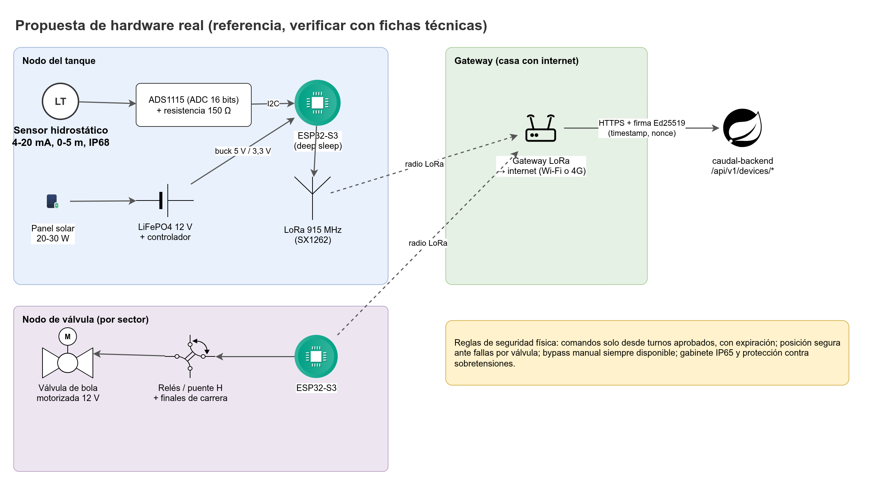
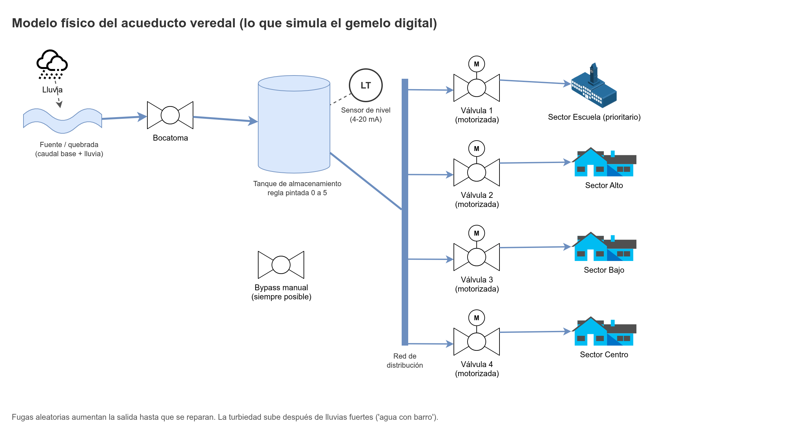

# Simulador y hardware real

Este documento propone el hardware de campo que CAUDAL usaría en el acueducto real y explica cómo `caudal-simulador` representa cada pieza. **El hardware no se construye en el MVP.** Todo lo que aquí aparece es una propuesta documentada, con valores de referencia que deben verificarse con fichas técnicas y proveedores locales antes de cualquier compra.





## 1. Alcance y fases de adopción

El sistema se adopta en tres fases. Cada fase agrega una capacidad sin depender de la siguiente.

| Fase | Nombre | Qué incluye | Qué no incluye | Condición para pasar a la siguiente |
|---|---|---|---|---|
| **A** | App manual | Fontanero registra lecturas en el celular (cola offline). Válvulas se operan a mano. El sistema calcula, la Junta aprueba y publica. | Sensores y válvulas electrónicas. | Operación estable durante un ciclo de racionamiento completo (duración por definir). |
| **B** | Telemetría de nivel | Sensor sumergido, nodo ESP32-S3, radio LoRa y gateway. Telemetría de `LEVEL`, `BATTERY_V` y `RSSI` que genera lecturas automáticas. | Actuación de válvulas. El fontanero sigue confirmando. | Datos de telemetría con continuidad aceptable y lecturas automáticas consistentes con las del fontanero (criterio por definir). |
| **C** | Actuación de válvulas | Válvulas de bola motorizadas con finales de carrera, comandos firmados desde turnos aprobados, acuse de recibo y bypass manual. Piloto en un sector. | Automatización sin aprobación. | Piloto sin incidentes de seguridad y con aprobación formal de la Junta (acta). |

> **Regla de la fase C:** el sistema nunca mueve una válvula sin un turno aprobado por la Junta o un comando manual con motivo firmado por `BOARD_ADMIN`. No existe modo automático.

## 2. Arquitectura del nodo de campo

Un nodo de campo cubre un tanque o una válvula. Todos los componentes son propuestos.

| Capa | Componente | Función |
|---|---|---|
| Medición | Sensor hidrostático sumergible 4–20 mA (0–5 m, IP68) | Mide la presión del agua sobre el sensor, que es proporcional al nivel. |
| Conversión | ADS1115 (ADC de 16 bits, I2C) con resistencia de precisión | Convierte la corriente del lazo en voltaje legible por el controlador. |
| Control | ESP32-S3 | Lee el sensor, controla el driver de la válvula, guarda los datos si no hay señal, firma las peticiones y envía telemetría. |
| Actuación | Válvula de bola motorizada 12 V con finales de carrera, driver puente H y relés | Abre y cierra el sector. Los finales de carrera confirman la posición. |
| Comunicación | LoRa 915 MHz punto a punto hacia un gateway con internet | Envía telemetría y recibe comandos. Alternativa: LTE Cat-1. |
| Energía | Panel solar 20–30 W, controlador de carga, batería LiFePO4 12 V | Alimenta el nodo sin red eléctrica. |
| Protección | Gabinete IP65, prensaestopas, fusibles, DPS (protector de sobretensiones), puesta a tierra | Protege la electrónica de humedad, polvo y picos de voltaje. |
| Respaldo | Válvula manual en paralelo (bypass) | Permite operar el agua a mano si el sistema falla. |

### 2.1 Sensor de nivel y lazo 4–20 mA

- El sensor es **hidrostático sumergido**: va en el fondo del tanque, o en un tubo de sondeo si el tanque lo permite. La presión sobre el sensor depende de la altura de agua (`P = ρ · g · h`), así que el sensor no depende de la superficie, de la espuma ni de la condensación del techo.
- La salida es un lazo de corriente de 4 a 20 mA para 0 a 5 m. Con una resistencia de precisión de **150 Ω** (valor de referencia, verificar), 4 mA dan 0,6 V y 20 mA dan 3,0 V. Ese rango cabe en la entrada del ADS1115 con ganancia 1 (verificar la configuración final).
- Cálculo del nivel: `h = (I_mA - 4) / 16 * 5` metros, con `I_mA` la corriente medida. La calibración final se hace con varias lecturas del fontanero en campo (regla pintada contra lectura del sensor), y la fórmula de calibración se guarda como parámetro del tanque, no como constante en el firmware.
- El rango del sensor (0 a 5 m) debe coincidir con la regla de lectura del tanque (`gauge_min`, `gauge_max`, `gauge_step` en `org.tanks`). Si la regla pintada no tiene la misma referencia que el sensor, la calibración lo corrige.
- Cable: blindado, de dos hilos más malla, con prensaestopas en la entrada del tanque. La malla va conectada a tierra en un solo punto.
- El sensor se instala lejos de la entrada de agua para no medir la turbulencia.

### 2.2 Controlador ESP32-S3

- Lectura del ADS1115 cada intervalo de telemetría (por definir; propuesta de 5 minutos en régimen normal).
- Registro de los puntos en memoria no volátil mientras no hay señal, con un identificador de punto generado en el dispositivo (la BD los trata como idempotentes por `id`).
- Firma Ed25519 de cada petición (ver sección 5).
- Control del driver de la válvula con tiempo máximo de maniobra y lectura de los finales de carrera.
- Monitoreo de voltaje de batería.

### 2.3 Válvulas de bola motorizadas

- **Por qué bola motorizada y no solenoide:** la válvula solenoide necesita una presión diferencial mínima para abrir. En un sistema por gravedad de baja presión, como el de una vereda, puede no abrir. La válvula de bola motorizada no tiene ese requisito.
- Voltaje 12 V. Corriente de movimiento de referencia: 2 A (verificar con la ficha del motor). Tiempo de recorrido por definir (verificar).
- **Dos finales de carrera** por válvula: uno para abierta y otro para cerrada. La posición reportada (`VALVE_POSITION`) sale de los finales de carrera, no de la orden enviada.
- **Tiempo máximo de maniobra:** si el final de carrera no se activa antes de ese tiempo, el firmware detiene el motor y reporta falla (`FAILED`). El valor es un parámetro por válvula.
- **Driver:** puente H para la dirección del motor, protegido por fusible. Nunca se conecta el motor directo al GPIO.
- **Bypass manual:** una válvula manual en paralelo, con su propia caja. El bypass se opera a mano cuando el sistema electrónico falla, y el acta registra cada uso.

### 2.4 Comunicación

| Opción | Ventajas | Desventajas | Uso propuesto |
|---|---|---|---|
| **LoRa 915 MHz** punto a punto hacia un gateway con internet | Bajo consumo. Alcance de kilómetros según el terreno. Sin plan mensual por dispositivo. | Requiere un gateway con internet y línea de vista razonable. Banda y potencia máxima: **verificar el plan regional vigente en Colombia**. | Opción principal. |
| **LTE Cat-1** (SIM7600 o A7670) | Sin gateway propio. Cobertura directa donde haya señal. | Costo mensual por SIM. Mayor consumo, que la energía solar debe cubrir. | Alternativa si la vereda tiene cobertura celular estable. |
| **Wi-Fi** | Alto ancho de banda y sin costo de radio. | No hay red de acceso confiable en las veredas (verificar en cada punto). | Descartado para el campo. Válido solo en pruebas de laboratorio. |

- El gateway hace de puente entre LoRa y la API. Su ubicación depende de la línea de vista desde los nodos (por definir).
- Sin señal de ningún tipo, el nodo guarda los puntos y los envía cuando vuelve la conexión. Esto replica el comportamiento de la cola offline del fontanero.

### 2.5 Energía solar

**Presupuesto de energía (referencia, verificar):**

| Carga | Supuesto de referencia | Energía diaria |
|---|---|---|
| Controlador ESP32-S3 y radio LoRa | Consumo promedio de 0,15 W con la mayor parte del tiempo en reposo | 3,6 Wh |
| Sensor 4–20 mA | Alimentado solo durante la lectura, con conmutación (supuesto) | 0,5 Wh |
| Válvulas (2 maniobras por día, 2 A, 12 V, 15 s por maniobra, por válvula) | `2 A * 12 V * 15 s * 2 = 720 W·s`, es decir, unos 0,2 Wh por válvula | 0,4 Wh (2 válvulas) |
| Driver, pérdidas del convertidor | Margen del 10 % | 0,5 Wh |
| **Total de referencia** | | **5 Wh/día** |
| **Total de diseño (margen de 2x)** | | **10 Wh/día** |

**Autonomía sin sol:**

- Batería LiFePO4 12 V 20 Ah: unos 256 Wh nominales (12,8 V × 20 Ah). Con profundidad de descarga del 80 %, unos 205 Wh utilizables.
- A 10 Wh/día, la autonomía es de unos **20 días** sin carga solar (verificar con la descarga real y la temperatura del sitio).

**Generación:**

- Panel de 30 W. Horas solares pico de referencia: 4 h/día (supuesto, verificar con datos de radiación de la zona). Pérdidas del sistema: 25 % (supuesto).
- Energía diaria: `30 W × 4 h × 0,75 = 90 Wh/día`, unas nueve veces el consumo de diseño.
- Un panel de 20 W da unos 60 Wh/día, también suficiente en condiciones normales. Se elige 30 W para cubrir días nublados.

**Controlador de carga:** MPPT recomendado por eficiencia (verificar). Un PWM es más barato, pero desperdicia parte de la potencia del panel.

**Batería:** LiFePO4 con BMS (protección contra sobrecarga, descarga profunda y temperatura). Las baterías de plomo-ácido se descartan por su vida útil más corta con descargas profundas (ver la tabla de hardware en [Stack-tecnologico.md](Stack-tecnologico.md)).

### 2.6 Gabinete y protección eléctrica

- **Gabinete IP65** con prensaestopas para cada cable (sensor, panel, antena, motor). Montado sobre soporte, protegido de la lluvia directa y fuera del alcance de personas no autorizadas.
- **Fusibles** en cada línea de 12 V (panel, batería, motor, sensor), dimensionados por la corriente de cada carga (por definir).
- **Protector de sobretensiones (DPS)** en la línea del panel, en el cable del sensor y en la línea de la antena. Las tormentas son frecuentes en la zona (supuesto, verificar).
- **Puesta a tierra** del gabinete y del pararrayos de la antena, con un solo punto de conexión.
- **Instalación eléctrica:** verificar los requisitos del RETIE (Reglamento Técnico de Instalaciones Eléctricas) aplicables a la instalación.

### 2.7 Instalación en el tanque y en las válvulas

| Sitio | Qué se instala | Consideraciones |
|---|---|---|
| Tanque | Sensor sumergido, cable blindado, prensaestopas en la tapa, gabinete a la intemperie protegido. | Sensor lejos de la entrada de agua. Tapa cerrada y sellada. Acceso para mantenimiento. Sin contacto con sedimentos del fondo (altura de montaje por definir). |
| Válvula | Válvula de bola motorizada en la línea del sector, válvula manual en paralelo, caja IP67 con los finales de carrera y el motor. | Válvula de bloqueo aguas arriba para mantenimiento. Acceso para operar el bypass. Caja con drenaje. |
| Gabinete | Controlador, driver, relés, DPS, fusibles, convertidor, batería y controlador de carga. | Montaje vertical, ventilado, lejos del agua. Panel orientado al sol (acimut y inclinación por definir por latitud). |

## 3. Bypass manual y operación sin electrónica

- Cada válvula motorizada tiene una válvula manual en paralelo que permite el mismo control del sector sin energía ni sistema.
- Cada uso del bypass se anota en el cierre del día y el sistema lo registra como novedad.
- Si el nodo está fuera de servicio, el sistema sigue funcionando en fase A: el fontanero opera a mano y registra.

## 4. Lista de materiales (BOM de referencia, sin precios)

Las cantidades son por nodo, salvo que se indique otra cosa. Las marcas y modelos se definen al comprar, con fichas técnicas.

| Componente | Cantidad | Nota |
|---|---|---|
| Sensor hidrostático sumergible 4–20 mA, 0–5 m, IP68 | 1 por tanque | Longitud de cable según la altura del tanque. Verificar alimentación del sensor (rango típico, verificar). |
| Módulo ADS1115 (ADC de 16 bits, I2C) | 1 por nodo de nivel | Ganancia y dirección I2C a definir. |
| Resistencia de precisión 150 Ω | 1 por nodo de nivel | Tolerancia baja (verificar). Valor de referencia. |
| ESP32-S3 (módulo con antena) | 1 por nodo | Firmware en PlatformIO (sección 6). |
| Módulo LoRa 915 MHz | 1 por nodo | Verificar banda y potencia en Colombia. |
| Gateway LoRa con conexión a internet | 1 por zona (por definir) | Ubicado con línea de vista a los nodos. |
| Antena LoRa con cable y pararrayos | 1 por nodo y 1 por gateway | Cable de baja pérdida. |
| Válvula de bola motorizada 12 V | 1 por sector motorizado | Tiempo de recorrido y corriente por verificar. |
| Finales de carrera | 2 por válvula | Abierta y cerrada. |
| Driver puente H para motor | 1 por válvula | Corriente mayor que la de arranque del motor. |
| Relés de 12 V | Según el diseño | Solo si el driver no integra la lógica necesaria. |
| Caja de conexiones IP67 | 1 por válvula | Para el motor y los finales de carrera. |
| Válvula manual de bypass | 1 por válvula | Misma medida de tubería. |
| Panel solar 30 W | 1 por nodo | Ver sección 2.5. |
| Controlador de carga solar (MPPT preferido) | 1 por nodo | Compatible con batería LiFePO4 de 12 V. |
| Batería LiFePO4 12 V 20 Ah con BMS | 1 por nodo | Ver sección 2.5. |
| Gabinete IP65 con prensaestopas | 1 por nodo | Tamaño según componentes. |
| Fusibles y portafusibles de 12 V | Según el diseño | Dimensionados por carga. |
| Protector de sobretensiones (DPS) | 1 por línea (panel, sensor, antena) | Verificar clase y tensión. |
| Convertidor DC-DC 12 V a 5 V y 3,3 V | 1 por nodo | Para el ESP32-S3 y los módulos. |
| Cable blindado de dos hilos más malla | Por metro | Para el sensor. |
| Soporte de montaje del panel y del gabinete | 1 por nodo | Resistente a viento. |
| Puesta a tierra (varilla y conductor) | 1 por instalación | Verificar con el RETIE. |

## 5. Seguridad del dispositivo

### 5.1 Identidad y firma

| Control | Regla |
|---|---|
| Algoritmo | Ed25519, una clave por dispositivo. |
| Clave privada | Solo en el dispositivo. Almacenamiento cifrado en el ESP32-S3 (mecanismo por verificar). Nunca en git, nunca en el servidor. |
| Clave pública | En `devices.device_keys`. Rotación: se registra una clave nueva y la anterior se marca inactiva. |
| Cabeceras | `X-Device-Id`, `X-Timestamp` (unix en segundos), `X-Nonce` (128 bits en hexadecimal), `X-Signature` (Ed25519 en base64url). |
| Cadena firmada | `método\nruta\ntimestamp\nnonce\nsha256(cuerpo)`. |
| Ventana de tiempo | `±300 s` respecto al servidor. |
| Anti-repetición | Cada nonce es único durante 10 minutos (`devices.device_nonces`). |
| Límite de cuerpo | 256 KiB para telemetría. |
| Límite de tasa | 60 peticiones por minuto por dispositivo. |

Ejemplo de cadena firmada (valores ilustrativos):

```
POST
/api/v1/devices/telemetry
1789545600
3f9a1c0e7b2d4f68a1c3e5d7b9f0a2c4
<sha256 del cuerpo, en hexadecimal minúsculo (verificar)>
```

### 5.2 Comandos de válvula

- Un comando solo puede venir de un **turno aprobado** (`valve_commands.schedule_item_id`) o de un **comando manual** con motivo (`manual_reason`) creado por `BOARD_ADMIN` en `POST /api/v1/valve-commands/manual`.
- Cada comando tiene `not_before` y `expires_at`. El dispositivo no ejecuta un comando antes de `not_before` ni después de `expires_at`.
- Estados del comando: `PENDING`, `DELIVERED`, `ACKED`, `FAILED`, `EXPIRED`, `CANCELLED`. Cada transición queda en `devices.valve_command_events`.
- El dispositivo recibe comandos con `GET /api/v1/devices/commands` (firmado) y confirma con `POST /api/v1/devices/commands/{id}/ack`.
- **Por definir:** si los comandos que el servidor envía al dispositivo llevan firma propia, además del TLS. Se evalúa antes de la fase C.

### 5.3 Comportamiento seguro ante fallas

| Situación | Comportamiento del nodo |
|---|---|
| Pérdida de comunicación | Guarda los puntos. Mantiene la última posición física. No ejecuta comandos vencidos. |
| Final de carrera no llega en el tiempo máximo | Detiene el motor, reporta `FAILED` y no reintenta sin orden nueva. |
| Batería baja | Reporta `BATTERY_V`. Deja de maniobrar por debajo de un voltaje mínimo (valor por definir). |
| Sensor fuera de rango o sin señal | Reporta el valor y la falla. No mueve válvulas por sí mismo. |
| Falla del nodo o pérdida de energía | La válvula va a su `fail_safe_position`, si el mecanismo lo permite. |

**`fail_safe_position`** es un campo de cada válvula (`org.valves.fail_safe_position`) con tres valores:

| Valor | Significado | Cuándo usarlo |
|---|---|---|
| `KEEP` | La válvula conserva su posición. | Valor por defecto. Es el que no cambia el agua ante una falla. |
| `OPEN` | Se abre ante una falla. | Solo si la Junta decide que cortar el agua es peor que abrirla. |
| `CLOSED` | Se cierra ante una falla. | Solo si la Junta decide que el riesgo de un flujo sin control es mayor. |

La elección de `fail_safe_position` por válvula es una decisión de la Junta y queda registrada en el acta. No la decide el equipo técnico.

### 5.4 Reglas de operación

- **Nunca automatizar sin aprobación de la Junta.** Ninguna anomalía, pronóstico o lectura dispara una maniobra por sí sola.
- El sistema solo propone; la Junta aprueba; el dispositivo ejecuta el comando dentro de su ventana.
- El bypass manual siempre está disponible y no depende del sistema.
- Cada maniobra queda registrada con su resultado.
- Las pruebas de la fase C se hacen primero en un banco de pruebas sin agua, y después en un sector piloto.

## 6. Firmware futuro

El firmware se escribe en **C++ con PlatformIO** para el ESP32-S3. Usa los mismos patrones del simulador, para que el comportamiento sea el mismo en el simulador y en el hardware.

| Patrón | Clase en firmware (propuesta) | Uso |
|---|---|---|
| State | `ValveState` (`CLOSED`, `OPEN`, `MOVING`, `FAULT`) | Estado de la válvula según finales de carrera y comandos. |
| Command | `OpenValveCommand`, `CloseValveCommand` | Maniobras con `not_before` y `expires_at`. |
| Observer | Bus de eventos local | Notifica cambios de estado a telemetría y a la pantalla de estado (si existe). |
| Bridge | `ValveActuator` × `ActuatorDriver` | Separa la lógica de la válvula del driver concreto del motor. |
| Adapter | `DeviceTelemetryAdapter` | Convierte lecturas a la forma de la API. |
| Decorator | Filtros del sensor (`NoisySensor` y similares) | Suavizado y validación de la lectura antes de enviarla. |
| Singleton | Reloj del dispositivo | Una sola fuente de tiempo. |

Consideraciones:

- El firmware no reinicia ni borra los puntos pendientes al perder la señal.
- La firma Ed25519 se implementa con una librería de C++ verificada (por definir).
- Las actualizaciones de firmware (OTA) quedan **por definir**. Antes de la fase B debe decidirse cómo se actualiza un nodo en campo.

## 7. Cómo el simulador representa cada componente real

El simulador tiene las mismas clases que el firmware real, para que las pruebas de software hablen del mismo modelo.

| Componente real | Clase del simulador | Patrón | Comportamiento simulado |
|---|---|---|---|
| Sensor hidrostático | Sensor base (por definir) con `NoisySensor`, `DriftingSensor`, `StuckSensor` | P09 Decorator | Ruido, deriva, valor pegado, picos y caídas. |
| ADS1115 y resistencia | `NoisySensor` (ruido de cuantización) | P09 Decorator | Ruido de conversión. |
| ESP32-S3 y firmware | `DeviceCreator` y `DeviceKitFactory` | P02 Factory Method, P03 Abstract Factory | Crean un nodo completo (sensor, actuador, transporte). |
| Radio LoRa y gateway | `OfflineBufferTransport` | P11 Proxy | Pérdida de paquetes y buffer cuando no hay señal. |
| Válvula de bola motorizada | `ValveActuator` | P07 Bridge | Maniobra con tiempo de recorrido. |
| Driver del motor | `ActuatorDriver` | P07 Bridge | Corriente y falla del motor. |
| Finales de carrera | `ValveState` | P18 State | Posición reportada por los finales de carrera. |
| Comando de abrir y cerrar | `OpenValveCommand`, `CloseValveCommand` | P13 Command | Ejecución con `not_before` y `expires_at`. |
| Firma Ed25519 y cabeceras | `ApiPayloadAdapter` | P06 Adapter | Firma y arma las peticiones igual que el firmware. |
| Tanque físico | `SimulationStep` y el balance de masa | P20 Template Method | Ver `Datos-simulados.md`, sección 3.1. |
| Reloj de la simulación | `SimulationClock` | P01 Singleton | Tiempo único para todos los actores. |
| Bypass manual | Por definir | Por definir | Operación a mano registrada como novedad. |
| Panel, batería y controlador de carga | Por definir (`PowerSupply`) | Por definir | Energía diaria y voltaje de batería. Alimenta el sensor de batería del escenario. |
| Gabinete y protecciones | No se simulan | No aplica | Fuera del alcance del simulador. |

Notas:

- La tabla no pretende reproducir la electrónica. Reproduce el comportamiento observable que el sistema consume: lecturas, posiciones, fallas y tiempos.
- Los parámetros de cada componente (ruido, tiempo de recorrido, tasa de caídas) salen de la ficha técnica real y se guardan en el YAML del escenario.

Relacionados: [Datos-simulados.md](Datos-simulados.md), [Modulo-IA.md](Modulo-IA.md), [Stack-tecnologico.md](Stack-tecnologico.md), [Roles-y-planeacion.md](Roles-y-planeacion.md)
