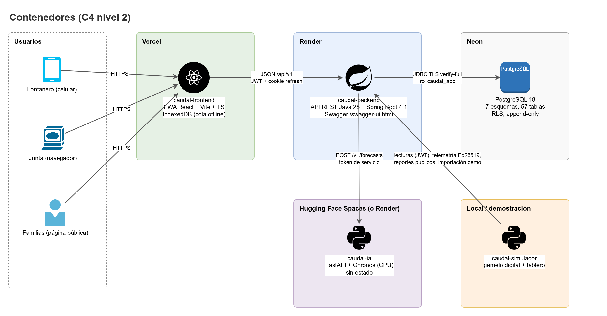
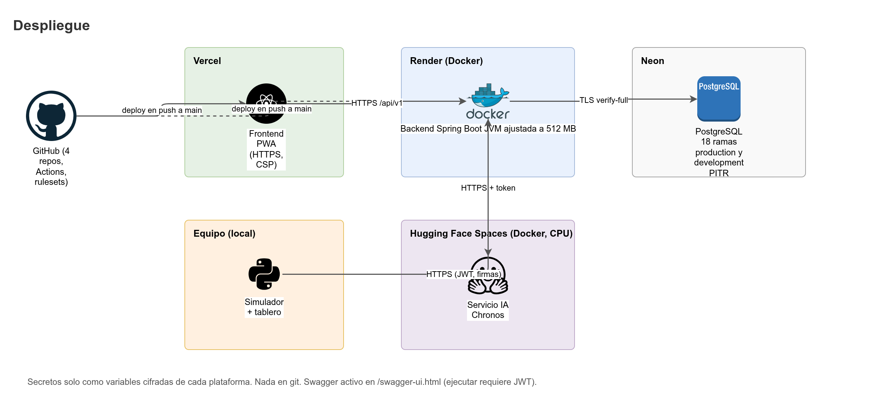

# Stack tecnológico

El stack responde a tres tipos de restricciones:

- **De la materia:** el backend debe ser Java (Patrones de Software) y el repositorio `caudal-backend` debe tener la mayor carga de commits del proyecto.
- **Del producto:** la app del fontanero funciona sin señal (PWA offline), la Junta decide con trazabilidad completa, y los datos personales se minimizan (Ley 1581 de 2012).
- **De presupuesto y operación:** costo cercano a cero en la fase de prueba, un solo equipo pequeño y ningún dato real de la región todavía. Por eso el pronóstico corre en CPU y los datos de campo se simulan.

Cada tabla de este documento sigue el mismo formato: **Tecnología**, **Uso**, **Por qué** y **Alternativa descartada y motivo**. Cuando una alternativa se descarta por una cifra o una limitación técnica concreta, el motivo lo dice. Cuando la decisión es de criterio del equipo, el motivo lo dice también.

## Versiones de referencia

| Componente | Versión | Nota |
|---|---|---|
| Java | 25 LTS | Lenguaje del backend. |
| Spring Boot | 4.1.x | Framework del backend. |
| springdoc-openapi | 3.x | Swagger UI y OpenAPI del backend. |
| PostgreSQL | 18 | Base de datos (Neon en la nube, Docker Compose en local). |
| React | 19 | UI de la PWA y del panel de la Junta. |
| Python | 3.12 | Servicio de IA y simulador. |

> **Fijar versiones exactas al crear cada proyecto.** Las versiones de esta tabla son el rango de referencia. Al crear cada repositorio se fija la versión exacta (por ejemplo, en el Maven Wrapper, `package.json` con `pnpm` y `pyproject.toml` con `uv.lock`) y se registra en el README del repositorio. Una actualización de versión mayor es un commit propio con su prueba.

## Base de datos

| Tecnología | Uso | Por qué | Alternativa descartada y motivo |
|---|---|---|---|
| **PostgreSQL 18** | Base de datos de los 7 esquemas (57 tablas): `iam`, `org`, `ops`, `reporting`, `devices`, `audit`, `sim`. | El dominio es relacional y necesita restricciones fuertes: `FORCE ROW LEVEL SECURITY` por acueducto, triggers de inmutabilidad, restricciones `EXCLUDE` con `btree_gist` (turnos y bandas sin solapes), `timestamptz` y `uuidv7()` nativo en PostgreSQL 18. Neon ofrece PITR y ramas para pruebas. | **MySQL:** no ofrece RLS equivalente a la usada aquí ni restricciones `EXCLUDE` para solapes de rangos. **MongoDB:** el modelo es relacional (reglas, versiones, turnos, auditoría con cadena de hashes) y las transacciones multi-documento pesarían sobre la integridad. |
| **Flyway** | Migraciones versionadas en SQL puro, con placeholders (`${person_name_max}`) alimentados por `FieldLimits`. | Los triggers, roles, políticas RLS y privilegios por columna se escriben como SQL explícito y revisable. Los placeholders evitan literales duplicados entre Java y BD. | **Liquibase:** su modelo de changelogs XML/YAML abstrae el SQL que aquí debe verse tal cual. Para este proyecto la abstracción sobra. |
| **Neon** | PostgreSQL gestionado en la nube, con PITR y ramas. | Plan gratuito suficiente para la fase de prueba y recuperación a un punto en el tiempo. | **Amazon RDS:** costo mensual fijo mayor para una fase sin usuarios reales. **Supabase:** agrega servicios (autenticación, almacenamiento) que el diseño ya resuelve en el backend. |
| **Docker Compose** | PostgreSQL local para desarrollo y pruebas de integración. | Mismo motor y versión que en la nube. | **H2 en memoria para pruebas:** no reproduce RLS, triggers ni `EXCLUDE`. Las pruebas de BD usan Testcontainers con PostgreSQL 18 real. |

## Backend (`caudal-backend`)

| Tecnología | Uso | Por qué | Alternativa descartada y motivo |
|---|---|---|---|
| **Java 25 LTS** | Lenguaje del backend. | Requisito de la materia. Versión LTS con soporte de largo plazo. | **Java 21 LTS:** válido, pero el equipo fija la última LTS disponible al iniciar el proyecto. |
| **Spring Boot 4.1.x** | Web MVC, Security, Data JPA, Validation y Actuator. | Un solo ecosistema cubre API REST, seguridad (filter chain, OAuth2 Resource Server), persistencia y salud del servicio. Documentación amplia para el equipo. | **Quarkus y Micronaut:** son válidos y ofrecen arranque más rápido. Se descartan para no sumar un segundo ecosistema de dependencias y configuración a un proyecto académico con tres integrantes. |
| **springdoc-openapi 3.x** | Swagger UI en `/swagger-ui.html` y OpenAPI en `/v3/api-docs`, con esquema bearer JWT y descripciones en español. | Genera el contrato desde los controladores; el frontend genera sus tipos con `openapi-typescript`. | **Documentación escrita a mano:** se desalinea del código en la primera semana. |
| **Spring Security + OAuth2 Resource Server (Nimbus, HS256)** | Autenticación JWT de acceso, deny-by-default y filter chain. | Un solo emisor y un solo validador (el mismo backend), por lo que HS256 con un secreto de al menos 256 bits basta y es más simple que gestionar un par de claves. | **JWT firmado con RS256 o EdDSA:** tiene sentido cuando varios servicios validan tokens sin compartir secreto. Aquí no aplica. Se puede migrar más adelante si el emisor se separa. |
| **Argon2id con `Argon2PasswordEncoder` (BouncyCastle)** | Hash de contraseñas (m=19456 KiB, t=2, p=1). | Memory-hard, recomendado por OWASP para contraseñas nuevas, con soporte directo en Spring Security. | **bcrypt:** no es memory-hard y su límite de 72 bytes obliga a reglas adicionales. **PBKDF2:** más débil frente a hardware especializado con los mismos recursos de CPU. |
| **Hibernate Validator** | Validación de entradas con `@Size`, `@Pattern` y `@NotNull` alimentados por `FieldLimits`. | Estándar de Jakarta Validation; los mensajes salen en español desde `messages_es.properties`. | **Validación manual en cada servicio:** dispersa las reglas y rompe la fuente única de límites. |
| **Flyway** | Migraciones versionadas en SQL puro para las 57 tablas, roles, RLS, triggers y privilegios, con placeholders (`${person_name_max}`) alimentados por `FieldLimits`. | El SQL de triggers, roles y políticas RLS debe verse tal cual y ser revisable. Los placeholders evitan literales duplicados entre Java y BD. | **Liquibase:** changelogs XML o YAML que abstraen el SQL que aquí debe ser explícito. |
| **Bucket4j con almacenamiento en PostgreSQL** | Rate limits: login 5/min/IP, reportes públicos 3/h/IP, API 120/min/usuario, telemetría 60/min/dispositivo, recálculo de pronóstico 10/h/acueducto. | Los contadores viven en la base de datos (`iam.rate_limit_buckets`), así que son compartidos entre instancias y sobreviven a reinicios. | **Resilience4j RateLimiter:** los contadores son en memoria de cada instancia, no compartidos. **Limitador del proxy (Render):** no cubre límites por usuario o por dispositivo. |
| **OpenPDF** | Actas, cartel y resumen en PDF, con la familia `DocumentFactory` (PDF y HTML). | Librería ligera, programable desde Java, sin herramienta de diseño aparte. Licencia LGPL/MPL (verificar antes de publicar). | **JasperReports:** requiere plantillas `.jrxml` con su herramienta de diseño y tiene una huella de dependencias mucho mayor para tres documentos simples. |
| **Circuit breaker propio** | Circuit breaker de la IA (`CircuitBreakerState`: Cerrado, Abierto, Semiabierto). | El estado y las transiciones son parte del patrón State que se evalúa en la materia; se implementan de forma explícita. | **Resilience4j CircuitBreaker:** es una opción correcta en producción. Se descarta para este proyecto porque ocultaría el patrón que debe verse en el código. |
| **JWT de Nimbus** | Firma y validación de tokens HS256 con `alg` explícito, `iss`, `aud`, `exp` y `nbf`. | Incluido con el Resource Server. | **Librerías JWT propias:** riesgo de errores de validación de `alg`. |
| **JUnit 5 / 6, AssertJ, Mockito** | Pruebas unitarias y de integración. | Estándar del ecosistema Spring. | **TestNG:** equivalente, pero distinto del resto de herramientas del stack. |
| **Testcontainers** | Pruebas de integración contra PostgreSQL 18 real. | Las restricciones de la BD (RLS, triggers, `EXCLUDE`) solo se prueban contra el motor real. | **H2:** no reproduce esas restricciones (ver base de datos). |
| **ArchUnit** | Reglas de arquitectura: `domain` sin Spring, JPA ni Jackson; sin ciclos entre paquetes. | Convierte la arquitectura hexagonal en una prueba que falla. | **Revisión manual en code review:** no escala y se olvida. |
| **JaCoCo** | Cobertura de pruebas. | Reporte en CI. | **Ninguna:** el equipo necesita evidencia de cobertura para la entrega. |
| **Spotless (google-java-format), Checkstyle (incluye `MagicNumber`), SpotBugs + FindSecBugs** | Formato, estilo, errores comunes y patrones de seguridad. | Corren en CI y bloquean el merge si fallan. | **Solo el formateador:** no detecta errores de lógica ni problemas de seguridad. |

## Frontend (`caudal-frontend`)

| Tecnología | Uso | Por qué | Alternativa descartada y motivo |
|---|---|---|---|
| **React 19 + TypeScript estricto** | UI de la PWA del fontanero, del panel de la Junta y de la página pública. | Requisito del equipo. Modo estricto con `strict`, `noUncheckedIndexedAccess` y `exactOptionalPropertyTypes` para atrapar errores de datos nulos y opcionales. | **Vue o Svelte:** no hay experiencia del equipo en ellos y React tiene el ecosistema de PWA y formularios que el proyecto usa. |
| **Vite + `vite-plugin-pwa` (Workbox)** | Build, servidor de desarrollo, service worker y caché offline. | Vite es rápido y el plugin PWA genera el service worker sin configuración de bajo nivel. | **Next.js:** su valor está en el renderizado en el servidor, que la app autenticada no necesita. Además agrega un runtime de servidor que la PWA no usa. |
| **React Router** | Rutas protegidas por rol (`BOARD_ADMIN`, `OPERATOR`, etc.) en `src/app`. | Modelo de rutas maduro y controlable por código. | **TanStack Router:** válido y con tipado más estricto de rutas. Se descarta por ser una tecnología menos conocida para el equipo y por no aportar un requisito que el proyecto necesite. |
| **TanStack Query** | Estado del servidor: caché, reintentos e invalidación tras registrar una lectura o aprobar una propuesta. | Separa el estado del servidor del estado de la UI. | **Redux:** más ceremonia para un estado que casi todo viene de la API. |
| **React Hook Form + Zod** | Formularios. Los esquemas Zod se arman en tiempo de ejecución con `GET /api/v1/meta/constraints` y `GET /api/v1/rule-sets/current`. | Las reglas de validación vienen del backend y no se escriben dos veces. | **Formik + Yup:** más código para el mismo resultado, y sin el armado en tiempo de ejecución. |
| **Dexie (IndexedDB)** | Cola offline de lecturas y cierres del día (`OfflineDatabase`). | Tablas tipadas y transacciones sobre IndexedDB, con una API que el equipo puede probar. | **`localStorage`:** síncrono, con cuota pequeña y sin transacciones. **IndexedDB directo:** API verbosa con más riesgo de errores. |
| **Radix UI** | Primitivas accesibles sin estilo (diálogos, menús, selects). | Accesibilidad de teclado y foco resuelta; el aspecto lo define el sistema de tokens propio. | **MUI:** trae un lenguaje visual propio (Material) que contradice el criterio del proyecto (tokens propios, sin degradados genéricos). Además pesa más. |
| **CSS Modules + tokens en variables CSS** | Estilos. Modo claro primero; modo oscuro por variables. | Sin dependencia de un framework de utilidades; los tokens son la única fuente del color y el espacio. | **Tailwind CSS:** válido; se descarta para que el equipo use una sola forma de definir tokens. |
| **Recharts** | Gráfica del pronóstico con banda `p10`–`p90`. | Componentes declarativos para líneas y áreas. | **Chart.js:** requiere más código para la banda de incertidumbre. |
| **sonner** | Avisos breves (lectura guardada, cola enviada). | Sencillo y accesible. | **Notificaciones propias:** trabajo sin beneficio. |
| **lucide-react** | Iconos. | Conjunto consistente y ligero. | **Iconos sueltos en SVG:** inconsistentes en tamaño y trazo. |
| **openapi-typescript** | Tipos generados desde el OpenAPI del backend. | Un cambio de contrato rompe la compilación del frontend, no producción. | **Tipos escritos a mano:** se desalinean. |
| **Vitest + Testing Library + MSW + Playwright (+ axe)** | Pruebas unitarias, de componentes, de flujos completos y de accesibilidad. | Un solo runner para unitarias (Vitest) y navegador real para flujos (Playwright). | **Jest:** requiere configuración extra con Vite. |
| **ESLint (`no-magic-numbers`, sin `dangerouslySetInnerHTML`) + Prettier, pnpm** | Calidad y gestor de paquetes. | Reglas de seguridad y de constantes con nombre aplicadas en CI. | **npm:** más lento y sin el mismo control estricto de dependencias. |

## IA (`caudal-ia`)

| Tecnología | Uso | Por qué | Alternativa descartada y motivo |
|---|---|---|---|
| **Chronos (`chronos-forecasting`)** | Modelo de pronóstico de series de tiempo en modo *zero-shot*. Predice el nivel del tanque a 1 a 3 días con cuantiles p10, p50 y p90. | Modelo fundacional preentrenado: no necesita entrenamiento con datos del acueducto, que todavía no existen. Ver la tabla de decisión siguiente. | **Entrenar un modelo propio:** no hay historial real. Entrenar con datos simulados aprendería el simulador, no el acueducto, y la evaluación sería circular. |
| **Chronos-2 (`autogluon/chronos-2-small`, 28M) y Chronos-Bolt (`amazon/chronos-bolt-small`, 48M)** | Modelos por defecto, elegibles por variable de entorno. | Tamaños pequeños que corren en CPU. Chronos-2 admite covariables conocidas en el futuro (horas de servicio planeadas), a futuro. | **Modelos grandes:** pesan más en memoria y en tiempo de CPU; no caben con holgura en el hosting gratuito (verificar). |
| **ARIMA y Prophet** | Candidatos a comparar en la fase de evaluación (no se implementan en el MVP). | Son referencias clásicas con buen comportamiento en series cortas. | **Como modelo principal:** requieren ajuste por tanque y supuestos de estacionariedad o estacionalidad que el nivel de un tanque no garantiza. Se usan solo como referencia si la evaluación lo justifica. |
| **Estimación simple de persistencia** | Respaldo y pronóstico en sombra. `p50` = último valor; `p10` y `p90` con cuantiles de cambios diarios históricos. | Es la línea base que la IA debe superar para justificar su uso. Funciona sin modelo. | Ninguna: es requisito del diseño (ver `Modulo-IA.md`). |
| **FastAPI + Pydantic v2 + pydantic-settings** | Contrato `POST /v1/forecasts`, salud (`/v1/health`, `/v1/ready`) y configuración por variables de entorno. | Mismo stack que el simulador; Swagger en `/docs`. | **Flask:** sin validación tipada integrada. |
| **PyTorch CPU, pandas, numpy** | Ejecución del modelo y preprocesado (re-muestreo diario). | PyTorch CPU evita la descarga de librerías CUDA. | **PyTorch con CUDA:** innecesario en el alcance actual. |
| **uv, pytest, ruff (`PLR2004`), mypy** | Gestor, pruebas, lint y tipos. | Rápidos y con el mismo estilo de los demás repos Python. | **poetry + black + flake8:** más piezas para lo mismo. |

**Por qué Chronos y por qué en CPU:**

| Decisión | Razón | Consecuencia |
|---|---|---|
| Modelo preentrenado (zero-shot) | No hay historial real. El simulador produce datos de prueba, no de entrenamiento válido para un acueducto real. | Se evalúa contra la estimación simple desde el primer día. |
| Modelos pequeños (28M y 48M) | Presupuesto de hosting gratuito o de bajo costo (Hugging Face Spaces en CPU, Render). | Mayor incertidumbre que un modelo grande; se mide con la evaluación. |
| Ejecución en CPU | Un pronóstico por tanque al día (y por petición manual de la Junta) no necesita GPU. | Latencia por verificar en la prueba de memoria y tiempo. El backend tiene timeouts de 2 s de conexión y 10 s de lectura, con respaldo a la estimación simple si se exceden. |
| Servicio sin estado | La IA no accede a la BD; recibe la serie y devuelve cuantiles. | Facilita reemplazar el modelo sin migraciones ni cambios en el backend. |

## Simulador (`caudal-simulador`)

| Tecnología | Uso | Por qué | Alternativa descartada y motivo |
|---|---|---|---|
| **Python 3.12 + numpy + pandas + pyarrow** | Generación de datasets (CSV y Parquet) y cálculo del balance del tanque. | Generación vectorizada y formatos estándar para la IA. | **Simulación pura en Python sin numpy:** lenta para años de datos por sector. |
| **Motor de simulación propio** (paso de tiempo, patrones explícitos) | Gemelo digital de la región: clima, fuente, tanque, sectores, turnos, fugas, fontanero, sensores y comunidad. | Los patrones de la materia (State, Strategy, Decorator, Observer, Command, Iterator, Template Method) quedan visibles en el código del simulador. | **SimPy:** biblioteca de eventos discretos muy usada. Su bucle de eventos oculta la planeación de los procesos dentro de la biblioteca, lo que haría los patrones implícitos. Además, el modelo es de paso de tiempo con procesos estocásticos, que se expresa mejor sin ese bucle. |
| **Typer** | CLI con los modos `generate`, `backfill`, `live` y `demo`. | Construye la CLI a partir de funciones con tipos de Python, con ayuda y validación de parámetros. | **argparse:** más código para el mismo resultado. |
| **Escenarios en YAML validados con Pydantic** | Parámetros y escenarios (año normal, seco, lluvioso, fugas frecuentes, sensores defectuosos, presentación). | Los valores viven en archivos, no en el código, y una semilla fija los hace reproducibles. | **Parámetros en el código:** contradice la regla de valores sin quemar. |
| **httpx** | Cliente de la API del backend (como fontanero, dispositivo, comunidad o importador). | Cliente HTTP asíncrono y con los mismos tipos que el resto de Python. | **requests:** síncrono; el modo `live` necesita concurrencia. |
| **`cryptography` (Ed25519)** | Firma de las peticiones de dispositivo con Ed25519. | Mismo algoritmo que el backend valida. | **HMAC compartido:** el secreto quedaría en el dispositivo y en el servidor; Ed25519 deja solo la clave pública en la BD. |
| **FastAPI + SSE** | API local del tablero (estado en vivo). | SSE basta para enviar cambios de estado de un solo sentido. | **WebSockets:** bidireccional sin necesidad. |
| **Tablero Vite + React + TypeScript** | Vista de la simulación en vivo. | Mismo stack de frontend. | **Panel en Streamlit:** otra tecnología a mantener. |
| **pytest + Hypothesis, ruff, mypy, uv** | Pruebas de propiedades (balance de masa, reproducibilidad), lint y tipos. | Hypothesis genera casos que los ejemplos fijos no cubren. | **Solo pruebas con ejemplos:** no prueban invariantes. |

## Hardware real propuesto (no se construye)

Los valores de esta sección son de referencia. Antes de cualquier compra se verifican con fichas técnicas y proveedores locales. Detalle en [Simulador-y-hardware.md](Simulador-y-hardware.md).

| Tecnología | Uso | Por qué | Alternativa descartada y motivo |
|---|---|---|---|
| **Sensor hidrostático sumergible 4–20 mA (0–5 m, IP68)** | Medición del nivel del tanque por presión. | Va sumergido y no depende de la superficie del agua. Tolera el polvo, la espuma y la condensación del techo del tanque. | **Ultrasónico (JSN-SR04T/A02YYUW):** se instala arriba del tanque, es sensible a la temperatura y a la espuma, y tiene una zona muerta cerca de la tapa. Queda como alternativa si el tanque no permite un sensor sumergido. |
| **ADS1115 (ADC de 16 bits, I2C)** | Lectura del lazo de corriente 4–20 mA convertido a voltaje con una resistencia de precisión. | El ADC interno del ESP32 tiene poca linealidad y ruido para una medición de nivel. | **ADC interno del ESP32:** descartado por precisión. |
| **ESP32-S3** | Controlador del nodo de campo: lectura, control de válvulas, telemetría y firma de peticiones. | Wi-Fi, BLE, bajo consumo en reposo y soporte de PlatformIO. Puede enlazar un módulo LoRa por SPI o UART. | **Arduino Uno o Nano:** sin conectividad. **Raspberry Pi:** requiere sistema operativo, consume más energía y no es adecuada para operar con panel solar y batería pequeña. |
| **Válvula de bola motorizada 12 V con finales de carrera** | Abrir y cerrar cada sector. | No requiere presión mínima para operar, por lo que sirve en sistemas por gravedad. Los finales de carrera confirman la posición real. | **Válvula solenoide:** necesita una presión diferencial mínima para abrir. En un sistema por gravedad de baja presión no siempre abre. |
| **Driver de motor (puente H) y relés de control** | Dirección del motor de la válvula. | Control seguro de la dirección y del tiempo de recorrido. | **Control directo desde el GPIO:** el motor puede dañar el microcontrolador. |
| **LoRa 915 MHz punto a punto hacia un gateway con internet** | Transmisión de telemetría desde el tanque y las válvulas hasta el gateway. | Bajo consumo, alcance de kilómetros sin plan mensual por dispositivo y sin dependencia de cobertura celular en la vereda. Banda y potencia por verificar con el plan regional vigente en Colombia. | **LTE Cat-1 (SIM7600 o A7670):** cobertura directa, pero con costo mensual de SIM y mayor consumo. Queda como alternativa si la vereda tiene buena cobertura celular. **Wi-Fi:** en veredas no hay red de acceso confiable. |
| **Panel solar 20–30 W con controlador y batería LiFePO4 12 V** | Energía del nodo de campo. | Los sitios pueden no tener red eléctrica estable (verificar en cada punto). LiFePO4 tolera muchos ciclos de descarga y carga. | **Batería de plomo-ácido:** más barata, pero con vida útil menor y sensible a la descarga profunda. **Red eléctrica:** solo donde haya suministro estable. |
| **Gabinete IP65 con prensaestopas y protección contra sobretensiones** | Protección de la electrónica en campo. | Protege contra humedad, polvo y picos de voltaje por tormentas. | **Caja plástica sin clasificación IP:** no protege contra el polvo ni la humedad de una vereda. |
| **Válvula manual en paralelo (bypass)** | Operación manual cuando el sistema electrónico falla. | El agua siempre se puede controlar a mano. | **Solo válvula electrónica:** cualquier falla deja el sector sin control. |

## Infraestructura

| Tecnología | Uso | Por qué | Alternativa descartada y motivo |
|---|---|---|---|
| **Render (Docker)** | Hosting del backend `caudal-backend`. | Despliegue desde Docker o GitHub, plan económico, HTTPS. | **Railway y Fly.io:** válidos. Se elige Render por el plan y la configuración ya definida. |
| **Vercel** | Hosting de la PWA `caudal-frontend` y de la página pública. | Despliegue por cada PR, HTTPS obligatorio para PWA y service worker. | **Netlify:** equivalente. Se elige Vercel por la integración con el flujo de PR. |
| **Hugging Face Spaces (Docker, CPU)** o **Render** | Hosting de `caudal-ia`. Se usa Render si el modelo cabe en la memoria del plan (verificar en la prueba de memoria). | Espacios gratuitos con CPU para modelos pequeños. | **GPU en la nube:** fuera del presupuesto. |
| **GitHub Actions** | CI de los cuatro repositorios: `commit-lint`, pruebas, análisis estático, CodeQL, gitleaks. | Integrado con el repositorio y con los rulesets. | **Jenkins u otro CI propio:** operación adicional para el equipo. |
| **Dependabot y CodeQL** | Actualizaciones de dependencias y análisis de seguridad. | Automatizan la detección de vulnerabilidades conocidas y de patrones de código inseguro. Disponibilidad según el plan del repositorio (verificar). | **Revisión manual de dependencias:** no escala. |
| **Secret scanning, push protection, gitleaks** | Evitar que un secreto llegue a git. | Doble barrera: en GitHub y en CI. | **Solo revisión visual:** insuficiente. |

## Herramientas del equipo

| Tecnología | Uso | Por qué | Alternativa descartada y motivo |
|---|---|---|---|
| **draw.io** (desktop y MCP de draw.io con sus iconos) | Diagramas. Fuente `.drawio` y exportación `.png` (escala 2) en `docs/images/` de cada repo. | Formato abierto y editable; el MCP permite generarlos con los iconos oficiales de cada tecnología. | **Mermaid:** no tiene los iconos de despliegue ni el control de diseño que los diagramas de arquitectura necesitan. |
| **Docker Engine + Compose** | PostgreSQL local, servicios de prueba y ensayos de despliegue. | Mismo entorno que la nube. | **Instalación manual de PostgreSQL:** difícil de reproducir entre equipos. |
| **JDK 25, Maven (Wrapper)** | Compilación del backend. | El Maven Wrapper fija la versión de Maven en el repositorio, así todos compilan igual. | **Gradle:** válido. Se elige Maven Wrapper por ser el mecanismo que el proyecto ya define. |
| **Git Flow con `develop` por defecto** | Ramas y releases. Ver [Roles-y-planeacion.md](Roles-y-planeacion.md). | Un flujo conocido por el equipo y compatible con los rulesets. | **Trunk-based:** no se usa porque la Junta necesita versiones estables con etiqueta. |
| **gh CLI** | Operaciones de GitHub con la cuenta del integrante que corresponde. | Un comando por operación; evita usar la interfaz web para cambios repetibles. | **Interfaz web:** válida para revisar, no para automatizar. |

## Notas de mantenimiento

- Cambiar un valor de negocio (por ejemplo, de 24 a 23 horas de un tope) es una nueva versión de reglas en la BD, no un cambio de código ni de este documento.
- Cambiar una versión de tecnología es un commit `build:` con su prueba.
- Un cambio de tecnología en esta tabla se registra aquí con su alternativa y su motivo, antes de implementarlo.

Relacionados: [Modulo-IA.md](Modulo-IA.md), [Simulador-y-hardware.md](Simulador-y-hardware.md), [Datos-simulados.md](Datos-simulados.md), [Diccionario-de-datos.md](Diccionario-de-datos.md)
